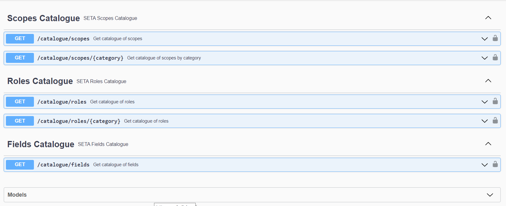

# SETA Catalogue API
!!! info
    The [**SeTA Catalogue API**]({{ setaUrls.apiCatalogue }}) are only available for the *Development Environment*

The SeTA Catalogue API is an interface designed to facilitate access to the catalogue of data sources available within the SeTA web application. This API enables users to programmatically interact with, retrieve information from, or manage the catalogue of available scopes.

Some functionalities typically offered by the SeTA Catalogue API include:
Scopes Catalogue Management: retrieve all catalogue scopes of filtered by category.

Roles Catalogue Management: retrieve all catalogue roles of filtered by role category.

Fields Catalogue Management: retrieve all catalogue fields of filtered by field category.

<figure markdown>
  
  <figcaption>SeTA Catalogues API</figcaption>
</figure>