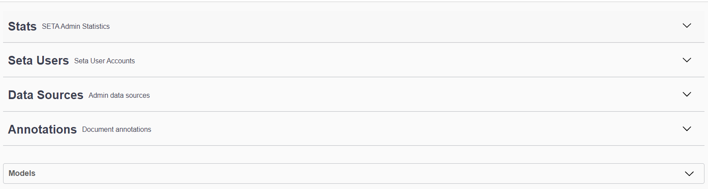

# SETA Sys Admin API
!!! info
    The [**SeTA Sys Admin API**]({{ setaUrls.apiSysAdmin }}) are only available for the *Development Environment*

The SeTA SysAdmin API is an interface that provides access to system administration functionalities within the SeTA application through programmable commands or HTTP requests. This API is specifically designed for system administrators or privileged users to perform administrative tasks and manage system-level configurations within SeTA.

Key capabilities of the SeTA SysAdmin API typically include:

User Management: Enabling administrators to retrieve user details and user accounts, update user scopes, delete, or manage user accounts, roles, and scopes.

System Configuration: Allowing administrators to configure system settings, such as datasources and annotations.

The SysAdmin API serves as a powerful tool for system administrators to automate administrative tasks, streamline system management, and ensure efficient governance and control over the SeTA web application.

<figure markdown>
  
  <figcaption>User Sys Admin APIs</figcaption>
</figure>