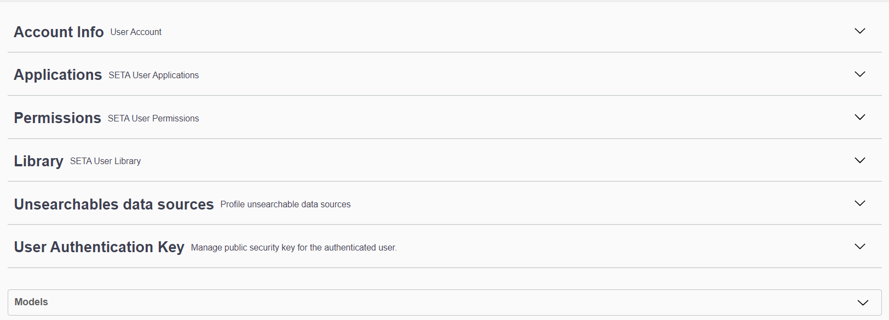

# SETA User Profile API
!!! info
    The [**SeTA User Profile API**]({{ setaUrls.apiUserProfile }}) are only available for the *Development Environment*

The SeTA User Profile API is an interface that allows access to and manipulation of user profile-related data within the SeTA system through programming commands or HTTP requests. This API provides functionalities to retrieve or manage user profile information, such as user roles, providers, contact details, and authentication data.

Developers or systems interacting with this API can perform operations like:

Fetching User Data: Retrieving user profile information, including roles, personal details, or preferences.

Updating Profiles: Allowing modifications to user profile data, such as changing roles or managing authentication keys.

Access Control: Managing access permissions or restrictions related to user profiles and their functionalities within the SeTA system.

The SeTA User Profile API serves as a bridge between external applications or systems and the SeTA application, enabling seamless integration, data retrieval, and management of user-related information programmatically.

<figure markdown>
  
  <figcaption>User Profile APIs</figcaption>
</figure>