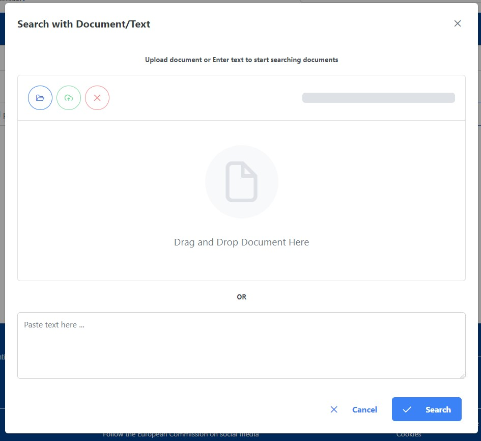

# FAQS

## How can I find the search menu?

In order to see the search option, it is necessary to logged into the application **EU Login**.  

1. From the **Header** menu, click **Login**.  

2. Enter your **EU credentials**.  

3. The app redirects to the landing page where the search bar appears in the top menu to interact with.  

4. In the middle of the page you will find an input text box. From there, you are invited to interact in two possible ways: by start typing in the box, by uploading a document/text. Once you start typing, you will see a dropdown window appear.  

## How can I search by text or by uploading a document?

1. From the **Search** page.  

2. Click in the **'cloud'** button near to the search box. An upload modal will be displayed. You can add a document by: *drag and drop, clicking on browse*. In both cases, after drag and dropping or uploading the document, automatically the search query is set up and the user will be redirected to the results page. Otherwise, to start searching by text, you can simply copy and paste the text in the text area and click Search.  
 