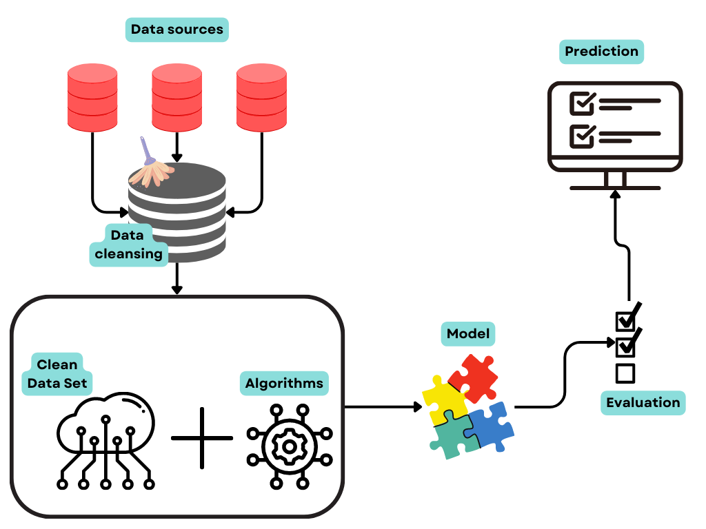

As described previously, SeTA follows two distinct steps for the creation of the knowledge base: 

a. Document collection, cleaning and storage 

b. Text analysis and modelling 

## 1. Document collection, cleaning and storage

### 1.1 Corpus preparation

#### 1.1.1 The corpus creation
The corpus of the public policy-related European documents counts more than 500.000 documents, coming from the following sources: EUR-LEX, EU Publications, CORDIS, the EU Open Data Portal, JRC PUBSY, EUROPARL.

All the texts collected are in English only (except for some older legal texts where multiple languages are interleaved on the same page). 

The reasons for this decision are:

1. English language sentence dependency parsing is rather straightforward and there are several open source semantic parsers with excellent tuning for this language.

2. We are interested in extracting knowledge from plain text and as the translation of, for example, a directive into all EU languages does not create new knowledge, processing a single language well should capture the available information.

#### 1.1.2 Document cleansing pipeline
Since there is a variety of web service document retrieval end-points and there are often more than one document per metadata record, a document harvesting process was established as the first part of the whole pipeline. 

Documents are retrieved through SPARQL, SOAP, FTP or HTTP protocol parsing, even though every source has its own specificities.

After metadata have been harvested and interpreted, the documents must be downloaded and processed. 

> #### Taxonomy

> Data taxonomy is the classification of data into categories and sub-categories. It provides a unified view of the data in a system and introduces common terminologies and semantics across multiple systems. Taxonomies represent the formal structure of classes or types of objects within a domain.

In SeTA, the received metadata from the datasources can be reconfigured, thanks to the dynamic generation of data taxonomy.

The fully automated and repeatable data cleaning mechanism, is being constantly improved. We keep learning the needs and requirements of neural networks to produce quality results. 

The typical process to create a general corpus involves:

- Conversion from original formats (PDF, HTML, XML, MSWord, …) to plain text

- Conversion to Unicode (often not easy), removal of text conversion artefacts, removal of non-alphanumeric characters, transposition of diacritics to ascii characters, spacing enforcement.

- De-hyphenation (a rather critical step)

- Sentence separation based on dependency parsing (allowing the reconstruction even of sentences split over several lines)

Adding another corpus is very easy since the general cleansing pipeline has already been implemented, metadata are parsed through abstraction layer for consolidation and processing is very swift.

The output of this step is a document repository containing the completely cleaned unified plain text, divided into chunks of 300 words. 

This new document structure is stored within an ElasticSearch (ES) database which allows searching and reproduction for human readers. 

At this point the full text of all documents can be searched through a simple interface, and users are able to target their search either to the individual document collections or to search across all collections in a harmonised way.

## 2.	Text analysis and modelling 

### 2.1 Neural networks training

This is the pivotal point of the whole analytical process. Neural networks can learn any function and only data availability defines how complex the function can be.  For SeTA it has been used **textacy**[^1].

**textacy** is a Python library for performing a variety of natural language processing (NLP) tasks, built on the high-performance **spaCy**[^2] library. With the fundamentals: *tokenization, part-of-speech tagging, dependency parsing, etc.* delegated to another library, **textacy** focuses primarily on the tasks that come before and follow after.

#### Features:

* Access and extend spaCy's core functionality for working with one or many documents through convenient methods and custom extensions

* Load prepared datasets with both text content and metadata

* Clean, normalize, and explore raw text before processing it with spaCy

* Extract structured information from processed documents, including n-grams, entities, acronyms, keyterms, and SVO triples

* Compare strings and sequences using a variety of similarity metrics

* Tokenize and vectorize documents then train, interpret, and visualize topic models

* Compute text readability and lexical diversity statistics, including Flesch-Kincaid grade level, multilingual Flesch Reading Ease, and Type-Token Ratio

!!! note
    This highlights an important point: we are dealing with scientific and technical reports and legal texts and their language bears completely different information from general text. The analyst must be aware of this focus when analysing the content.

[^1]: https://pypi.org/project/textacy/
[^2]: https://spacy.io/usage/spacy-101

