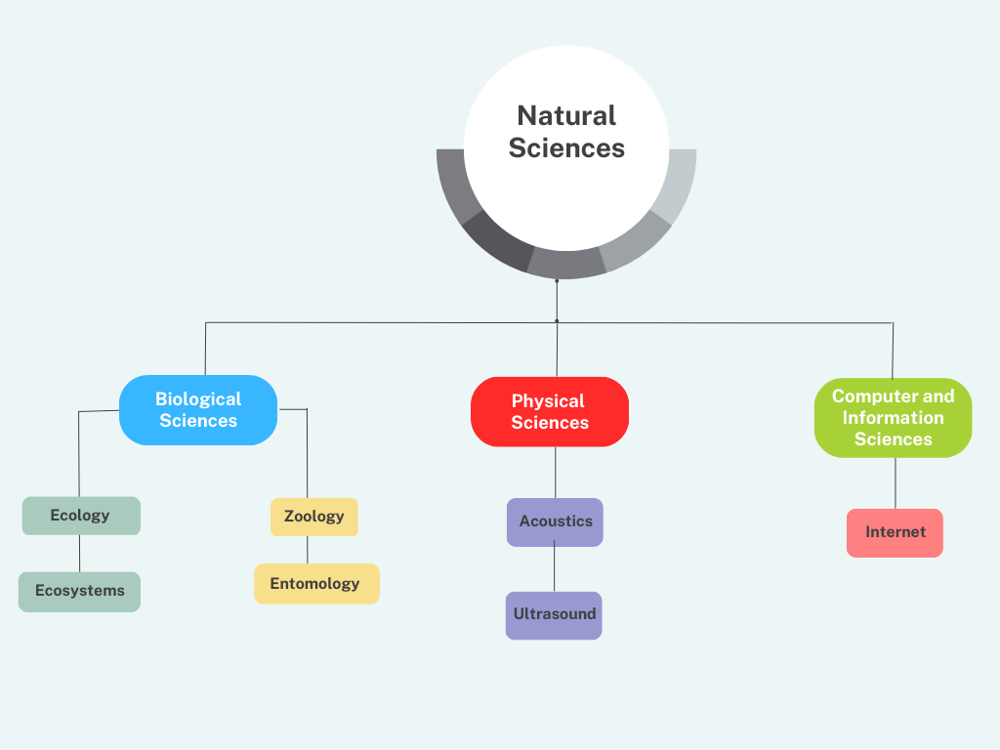

The following diagram describes the workflow of SeTA.
 
1. Everything starts by receiving as input from different sources the data that will fill the database.
2. The data is processed (cleaned, algorithms)
3. The processed data is used to create the AI Models
4. The parsed and labelled data is ready to use for the searching. 


As described previously, SeTA follows two distinct steps for the creation of the knowledge base: Document collection, cleaning and storage and Text analysis and modelling.


## Corpus preparation

As mentioned, the corpus of the public policy-related European documents comes from the following sources: EUR-LEX, CORDIS, JRC PUBSY, EUROPARL.

All the texts collected are in English only (except for some older legal texts where multiple languages are interleaved on the same page). 

The reasons for this decision are:

- [x] English language sentence dependency parsing is rather straightforward and there are several open source semantic parsers with excellent tuning for this language.

- [x] We are interested in extracting knowledge from plain text and as the translation of, for example, a directive into all EU languages does not create new knowledge, processing a single language well should capture the available information.


### Taxonomy

In recent years, access to knowledge has improved and become more widespread, mostly due to technology. However, this had made it difficult for people to locate accurate, timely, and reliable information.      
This issue is also frequent in sectors where large amounts of information are held in unstructured ways in many repositories, databases, and libraries, often with ambiguous naming conventions that provide little insight into the material and its value to the user.      
The implementation of Taxonomy is an effort to provide organization and increase productivity through quicker, more efficient retrieval and use.        
In order to make it simpler to identify related information, Taxonomy uses a regulated vocabulary to represent the formal structure of classes or types of things inside a knowledge domain. Taxonomy aids in the hierarchical organization of the assets and material. It can be much simpler to search for or explore an asset or content management by classifying the content and assets in a Taxonomy. [^1]        


The term **'Taxonomy'** refers to the science of categorizing things. It is currently a common phrase for any system of hierarchical classification or categorization. Thus, a Taxonomy is a controlled vocabulary in which all terms have parent/child or broader/narrower relationships to other terms and belong to a single hierarchical structure. The structure is also referred to as a 'tree'. Non-preferred terms/synonyms may or may not be included in a Taxonomy. Taxonomy has recently gained popularity as a term for any type of controlled vocabulary, whether a term list, authority file, thesaurus, or any hybrid combination. [^2]

To facilitate uniform, precise, and rapid indexing and retrieval of the content of digital assets, Taxonomies are utilised in the descriptive metadata fields. Non-text digital files typically require some type of descriptive tagging in order to be retrieved in subject searches, whereas text documents can be automatically indexed or auto-classified based on search queries matching words within the texts. Uncontrolled keyword tagging frequently produces retrieval results that are inconsistent, inadequate, overly general, and biased. Implementing Taxonomies in the fields of descriptive metadata is the answer for indexing.[^2].    

Consistent, precise, and quick indexing and retrieval of content are made possible by Taxonomies. Vocabulary design must be connected with the metadata approach because Taxonomies offer a variety of metadata fields.


#### Taxonomy provides: 

- Relationships between the structure, content, and component parts.
- Identifies and organises information into hierarchical categories for analysis.
- It is a method of managing material that classifies data according to terms kept in metadata.
- It introduces common terminologies and semantics across various systems and offers a unified view of the data in a system.
- Establishes the terminology to be used for each notion and formalises the hierarchical relationships between them.
- Specifies terminology and structure.
- Improve data quality
- Create an accessible metadata structure.
- Control data assets through data governance.
- Determine trends and patterns through guiding machine learning and data experiences.

It is critical to keep a constant level of precision within a category while constructing a Taxonomy. 


#### Hierarchical Taxonomies
Taxonomies can be of several kind, such as *flat, hierarchical, network*, and so on. Based on past experience, a hierarchical structure is best. There are three types of hierarchical structures: 

  1.  Standard Hierarchy: A standard hierarchy Taxonomy has a single root that is subdivided into categories as needed to organise the information and is frequently represented as a tree. A single hierarchical structure is simple to grasp and establish a mental model for finding information.

  2.  Polyhierarchy: A term in a Taxonomy can be repeated in different categories in a polyhierarchy hierachy.  It is not suggested because it can cause misunderstanding. Polyhierarchy violates the first and second criteria of Taxonomy word naming: "Terms should be unambiguous and mutually exclusive." 
 
  3. Faceted: A faceted classification system has multiple dimensions. It comprises of various Taxonomies, or "facets," where each one's top-level node denotes a distinct kind of Taxonomy, attribute, or context. 

  <!-- to ask what type of Taxonomy we are considering-->

  For SeTA we are using Standard Hierarchy.

#### How to design a good Taxonomy

When creating a Taxonomy, consider[^1]:       
1. Decide what topics your Taxonomy must include.    
2. Consider how specific the Taxonomy needs to be.    
3. Provide names for each object in relation to other objects and follow a hierarchical style.     
4. Have particular guidelines that are followed while classifying or categorising any object inside a domain. These guidelines must be comprehensive, consistent, and clear.      
5. Apply strict specification to ensure that any newly discovered object can only belong to one specific category or type of object.      
6. Inherit every property from the class above it and also have the option of adding new properties.      
7. Objects membership attributes in relation to other objects may also be captured.     

The following example describes a simple Taxonomy:

{width=600}

<!--```
  /natural sciences
  /natural sciences/biological sciences
  /natural sciences/biological sciences/ecology
  /natural sciences/biological sciences/ecology/ecosystems
  /natural sciences/biological sciences/zoology
  /natural sciences/biological sciences/zoology/entomology
``` -->


#### Taxonomy in SeTA
In SeTA, we have define some Taxonomies that can be used, but you can also define a new Taxonomy if is necessary.    


To create a new Taxonomy, you can use our API interface. After selecting the terms that represent the broadest category, and assigning the remaining terms to the other categories, you can start creating the new Taxonomy.    

From the API interface you will just need to set up the parameters: **code, label, long label, classifier, version, validated**  and later upload the new Taxonomy.  

It is possible to create as many Taxonomies as you need.    

The outcome is a JSON file that reveals the recursive nature of the tree.


{++ example of SeTA Taxonomy++}


The following example describes part of a Taxonomy used in SeTA:

```json
"aggregations": {
    "taxonomy": [
      [
        {
          "doc_count": 7,
          "name": "euro_sci_voc",
          "subcategory": [
            {
              "classifier": "cordis",
              "code": "/23",
              "doc_count": 6,
              "label": "natural sciences",
              "longLabel": "/natural sciences",
              "name": "natural_sciences",
              "subcategory": [
                {
                  "classifier": "cordis",
                  "code": "/23/49",
                  "doc_count": 4,
                  "label": "biological sciences",
                  "longLabel": "/natural sciences/biological sciences",
                  "name": "biological_sciences",
                  "subcategory": [
                    {
                      "classifier": "cordis",
                      "code": "/23/49/335",
                      "doc_count": 2,
                      "label": "ecology",
                      "longLabel": "/natural sciences/biological sciences/ecology",
                      "name": "ecology",
                      "subcategory": [
                        {
                          "classifier": "cordis",
                          "code": "/23/49/335/1009",
                          "doc_count": 2,
                          "label": "ecosystems",
                          "longLabel": "/natural sciences/biological sciences/ecology/ecosystems",
                          "name": "ecosystems",
                          "subcategory": []
                        }
                      ]
                    },
                    {
                      "classifier": "cordis",
                      "code": "/23/49/345",
                      "doc_count": 2,
                      "label": "zoology",
                      "longLabel": "/natural sciences/biological sciences/zoology",
                      "name": "zoology",
                      "subcategory": [
                        {
                          "classifier": "cordis",
                          "code": "/23/49/345/1039",
                          "doc_count": 2,
                          "label": "entomology",
                          "longLabel": "/natural sciences/biological sciences/zoology/entomology",
                          "name": "entomology",
                          "subcategory": []
                        }
                      ]
                    }
                  ]
                },
```


### Document cleaning pipeline
The document gathering process is the initial step in the pipeline's overall procedure. 

Documents are retrieved from a number of web addresses (URLs) via various endpoints such as SPARQL, SOAP, FTP, or HTTP protocol parsing. Per metadata record, there is frequently more than one document. 

The papers must be downloaded and processed after the metadata has been gathered and read. 

The typical process to create a general corpus involves:

- Conversion from original formats (PDF, HTML, XML, MSWord, …) to plain text.

- Conversion to Unicode, removal of text conversion artefacts, removal of non-alphanumeric characters, transposition of diacritics to ascii characters.

- De-hyphenation.

- Sentence separation based on dependency parsing (allowing the reconstruction even of sentences split over several lines).

This stage produces a document repository containing the thoroughly cleaned unified plain text, separated into 300-word chunks. 

This new document structure is saved in the ElasticSearch database, which allows users to search and reproduce it. 


### Neural networks training

Neural networks may learn any function, and the only limitation is the availability of data. As a result, data preparation, feature engineering, and domain coverage become critical components for producing relevant and understandable results from neural network training.     
Weights and thresholds are continuously changed throughout training until training data with the same tags consistently produce results that are similar.     
The EC public knowledge corpus provides a consistent language and so characteristics that have been generated from chunks rather than words, as in general language.


### Chunk compositionality

**"Chunking"** is the process of combining several pieces of information into more comprehensible or significant portions.[^3]. 

By selecting chunk shapes and sizes wisely, significant performance benefits can be achieved. Chunking also provides efficient per-chunk compression and efficiently extending multidimensional data along multiple axes. As a result, reading a portion of a compressed variable does not necessitate uncompressing the entire variable.[^4] 

Three key ingredients needed for successful chunking:

- Using small, well-organized units.
- Using units of no more than seven items.
- Finding the right level of detail.

These procedures are put into practise by removing titles, abstracts, and identifiable sentences from the entire corpus, then identifying, harmonising, and replacing phrases before storing.


### Actual neural network training

**spaCy** is a Python library for advanced Natural Language Processing (NLP) that is open-source and free.[^5] It helps create applications that process and "understand" massive volumes of text and is specifically created for usage in production. It can be used to create information extraction or systems for interpreting natural language, or it can be used to prepare text for deep learning.     


We train neural networks using **textacy**, a potent Python language modelling package built on the basis of **spaCy**[^6]. It can carry out a variety of natural language processing (NLP) tasks thanks to the **spaCy** library's outstanding performance. The essentials, such as part-of-speech tagging, dependency parsing, and tokenization, are handled by another library, leaving **textacy** to concentrate mostly on the jobs that occur before and after. The pre-processing module of **textacy** has a good number of functions to normalise characters and to handle common patterns like URLs, email addresses, phone numbers, and so on.    

Some of these functions are:      
<!-- - *normalize_hyphenated_words*   
- *normalize_quotation_marks*   
- *replace_phone_numbers*   
- *replace_phone_numbers*   
- etc...    -->

<!--
| Function      | Description                          |
| :--------- | :---------------------------------- |
| *normalize_hyphenated_words*| 	Reassembles words that were separated by a line break                 | 
| *normalize_quotation_marks* |	Replaces all kind of fancy quotation marks with an ASCII equivalent   |
| *normalize_unicode* 		|	Unifies different codes of accented characters in Unicode             |
| *remove_accents* 			|	Replaces accented characters with ASCII, if possible, or drops them   |
| *replace_urls*	 			|	Similar for URLs like https://xyz.com                                 |
| *replace_emails* 			|	Replaces emails with _EMAIL_                                          |
| *replace_hashtags*	 		|	Similar for tags like #sunshine                                       |
| *replace_numbers* 			|	Similar for numbers like 1235                                         |
| *replace_phone_numbers* 	|	Similar for telephone numbers +1 800 456-6553                         |
| *replace_user_handles*	 	|	Similar for user handles like @pete                                   |
| *replace_emojis* 			|	Replaces smileys etc. with _EMOJI_                                    |
-->

**textacy** features:

- Connect directly and add custom extensions to the main functionality of spaCy for interacting including one or more documents.
- Various similarity measures are used to compare strings and sequences.
- Prior to using spaCy to analyse raw text, clean, normalise, and examine it.
- Documents are tokenized and vectorized, and then topic models are trained, interpreted, and displayed.


[^1]: https://data.nsw.gov.au/IDMF/data-structure-and-coordination/data-taxonomy
[^2]: https://link.springer.com/article/10.1057/dam.2010.29
[^3]: https://www.mindtools.com/a8u1mqw/chunking
[^4]: https://www.unidata.ucar.edu/blogs/developer/en/entry/chunking_data_why_it_matters
[^5]: https://spacy.io/usage/spacy-101 
[^6]: https://pypi.org/project/textacy/


