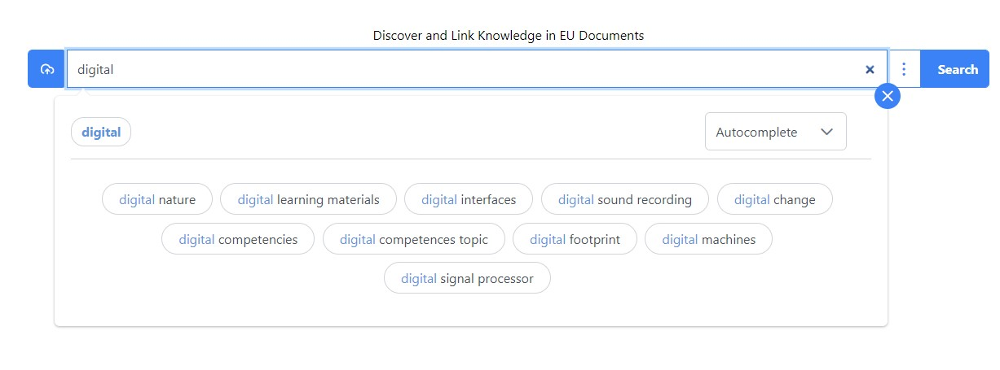
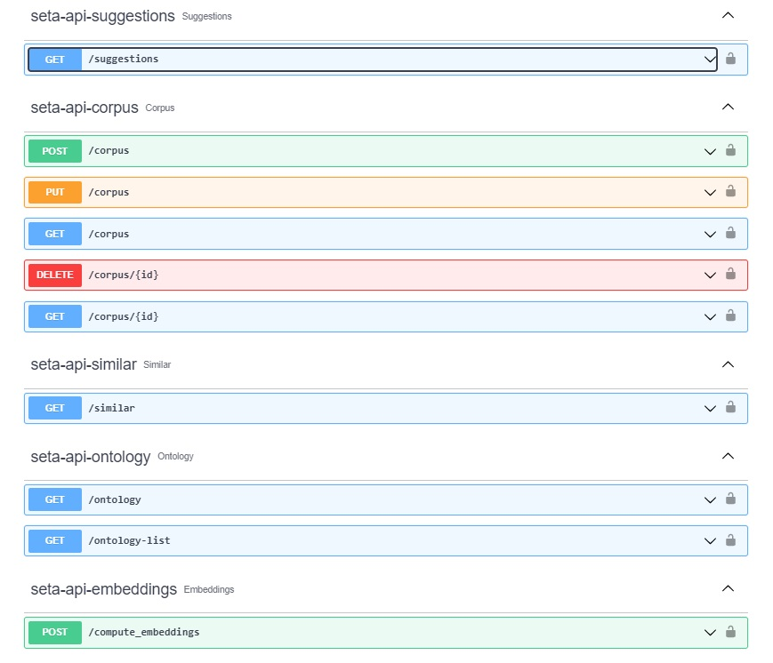

SeTA can receive various inputs through it user interface and through the API.

## User interface input

In the user interface you can input a word, a phrase, a title, a piece of text or a complete document.

## API input

In the API, the inputs can be according to the type of query needed.

