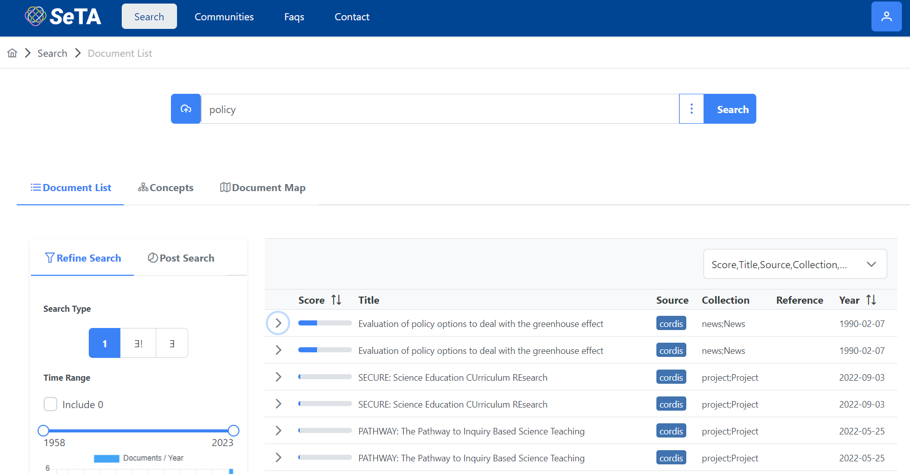
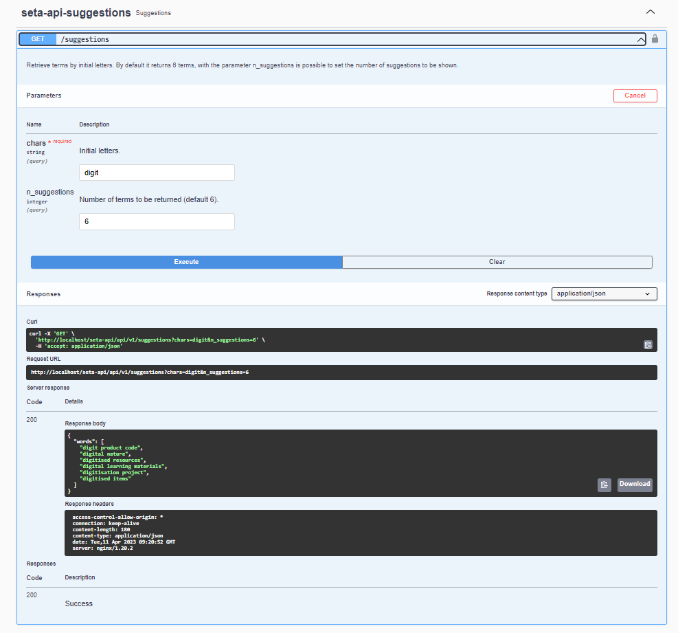

# User interface

=== "List of results"
    After click on the search button, below the search bar, you can see the list of results    :
    

=== "Details of the single result"
    If you click on a single result you can see more detailed information:
    

# API

- For the API interface, depending on the type of request: *get, post, put, delete* the various results will be described in a JSON file format. 

=== "Result after a *get* execution"
        
    

=== "Result after a *put* execution"
        
    

=== "Result after a *post* execution"
        
      

=== "Result after a *delete* execution"
        
       

