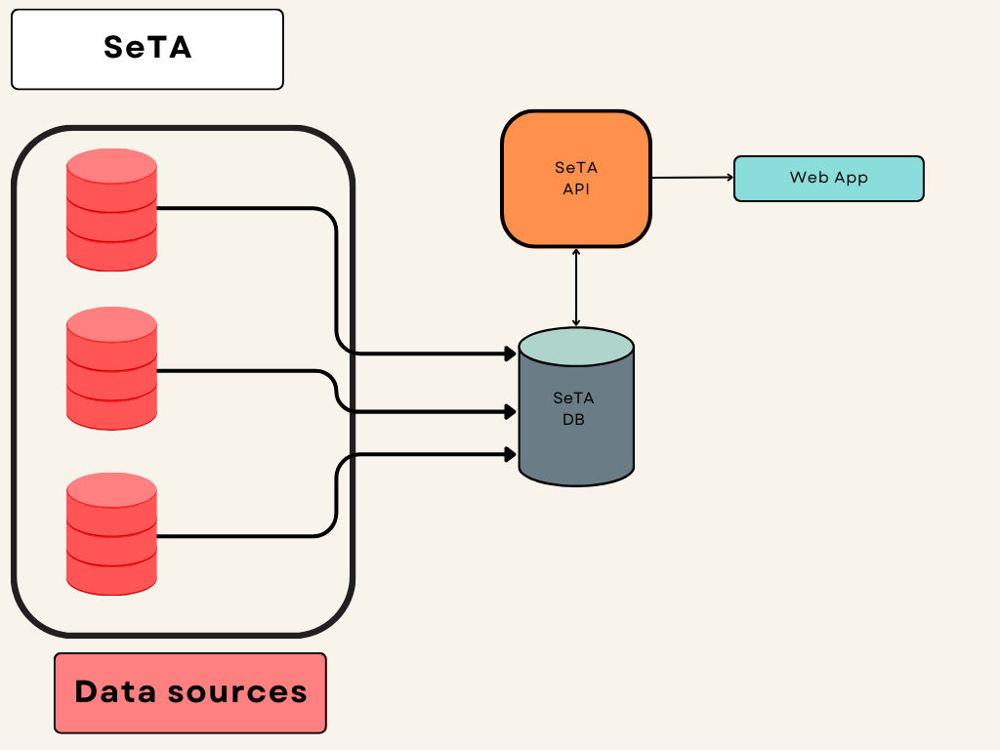

# SeTA *Semantic Text Analyser*


<iframe width='560' height='315' src='https://www.youtube.com/embed/jd6iXKr2UZg' title='YouTube video player' allow='accelerometer; autoplay; clipboard-write; encrypted-media; gyroscope; picture-in-picture; web-share' allowFullScreen> </iframe>


The European Union Bodies publish a vast amount of information which is made available by the different pubblications.
Making sense of this textual content and finding links between documents is difficult if not impossible just by having humans read it. 

The **semantic text analyzer** or **SeTA** is a software tool that accomplishes these tasks.

SeTA uses advanced text mining techniques to help users to screen and query large document collections.

Users can search EU documents based on keywords and then screen the results and apply filters all very quickly and accurately.

## How can SeTA provide all of this information to users?

First of all, data are harvested from the following sources:
<!-- 
``` mermaid
stateDiagram
    CORDIS <!-- SeTA
    PUBSY  SeTA
    EUROPARL  SeTA
    EURLex  SeTA
``` -->


These data consist of text documents and the metadata that describe them. 

SeTA then ingests the documents and cleans all of their text content.

When this is done, the documents and metadata are ready to be stored in **Elastic Search**, a special database that SeTA uses. 

### AI Models

The next step is to train AI models by using full text documents and their phrases from elastic search. This training helps the models to learn relations between the meanings of the words in the text provided. 

For instance, an algorithm called **Word2Vec** processes phrases. This algorithm takes input words and groups them together based on the similarity of their meanings. This similarity is calculated using complex mathematical formulas based on the context of the words. 

A similar algorithm, **sBERT** is based on sentences and provides further training to the model. By training the models with new documents as they are published, we can ensure that the knowledge they contain represents EU documents accurately. 

This knowledge is used to enrich document metadata by providing content driven labels and by expanding the labels based on existing ontologies.

At this point the full text of all documents can be searched through a simple interface, and users are able to target their search either to the individual document collections or to search across all collections in a harmonised way.


### API

A specific APi have been built to access this knowledge and can be used to receive suggestions of similar terms and related documents.

In the end, this API also feed the user interface providing users with the information they are looking for. 





   