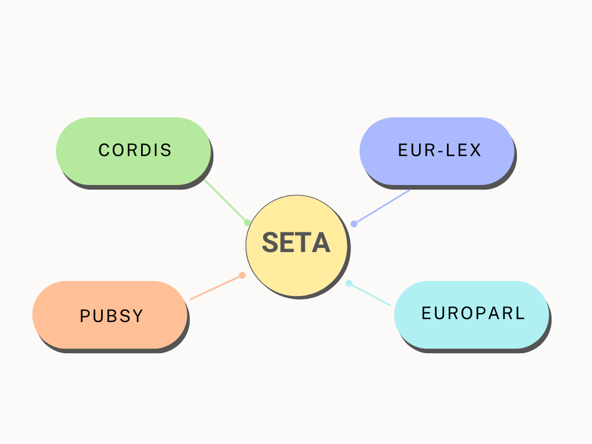

<!--  {{ customer.web }} -->

The European Union Bodies publish a vast amount of information which is made available via different channels.      
Making sense of the textual content and finding links between documents is difficult if not impossible just by having humans read it. 


The **Semantic Text Analyzer** or **SeTA** is a software tool that supports these tasks.     

SeTA uses advanced text mining techniques to help users screen and query these large document collections.   

Users can search EU documents based on keywords and then screen the results and apply filters, all very quickly and accurately.    


## How can SeTA provide all of this information to users?

First of all, data are harvested from the following sources:
<!-- 
``` mermaid
stateDiagram
    CORDIS <!-- SeTA
    PUBSY  SeTA
    EUROPARL  SeTA
    EURLex  SeTA
``` -->



- EUR-Lex is the online database of all EU legal documents, providing the official and most comprehensive access to them.      
- CORDIS contains the results from the projects funded by the EU's framework programs for research and innovation.      
- Pubsy is the publications repository of the European Commission's Joint Research Centre.     
- As a fourth main data source, SeTA covers the publications of the European Parliament.     

These data consist of text documents and the metadata that describe them.      

SeTA ingests and, after some cleaning of the text content, stores the documents and metadata in **ElasticSearch**, a special database.     


### ElasticSearch
ElasticSearch is a distributed, free and open search and analytics engine for all types of data, including textual, numerical, geospatial, structured and unstructured. ElasticSearch is built on Apache Lucene and was first released in 2010 by ElasticSearch N.V. (now known as Elastic).  Raw data flows into ElasticSearch from a variety of sources, including logs, system metrics, and web applications. Data ingestion is the process by which this raw data is parsed, normalized, and enriched before it is indexed in ElasticSearch. Once indexed in ElasticSearch, users can run complex queries against their data and use aggregations to retrieve complex summaries of their data.[^1] *(NB: clicking on a footnote takes you there and back again)*

### AI Models

An Artificial Intelligence model is a program or an algorithm that utilizes datasets to find patterns within that data. This allows the model to reach certain conclusions and make predictions when provided with the necessary information.[^2] 

The first step is to create an AI model, which uses a complex algorithm or layers of algorithms that interpret data and make decisions based on that data.[^3] 

The next step is to train the AI model by using full text documents and their phrases from ElasticSearch. This training enables the models to learn relations between the meanings of the words in the text provided. 


### Word2Vec

The algorithm **Word2Vec** processes phrases. This algorithm takes input words and groups them together based on the similarity of their meanings. This similarity is calculated using complex mathematical formulas based on the context of the words. 

Word2vec is a two-layer neural net that processes text by “vectorizing” words. Its input is a text corpus and its output is a set of vectors: feature vectors that represent words in that corpus. Word2vec creates vectors that are distributed numerical representations of word features, features such as the context of individual words. It does so without human intervention. While Word2vec is not a deep neural network, it turns text into a numerical form that deep neural networks can understand.[^4] Its output is a vocabulary in which each item has a vector attached to it, which can be fed into a deep-learning net or simply queried to detect relationships between words.

The purpose and usefulness of Word2vec is to group the vectors of similar words together in vectorspace. That is, it detects similarities mathematically. 

Given enough data, usage and contexts, Word2vec can make highly accurate guesses about a word’s meaning based on past appearances. Those guesses can be used to establish a word’s association with other words (e.g. “man” is to “boy” what “woman” is to “girl”), or cluster documents and classify them by topic. Those clusters can form the basis of search, sentiment analysis and recommendations in such diverse fields as scientific research, legal discovery, e-commerce and customer relationship management.


### sBERT

**sBert** is a modification of the standard pretrained **BERT** network..

**BERT**, which stands for *Bidirectional Encoder Representations from Transformers*, is an open source machine learning framework for natural language processing (NLP) originating from Google [https://en.wikipedia.org/wiki/BERT_(language_model)]. Is designed to help computers understand the meaning of ambiguous language in text by using surrounding text to establish context. The BERT framework was pre-trained using text from Wikipedia and can be fine-tuned with question and answer datasets.  BERTis based on Transformers[^5], a deep learning model in which every output element is connected to every input element, and the weightings between them are dynamically calculated based upon their connection. (In NLP, this process is called attention.)[^6]

**sBERT** is based on sentences and provides further training to the model, making semantic search for a large number of sentences feasible. SBERT uses a siamese architecture, where it contains two BERT architectures that are essentially identical and share the same weights, and SBERT processes two sentences as pairs during training. While the original research paper tried several pooling methods, they found mean-pooling was the best approach. Pooling is a technique for generalizing features in a network, and in this case, mean pooling works by averaging groups of features in the BERT. After the pooling is done, we now have two embeddings: one for sentence A and one for sentence B. When the model is training, SBERT concatenates the two embeddings which will then run through a softmax classifier and be trained using a softmax-loss function. At inference — or when the model actually begins predicting — the two embeddings are then compared using a cosine similarity function, which will output a similarity score for the two sentences.[^7] 

By training the models with new documents as they are published, we can ensure that the knowledge the models contain continues to represent EU documents accurately. 

This knowledge is used to enrich document metadata and by expanding the labels (the meanings or categories attached to words) based on existing ontologies.

!!! info "Ontology"
    Ontology shows properties and relations between a set of concepts and categories within a  subject area or domain. It is a branch of linguistics called semantics, the study of meaning. With ontology, a machine can accurately interpret the meaning of the word “diamond” in relation to a baseball player, jeweler, or card suit. It can also help interpret the word “chicken” as either food or an animal or differentiate between “bank” as a place of business or land alongside a river or lake.[^8]

At this point the full text of all documents can be searched through a simple interface, and users are able to target their search either to the individual document collections or to search across all collections in a harmonised way.


[^1]:https://www.elastic.co/what-is/elasticsearch
[^2]:https://plat.ai/blog/what-you-know-about-ai-model/
[^3]:https://www.intel.com/content/www/us/en/analytics/data-modeling.html
[^4]:http://wiki.pathmind.com/word2vec
[^5]:https://blogs.nvidia.com/blog/2022/03/25/what-is-a-transformer-model/
[^6]:https://www.techtarget.com/searchenterpriseai/definition/BERT-language-model
[^7]:https://towardsdatascience.com/an-intuitive-explanation-of-sentence-bert-1984d144a868
[^8]:https://www.expert.ai/blog/how_ontology_works_and_adds_value_to_nlu/
   