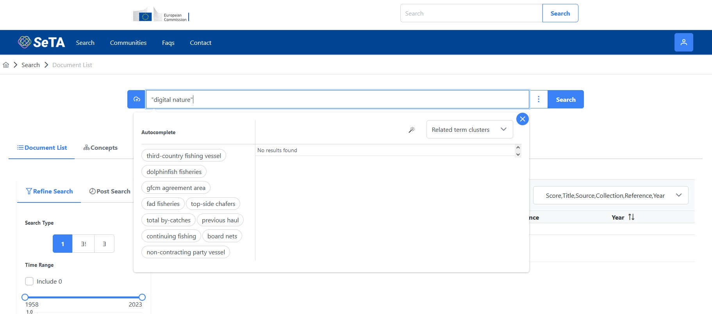

# SeTA *Semantic Text Analyser*

SeTA is a new tool that applies advanced text analysis techniques to large document collections, helping policy analysts to understand the concepts expressed in thousands of documents and to see in a visual manner the relationships between these concepts and their development over time. 



   

## General Overview 

This project is made up of two modules:

* The **frontend** 

* The **flask-server**

**Seta-frontend** is an *React* standard workspace enabled application. The frontend module contains all the static resources that make up the UI business logic. 

**Seta-middleware** is a standard {++maven-archetype-webapp++}, contains all the java sources and acts as a proxy / integration layer towards the backend. 

**Seta-flask-server** is a Flask application, contains all the python sources and acts as a proxy / authentication layer towards the backend.


All static resources that ensure from {++ng build seta-web -c=<environment>++} of the the frontend module are copied inside the flask-server **seta-ui** folder's module. 

The end result is a ***seta-flask-server*** folder that contains a Flask application that can be deployed on any web container.  

The Flask configurations files are:

 - seta-flask-server/config.py

 - seta-flask-server/.env
 
The React configuration files are:

 - package.json
 
## Prerequisites

It is necessary to download the project from the git repository

!!! info
    Use the git **clone** command to clone the project in the current directory, using an SSH link.
    ```
        git clone https://github.com/vidaud/seta.git
    ```


## Minimum requirements

* At least 10 GB available free RAM.

* 16 GR (32 GB preferred) RAM, 100 GB free space HDD or SSD (preferred).

* Good Internet speed. You will need to download at least 5GB (> 20GB for all data)

!!! warning
    The first run will take time, while the next run will be fast.


## Installation

Move to the directory of the project:

```
    # make sure that you are in the root directory of the project, use" pwd" or "cd" for windows

    cd RepoName
```

The *node_modules* directory is not a part of the cloned repository and should be downloaded using the *npm install* command to download all the direct and transitive dependencies mentioned in the package.json file:

```
    npm install
```

!!! warning
    It will take some time to download all the dependencies into the **node_modules** directory.

## Deployment procedure

### Docker composer

Move to folder **seta-compose** and follow these instructions:

```
    cd ./seta-compose
```    

Create an ***.env*** file containing the variables as described in the file  *.env.example*

The following commands will call by default the {++docker-compose.yml++} as the configuration file and *.env* as the environment file

```
    docker-compose build
    docker-compose up
```

???+ note "Notes:"
  
    It will setup all system and data.

    It will take a while depending on the Internet speed. Might take 30min to 2h.

    At some point there will be a message *"SeTA-API is up and running."*


After successfully start all the containers you are ready to open your browser and start typing:

* **for UI:** [http://localhost/seta-ui](http://localhost/seta-ui)

* **for API:** [http://localhost/seta-api/doc](http://localhost/seta-api/doc)

* **for DOCS:** [http://localhost/docs](http://localhost/docs)

#### To stop services:
```
    CTRL + C
```

#### Start in detach mode:

```
    docker-compose up -d
```

#### Stop services after detach mode

```
    docker compose down
```

#### Development environment

To deploy in the Development environment:

Create an ***.env.dev*** file containing the variables as described in  file **.env.example**

#### To (re-)build all images

```
    docker compose -f docker-compose.yml -f docker-compose-dev.yml --env-file .env.dev build
```

#### To (re-)build only seta-ui image

```
    docker compose -f docker-compose.yml -f docker-compose-dev.yml --env-file .env.dev build seta-ui
```

#### Start all services for your environment locally:

```
    docker compose -f docker-compose.yml -f docker-compose-dev.yml --env-file .env.dev up
```

#### Start all services for your environment locally in detached mode:

```
    docker compose -f docker-compose.yml -f docker-compose-dev.yml --env-file .env.dev up -d
```

#### Rebuild and restart seta-ui services while other services are runing:  

```
    docker compose -f docker-compose.yml -f docker-compose-dev.yml --env-file .env.dev up --force-recreate --build --no-deps seta-ui
```

#### Shell scripts

For the scripts with short commands: 
```
    docker compose -f docker-compose.yml -f docker-compose-dev.yml --env-file .env.dev
```

 is used a .bat file where it can be set up all the neccesary functions, as well as the set up of the proxy.  Here below the execution of this bat files in {++Windows++} and {++Linux++}.

#### Windows

Open a *cmd* window and from there go to the *seta-compose* folder, for example, if we want to run for *development* environment the build and up:

```
    dev-build.bat
    dev-up.bat
```

From now, any argument for the docker compose *build* or *up* commands will be appended in the batch scripts.

For example:

```
    dev-build.bath --no-cache
```

#### Linux

For execute permissions run:

```
    chmod +x ./dev-build.sh
    chmod +x ./dev-up.sh
```

Run for development build and up:

```
    ./dev-build.sh
    ./dev-up.sh
```

Any arguments for the docker compose *build* or *up* commands will be appended in the shell scripts.

For example:

```
    ./dev-build.sh --no-cache
```

#### Test environment

Create an ***.env.test*** file containing the variables as described in *.env.example*

```
    docker compose -f docker-compose-test.yml build
    docker compose -f docker-compose-test.yml up
```

## User's guide

+  [API](seta-api/seta_api_v1.md#seta-api-v1) 
+  [FAQs](faqs/faqs.md#faqs)
+  [License](license/license_v1.md#license)

[FAQs :octicons-question-16:](faqs/faqs.md#faqs){ .md-button .md-button--primary }

