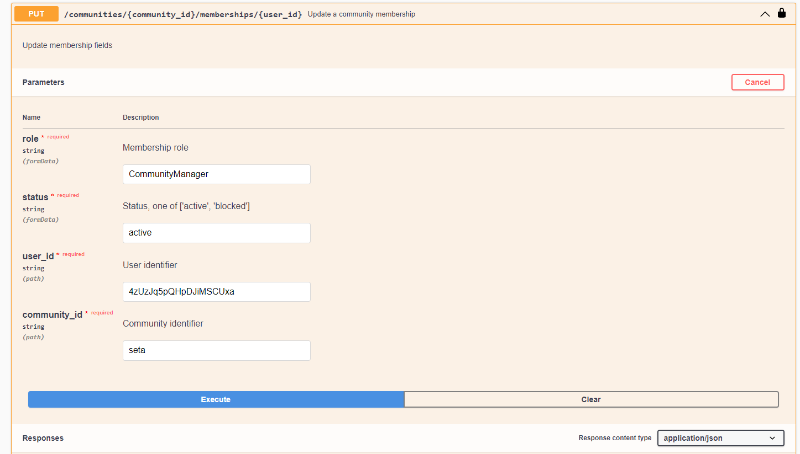
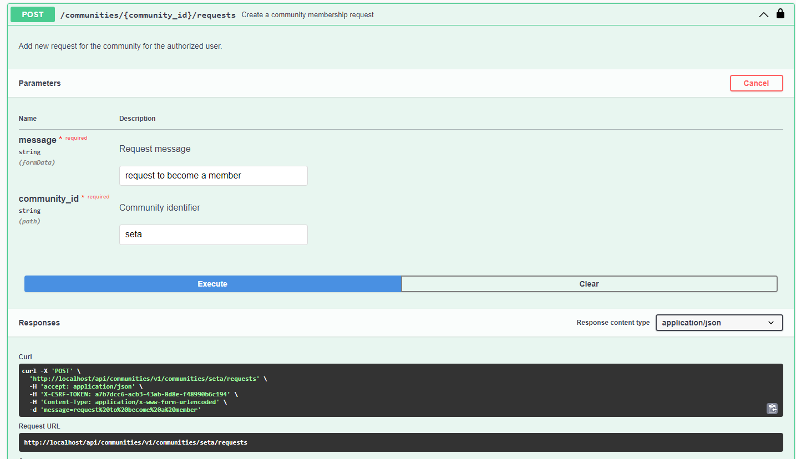
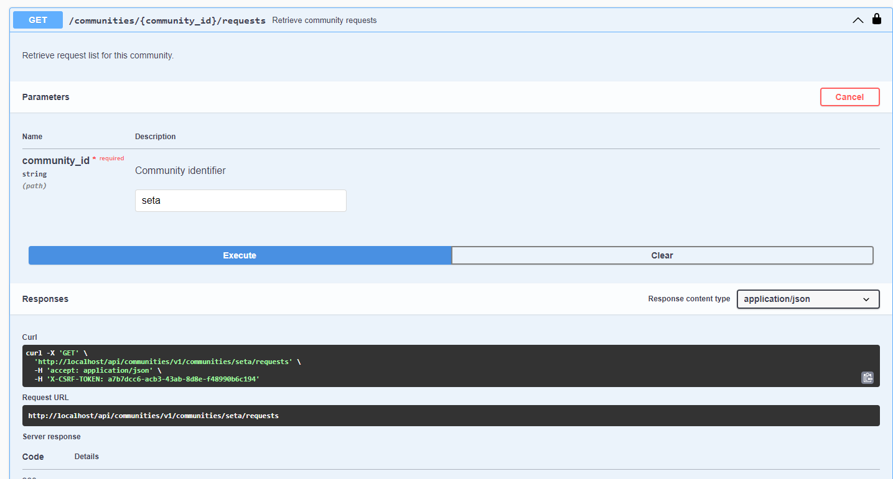
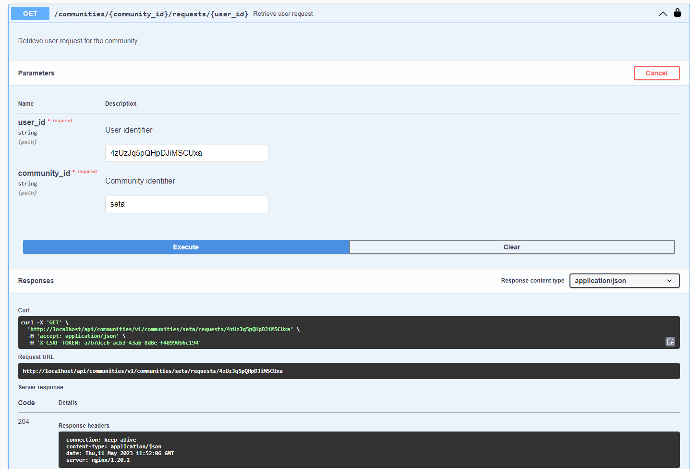
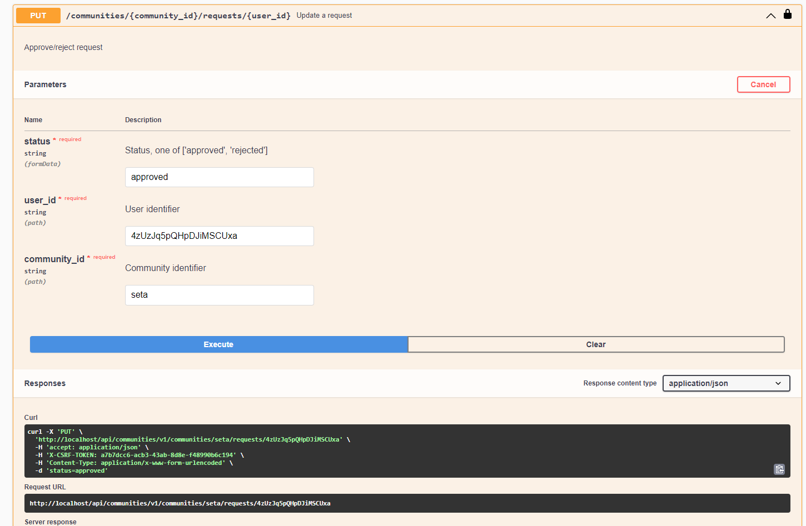
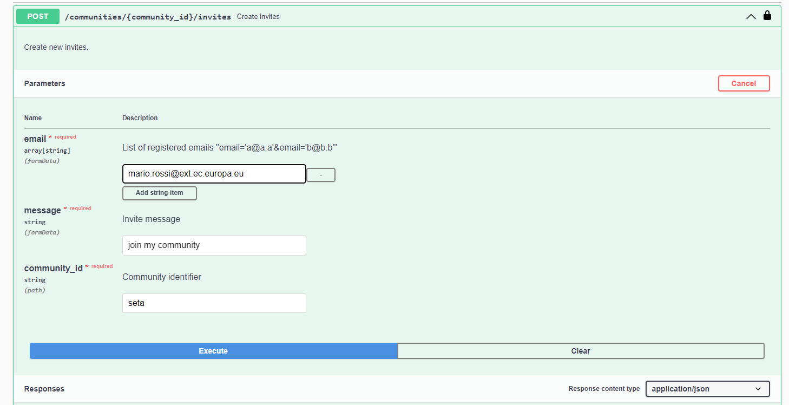
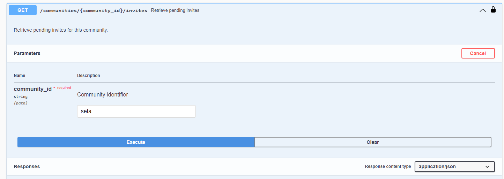

# SETA-API

The SeTA API Communities exposes the data and functionality of the management in the communities. It has various methods that can be performed on them over HTTP, like GET, POST, PUT, and DELETE. 

The main categories are:    
- Communities    
- Community Change Requests     
- Community Memberships      
- Community Invites       
- Invites
- Resources
- Resource Contributors
- Resource Change Requests
- Community User Permissions
        

 
## Communities

The Communities section is the related to the creation, retrieve, update and delete the communities.

### POST /communities

Create a new community and add this user as a member with elevated scopes.    
    
{ width="900" }
{ width="900" }

### GET /communities
Retrieve community list for this user.    

{ width="900" }

### DELETE /communities/{id}

Delete community entries.     

{ width="900" }

### GET /communities/{id}
Retrieve community, if user is a member of it.    

{ width="900" }

### PUT /communities/{id}
Update community fields.

{ width="900" }
{ width="900" }

## Community Change Requests

SETA Community Change Requests.    

### GET /communities/change-requests/pending
Retrieve pending change requests for communitites.    

{ width="900" }

### POST /communities/{community_id}/change-requests/
Add new change request for a community field.    
{ width="900" }
{ width="900" }

### GET /communities/{community_id}/change-requests/{request_id}

Retrieve change request for the community.     

{ width="900" }

### PUT /communities/{community_id}/change-requests/{request_id}

Approve/reject request    
{ width="900" }

## Community Memberships

### POST  /communities/{community_id}/memberships    
Add new member to an opened community.    

{ width="900" }

### GET /communities/{community_id}/memberships
Retrieve membership list for this community.

{ width="900" }

### DELETE /communities/{community_id}/memberships/{user_id}

Remove membership.

{ width="900" }

### GET /communities/{community_id}/memberships/{user_id}
Retrieve user membership

{ width="900" }

### PUT /communities/{community_id}/memberships/{user_id}
Update membership fields.

{ width="900" }

### POST  /communities/{community_id}/requests    
Add new request for the community for the authorized user.    

{ width="900" }

### GET /communities/{community_id}/requests
Retrieve request list for this community.

{ width="900" }

### GET /communities/{community_id}/requests/{user_id}
Retrieve user request for the community.

{ width="900" }

### PUT /communities/{community_id}/requests/{user_id}
Approve/reject request.

{ width="900" }

## Community Invites

### POST  /communities/{community_id}/invites    
Create new invites.    

{ width="900" }

### GET /communities/{community_id}/invites

Retrieve pending invites for this community.

## Invites

### POST /compute-embeddings
Given a file or a plain text, related embeddings are provided. Embeddings are built using Doc2vec. Tika is used to extract text from the provided file. If both file and text are provided, function will return text embeddings.

## Models

The models section describes the patterns that were used in the different executions of the API.

## Swagger

In the following swagger implementation it is possible to start using the API, *^^do not forget to follow the instructions in the set up page^^*:

!!swagger seta_api_v1.json!!