# SETA-API

The SeTA API Communities exposes the data and functionality of the management in the communities. It has various methods that can be performed on them over HTTP, like GET, POST, PUT, and DELETE. 

The main categories are:    
- Communities    
- Community Change Requests     
- Community Memberships      
- Community Invites       
- Invites
- Resources
- Resource Contributors
- Resource Change Requests
- Community User Permissions
        

 
## Communities

The Communities section is the related to the creation, retrieve, update and delete the communities.

### POST /communities

Create a new community and add this user as a member with elevated scopes.    
    
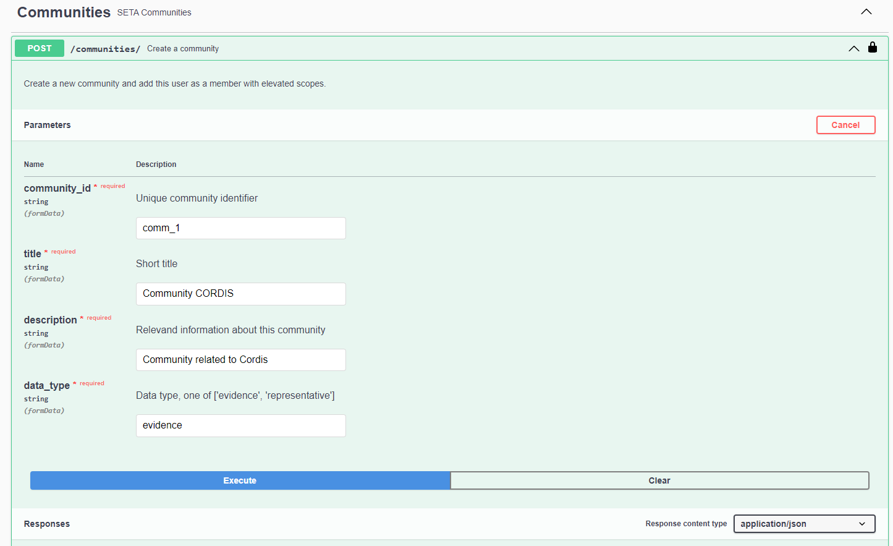

### GET /communities
Retrieve community list for this user.    

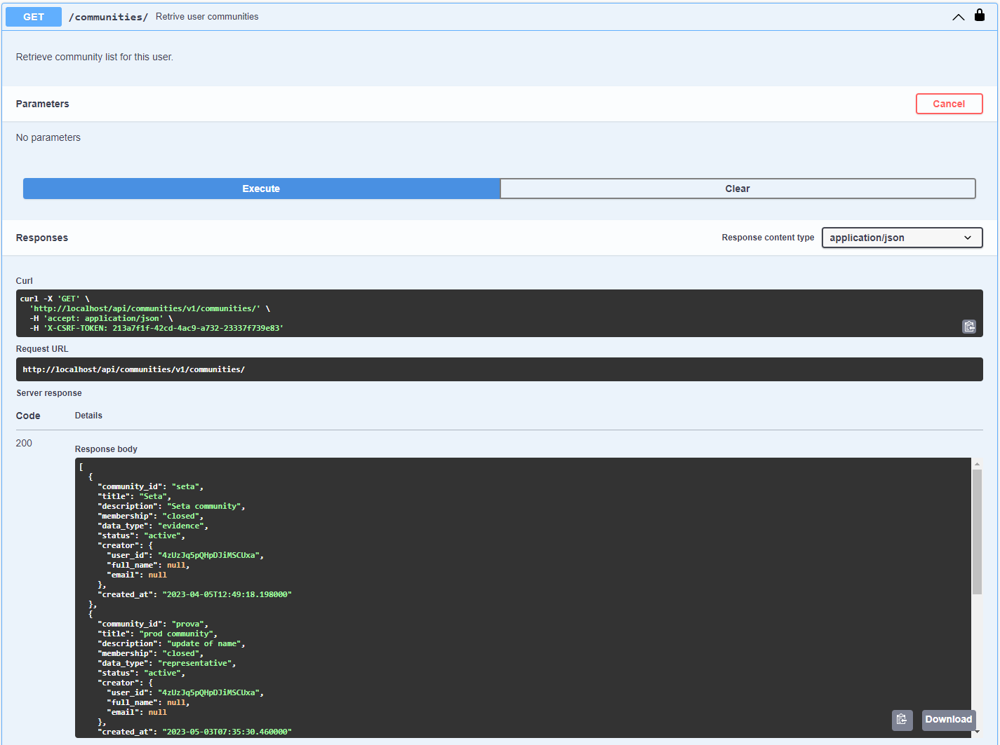

### DELETE /communities/{id}

Delete community entries.     

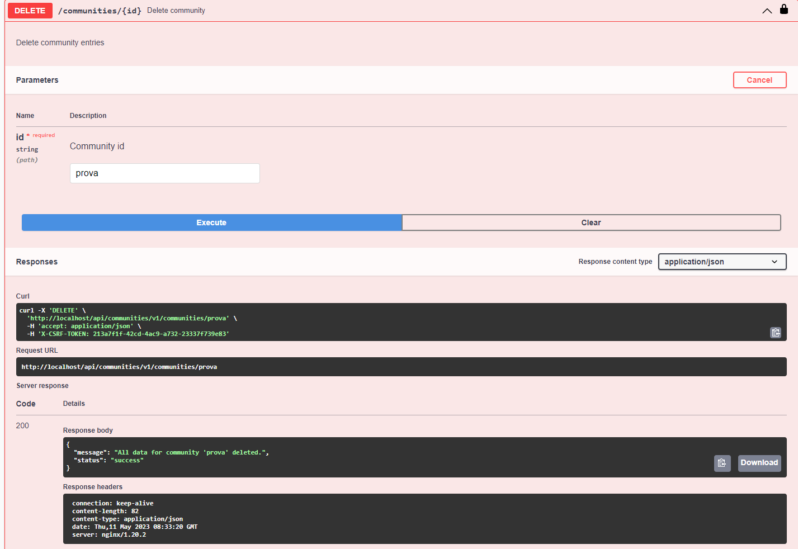

### GET /communities/{id}
Retrieve community, if user is a member of it.    

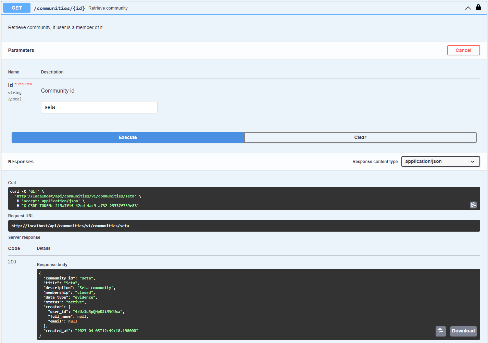

### PUT /communities/{id}
Update community fields.

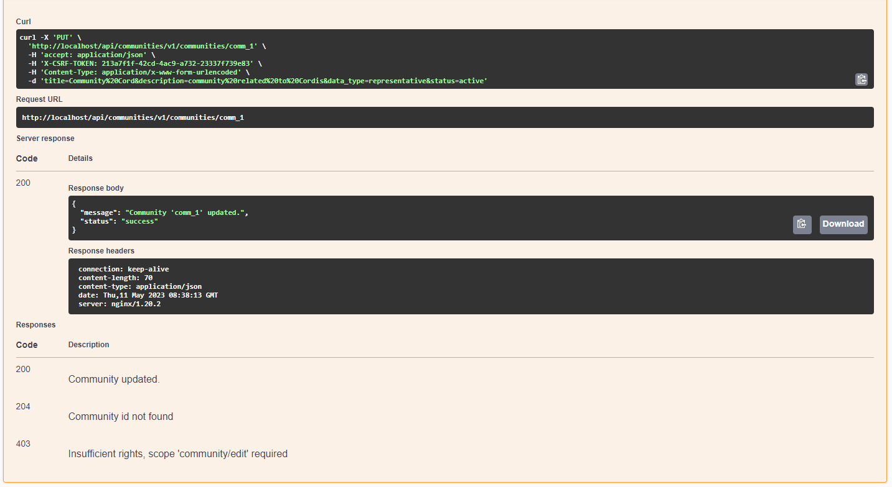

## Community Change Requests

SETA Community Change Requests.    

### GET /communities/change-requests/pending
Retrieve pending change requests for communitites.    

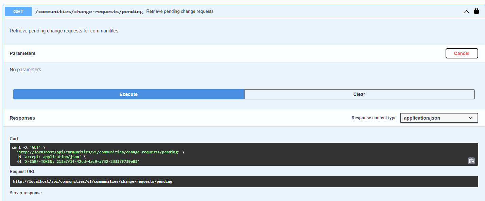

### POST /communities/{community_id}/change-requests/
Add new change request for a community field.    
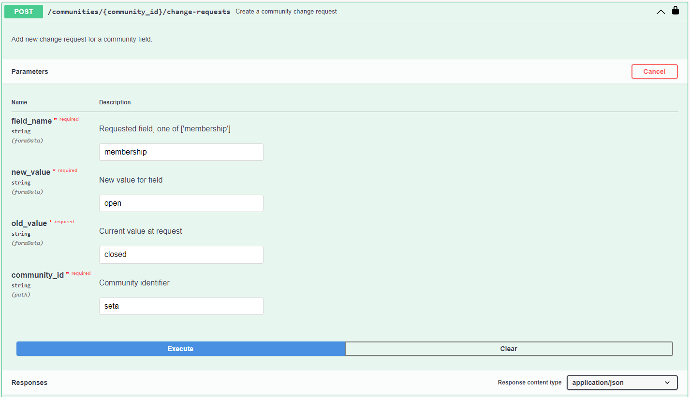
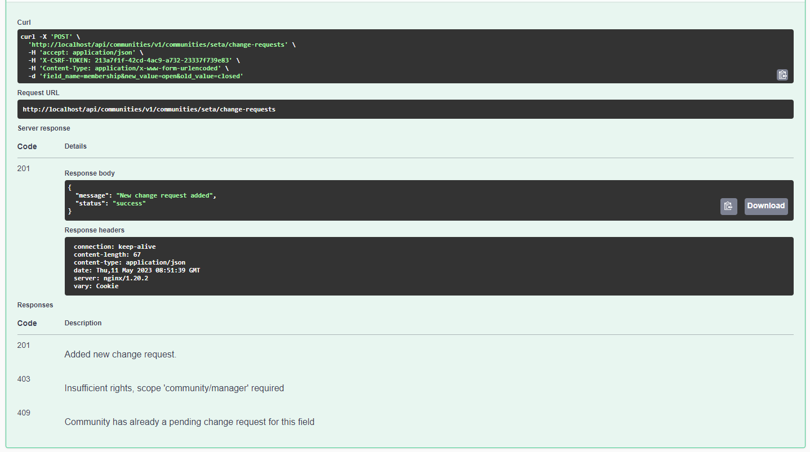

### GET /communities/{community_id}/change-requests/{request_id}

Retrieve change request for the community.     

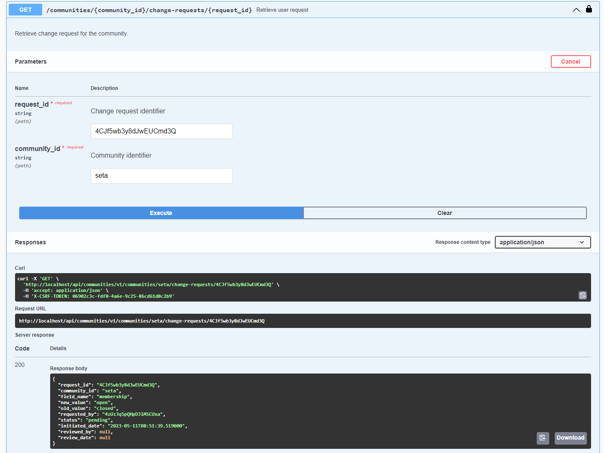

### PUT /communities/{community_id}/change-requests/{request_id}

Approve/reject request    
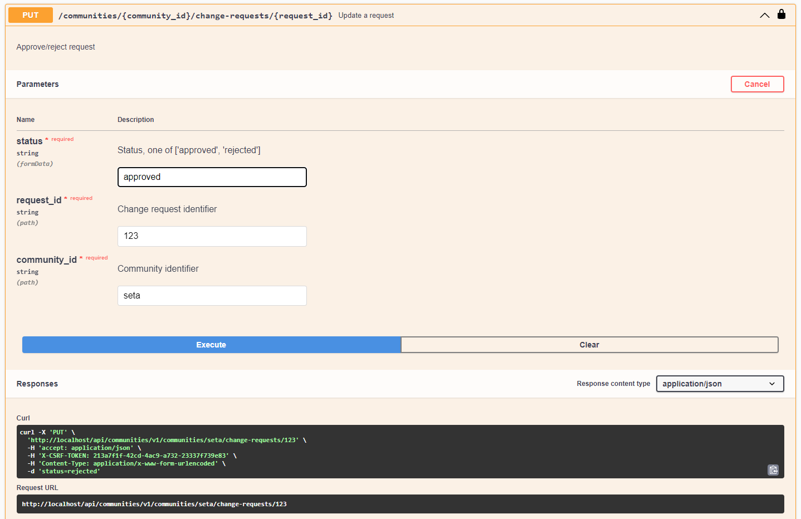

## Community Memberships

### POST  /communities/{community_id}/memberships    
Add new member to an opened community.    

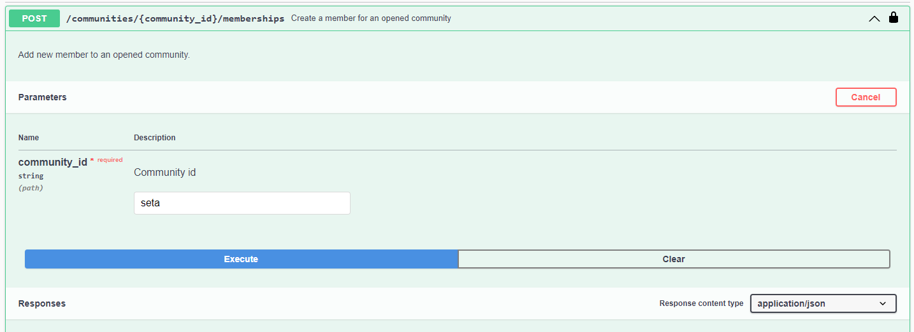

### GET /communities/{community_id}/memberships
Retrieve membership list for this community.

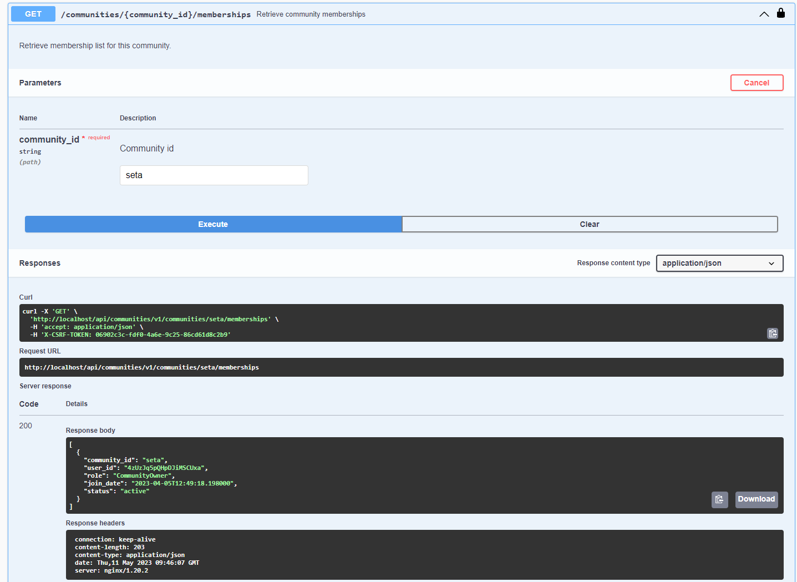

### DELETE /communities/{community_id}/memberships/{user_id}

Remove membership.

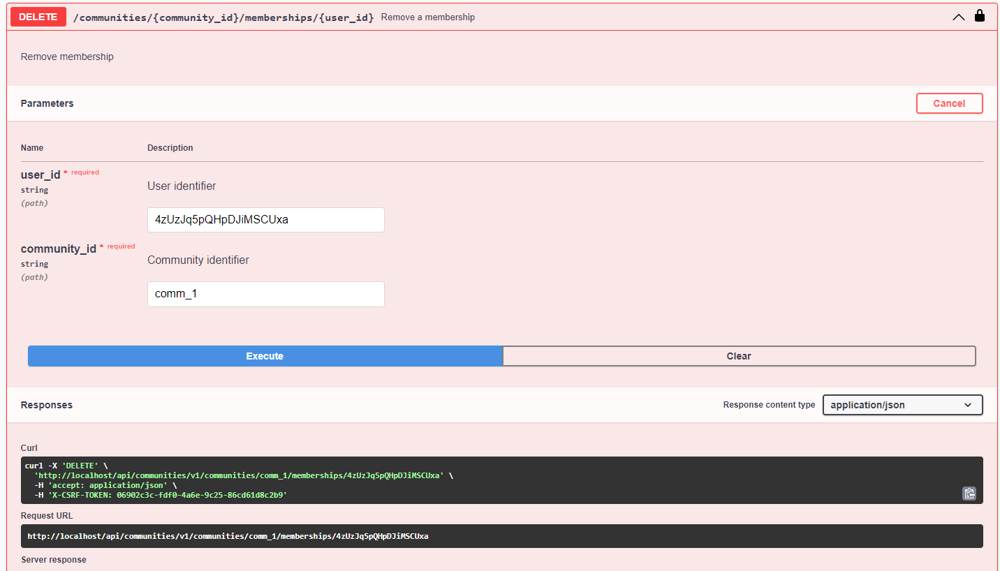

### GET /communities/{community_id}/memberships/{user_id}
Retrieve user membership

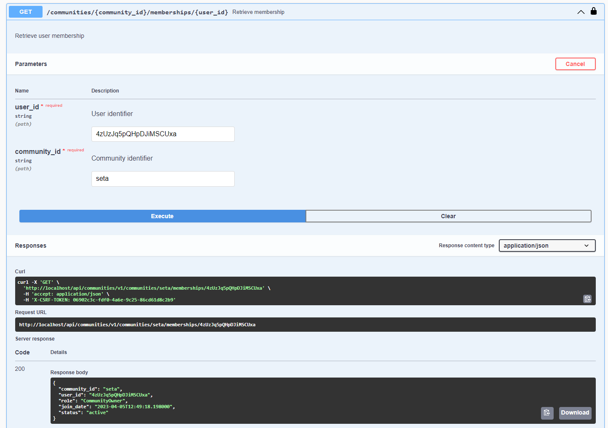

## seta-api-ontology

### GET /ontology

Return a graph that describes the ontology of the specified term. A set of nodes and relative links are provided.  For each node depth, id, size and graph size are returned, depth indicates the depth of the node in the graph, id is the identifier of the term for the node, size indicates the number of occurrences of the term in the document corpus and graph size is useful to visualize the graph.  For each link source, target and value are returned, source indicates the node (its id) from which the link starts, target is the node (its id) linked to source and value is used to visualize the graph.

### GET /ontology-list

Return a list of lists of similar terms that describes the ontology of the specified term. Lists are ranked by the relation strenght to a query term. The first node in each list is direct relation to query term. The following terms in each sublist have relation to the first node in a sublist.The result should be interpretd as follows: the first item in each sublist is first level connection to the query term. The following terms in sublists have second level relation to the main query term and direct connection to the head of sublist.

## seta-api-embeddings

### POST /compute-embeddings
Given a file or a plain text, related embeddings are provided. Embeddings are built using Doc2vec. Tika is used to extract text from the provided file. If both file and text are provided, function will return text embeddings.

## Models

The models section describes the patterns that were used in the different executions of the API.

## Swagger

In the following swagger implementation it is possible to start using the API, *^^do not forget to follow the instructions in the set up page^^*:

!!swagger seta_api_v1.json!!