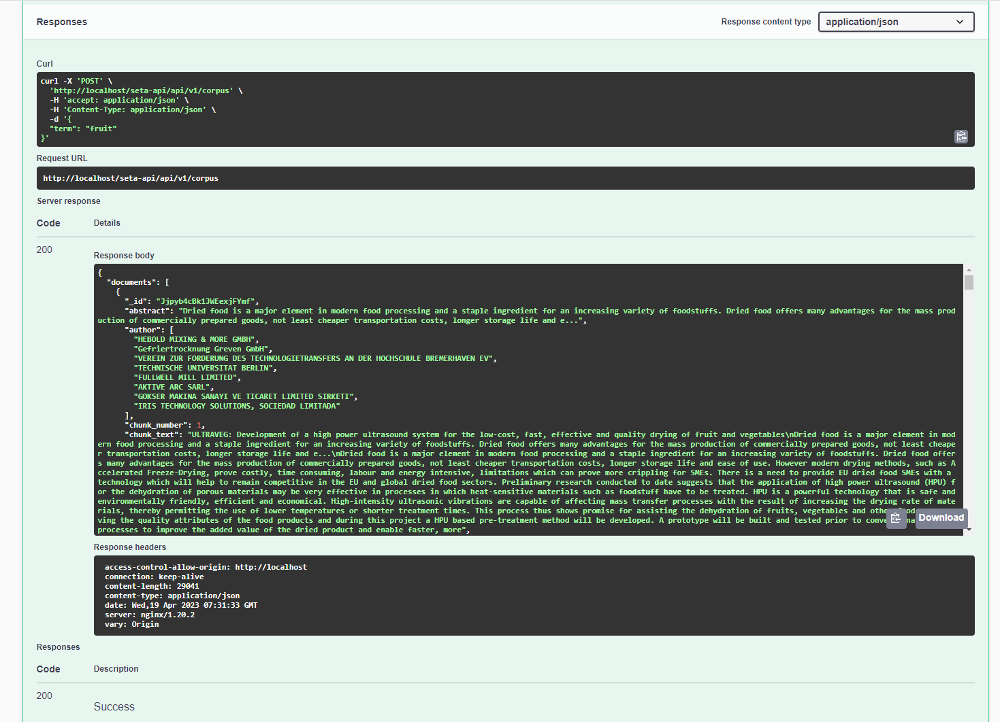
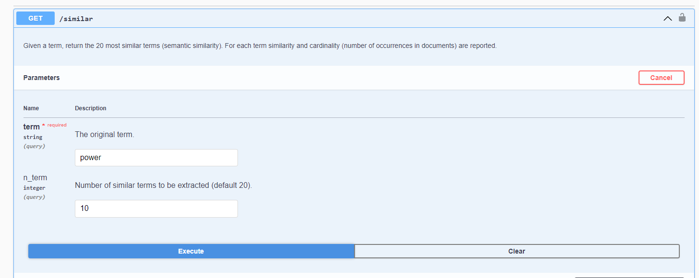
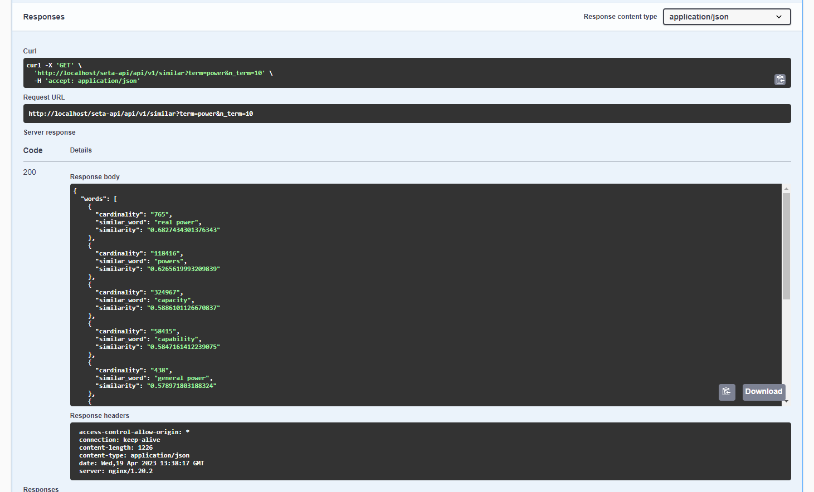
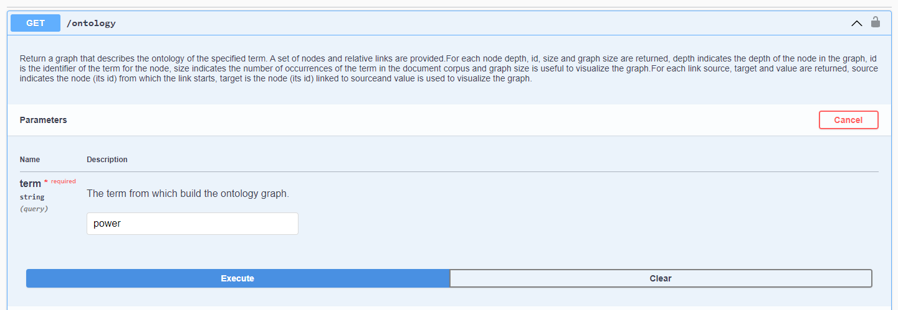
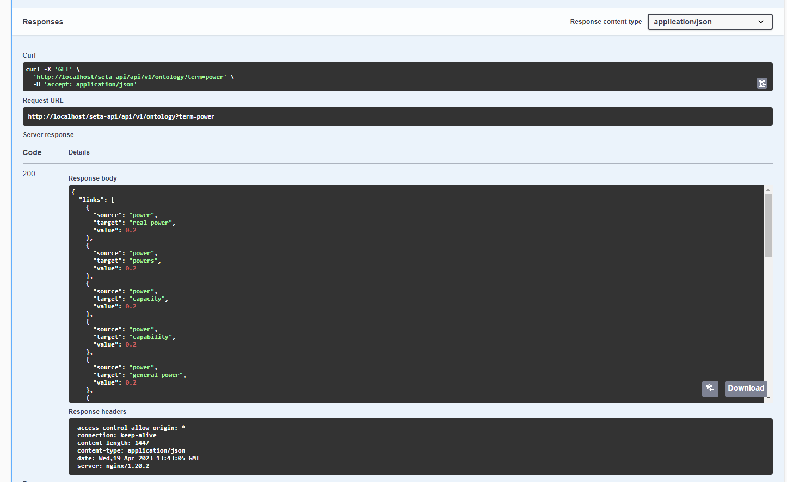
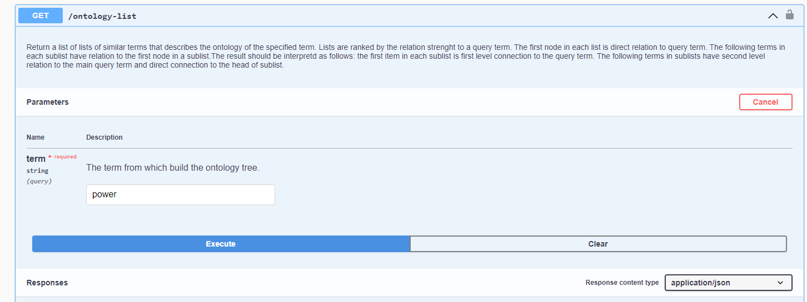
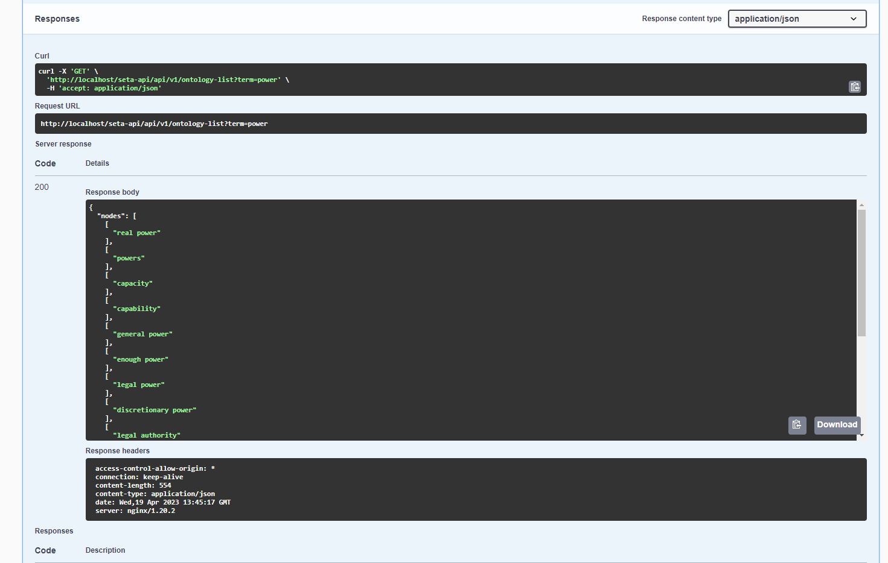
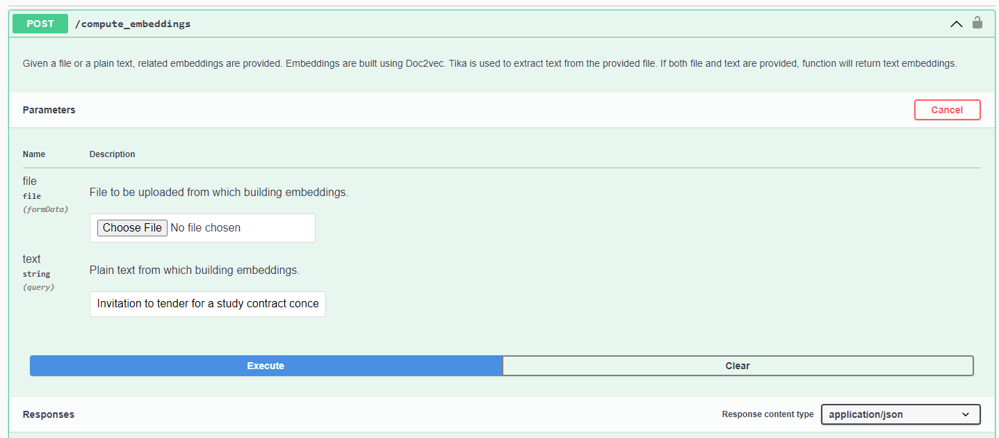
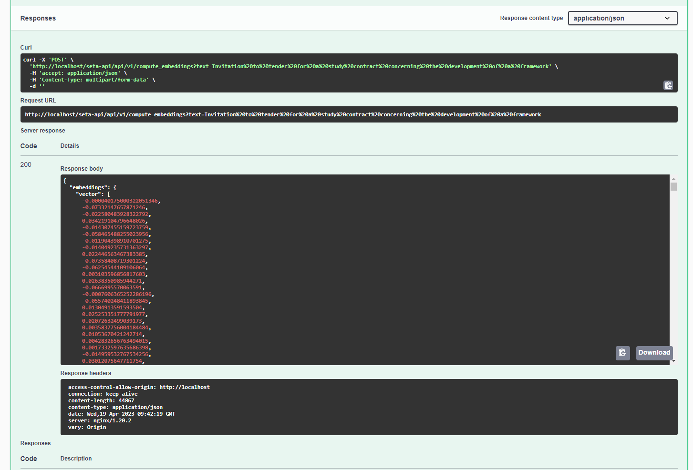
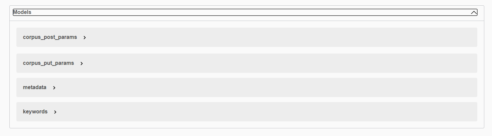

# SETA-API

The SeTA API exposes the data and functionality in a consistent JSON format. It has various methods that can be performed on them over HTTP, like GET, POST, PUT, and DELETE. Where POST is used to create resources, and PUT to update resources.

The main categories are:    
- suggestions    
- corpus     
- similar      
- ontology       
- embeddings        

 
## seta-api-suggestions

The suggestions is the related terms list that is generated after setting a term. ***In the preparation of the ***

### GET /suggestions

Retrieve terms by initial letters. By default it returns 6 terms, with the parameter *n_suggestions* is possible to set the number of suggestions to be shown.
    

## seta-api-corpus
The corpus, is a collection of text organized into json files. The SeTA API provides with the following functions to manage the corpus.

### PUT /corpus
Put a document into corpus index.

### GET /corpus
Retrieve documents related to a term from EU corpus.

### POST /corpus
Retrieve documents related to a term from EU corpus.

### GET /corpus/{id}
Given the elasticsearch unique _id, the relative document from EU corpus is shown.

### DELETE /corpus/{id}

Given the elasticsearch unique _id, the relative document is deleted.

## seta-api-similar

### GET /similar     
Given a term, return the 20 most similar terms (semantic similarity). For each term similarity and cardinality (number of occurrences in documents) are reported.

## seta-api-ontology

### GET /ontology

Return a graph that describes the ontology of the specified term. A set of nodes and relative links are provided.For each node depth, id, size and graph size are returned, depth indicates the depth of the node in the graph, id is the identifier of the term for the node, size indicates the number of occurrences of the term in the document corpus and graph size is useful to visualize the graph.For each link source, target and value are returned, source indicates the node (its id) from which the link starts, target is the node (its id) linked to source and value is used to visualize the graph.

### GET /ontology-list

Return a list of lists of similar terms that describes the ontology of the specified term. Lists are ranked by the relation strenght to a query term. The first node in each list is direct relation to query term. The following terms in each sublist have relation to the first node in a sublist.The result should be interpretd as follows: the first item in each sublist is first level connection to the query term. The following terms in sublists have second level relation to the main query term and direct connection to the head of sublist.

## seta-api-embeddings

### POST /compute-embeddings
Given a file or a plain text, related embeddings are provided. Embeddings are built using Doc2vec. Tika is used to extract text from the provided file. If both file and text are provided, function will return text embeddings.

## Models

The models section describes the patterns that were used in the different executions of the API.

In the following swagger implementation it is possible to start using the API, *^^do not forget to follow the instructions in the set up page^^*:

!!swagger seta_api_v1.json!!