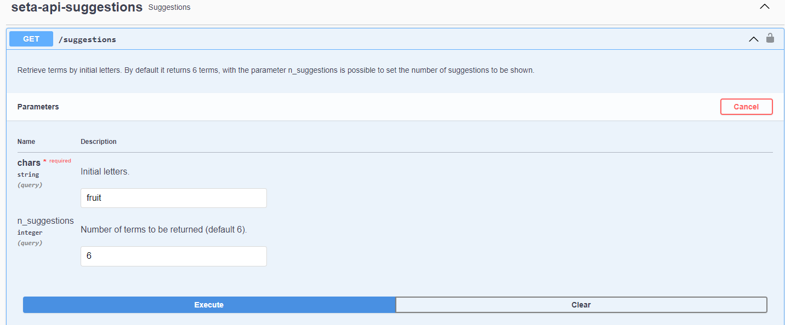
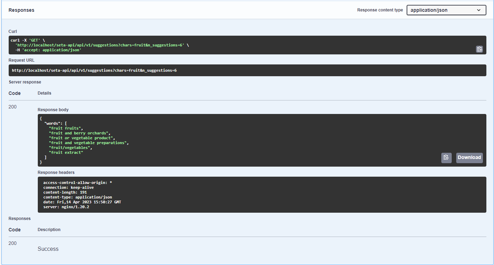
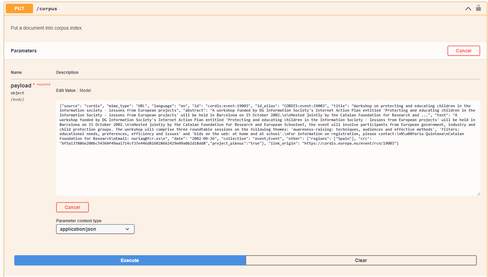
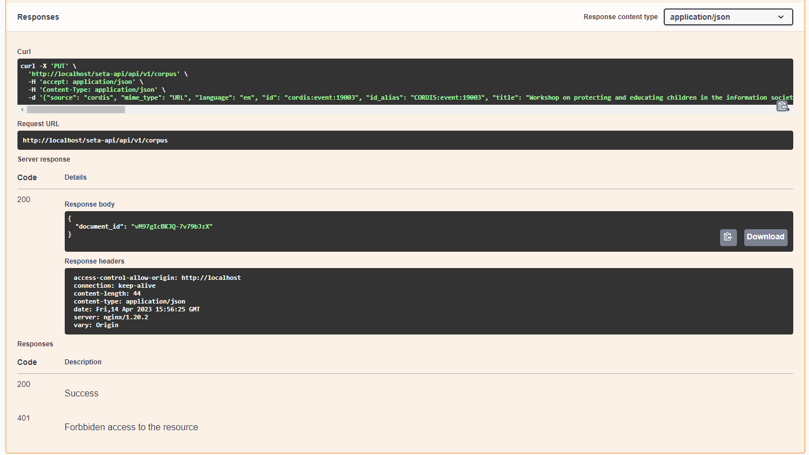
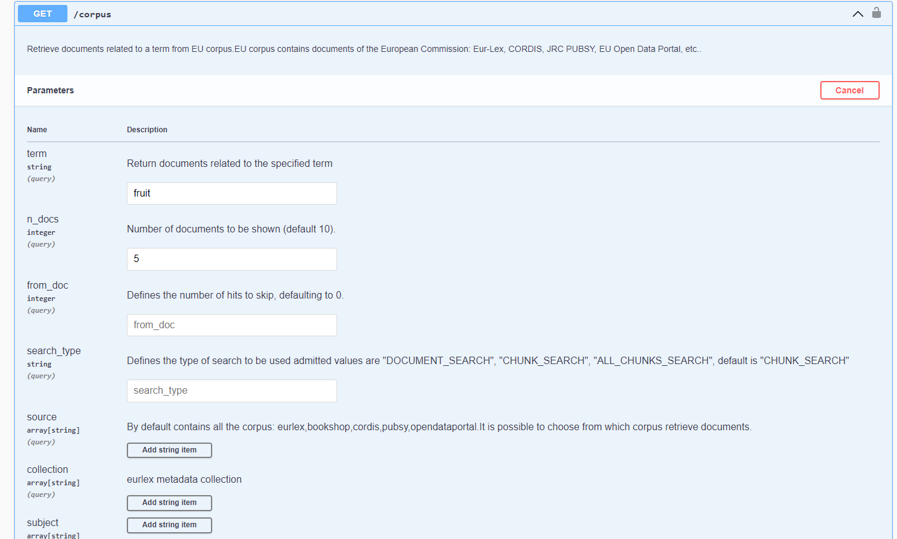
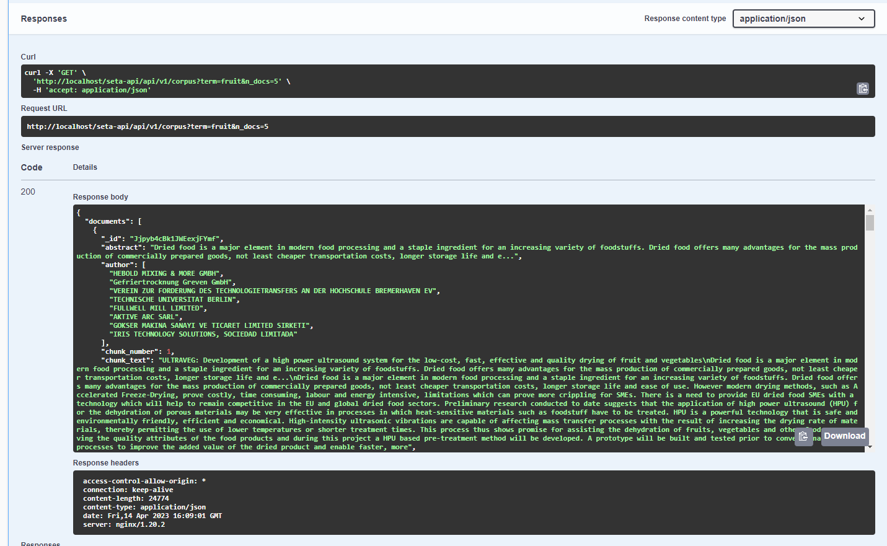
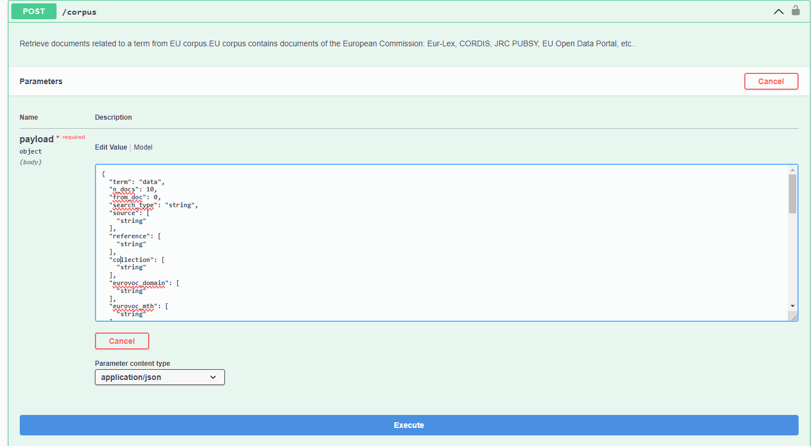
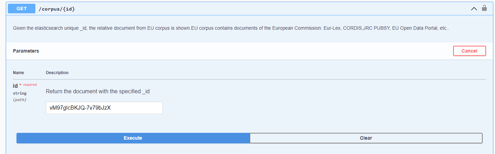
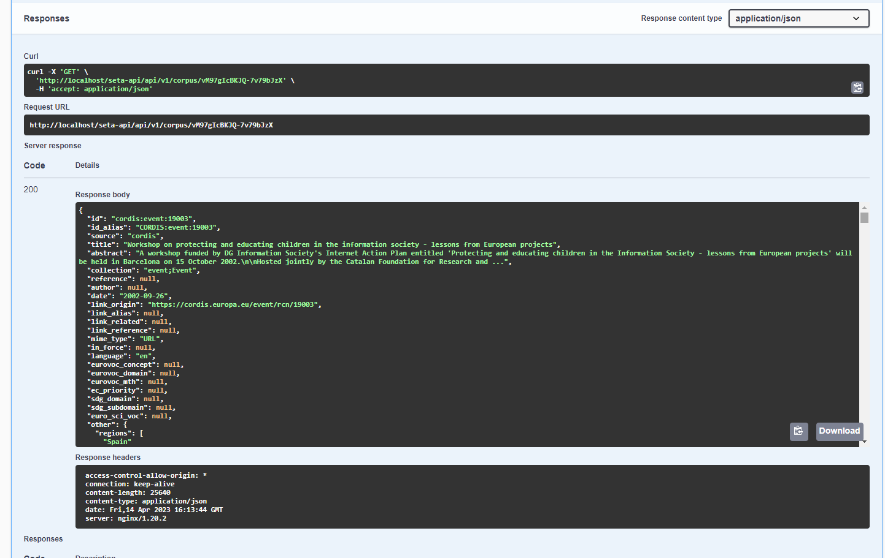
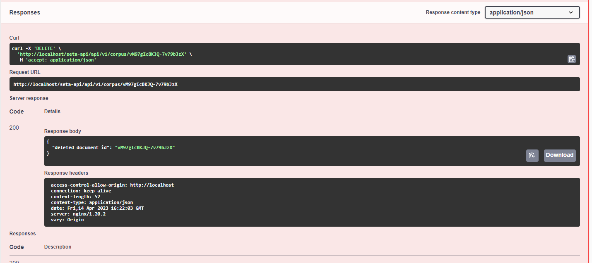

# SETA-API
The SeTA API provides functions and procedures that allow to access data and feature other services. 

## seta-api-suggestions

The suggestions is the related terms list that is generated after setting a term. 

### GET /suggestions

Retrieve terms by initial letters. By default it returns 6 terms, with the parameter *n_suggestions* is possible to set the number of suggestions to be shown.
    

## seta-api-corpus
The corpus, is a collection of text organized into json files. The SeTA API provides with the following functions to manage the corpus.

### PUT /corpus
Put a document into corpus index.

### GET /corpus
Retrieve documents related to a term from EU corpus.

### POST /corpus
Retrieve documents related to a term from EU corpus.

### GET /corpus/{id}
Given the elasticsearch unique _id, the relative document from EU corpus is shown.

### DELETE /corpus/{id}

Given the elasticsearch unique _id, the relative document is deleted.

## seta-api-similar

### GET /similar

## seta-api-ontology

### GET /ontology

### GET /ontology-list

## seta-api-embeddings

### POST /compute-embeddings

## Models

In the following swagger implementation it is possible to start using the API, *^^do not forget to follow the instructions in the set up page^^*:

!!swagger seta_api_v1.json!!