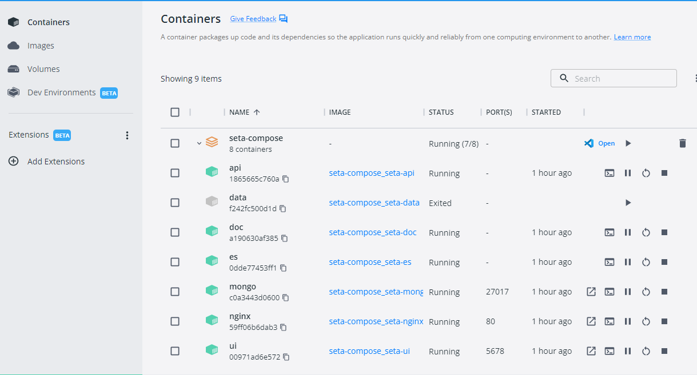

# Docker   
SeTA uses Docker, an open platform for developing, shipping, and running applications. Docker enables to separate applications from infrastructure so it is possible to deliver software quickly. By taking advantage of Docker’s methodologies for shipping, testing, and deploying code quickly, it can reduce significantly the delay between writing code and running it in production.[^1]


## Docker architecture

Docker uses a client-server architecture. The *Docker client* talks to the *Docker daemon*, which does the heavy lifting of building, running, and distributing the Docker containers. The Docker client and daemon can run on the same system, or connect a Docker client to a remote Docker daemon. The Docker client and daemon communicate using a REST API, over UNIX sockets or a network interface. Another Docker client is *Docker Compose*, that allows to work with applications consisting of a set of containers.  The Docker daemon (dockerd) listens for Docker API requests and manages Docker objects such as images, containers, networks, and volumes.      

## Docker Desktop

Docker Desktop is an easy-to-install application for the user environment that enables to build and share containerized applications and microservices. Docker Desktop includes the Docker daemon (dockerd), the Docker client (docker), Docker Compose, Docker Content Trust, Kubernetes, and Credential Helper.[^2].


## SeTA Docker architecture

The SeTA project has been designed with folder **seta-compose** as the configuration source. 

### Configuration files
Inside this folder we can find:

File **common.yml** to set up of all the services:

```
    services:
        mongo:
            restart: always
            build:
            context: ../seta-mongo
            args:
                - HTTP_PROXY=${HTTP_PROXY}
                - HTTPS_PROXY=${HTTPS_PROXY}
            expose:
            - "27017"
            environment:
            - NO_PROXY=${NO_PROXY}
            - no_proxy=${NO_PROXY}

        es:
            restart: always
            build:
            context: ../seta-es
            args:
                - HTTP_PROXY=${HTTP_PROXY}
                - HTTPS_PROXY=${HTTPS_PROXY}
            expose:
            - "9200"
            - "9300"
            mem_limit: "4g"
    
    cont...
```

File **docker-compose.yml** with the base configuration and with reference to file *common.yml*:

```
    version: "3.8"
    services:
    seta-mongo:
        container_name: mongo
        extends:
        file: common.yml
        service: mongo
        networks:
        - seta-network
        volumes:
        - seta-mongo:/data/db

    cont...
```
### Containers
For SeTA we are using two types of containers:     

- **Stateless Containers**: These types of containers do not persist data, i.e., their data is deleted as soon as they are stopped.    In SeTA the containers of this type are:    

    a) **seta-api**: service that communicates with the docker client in order to elaborate the queries to the Elasticsearch  engine that come from the web app.   It includes the functions by which this raw data is parsed, normalized, and enriched before it is indexed in Elasticsearch .   The process of index in Elasticsearch  is also included in this container. 

    b) **seta-auth**: it hosts the web service for authentication for register users. Also, for the external as well internal applications. This service is intended for the communication from the web service that has authorization through a public driver key defined by register users and also a second part used for internal communication.                   

    c)  **seta-doc**: contains the documentation files, is not a dynamic container.                   

    d) **seta-es**: contains the image where the Elasticsearch  engine is stored.  The Elasticsearch  engine is fast, and with its logic of placing documents distributed across different containers, it provides redundant copies of the data in case of hardware failure. It has a number of powerful built-in features that make storing and searching data even more efficient, such as data rollups and index lifecycle management.

    e) **seta-nginx**: contains the proxy server configurations for all the endpoints to be reachable outside, in particular for web services.

    f) **seta-ui**: contains the configuration that enables the access to the web app. In this folder the code to support the seta-api container and the code to support the seta-api to validate the authentication token are included.

    g) **seta-react**: contains the react code of the web app interface.

- **Stateful Containers**: These types of containers persist data and are typically used to run stateful applications such as databases, message queues, and file servers. The data stored inside the container is persistent even if the container is stopped or recreated.  In SeTA the containers are:    

    a) **seta-data**: this container functions mainly to populate de Elasticsearch  database. If the database is empty at the beginning, it will fill the Elasticsearch  database.

    b) **seta-mongo**: contains the operational databases for SETA web services and web application, and also includes users management, datasource management and other operational data.


## SETA Docker desktop

The docker desktop in SeTA displays the containers mentioned above. Please note that the displayed names are just labels, for the deployment we use the services names as per file **common.yml**:  

<figure markdown>
{ width="900" }
<figcaption>SeTA Docker desktop</figcaption>
</figure>


[^1]: https://docs.docker.com/get-started/overview/
[^2]: https://docs.docker.com/desktop/