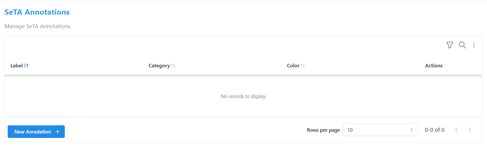
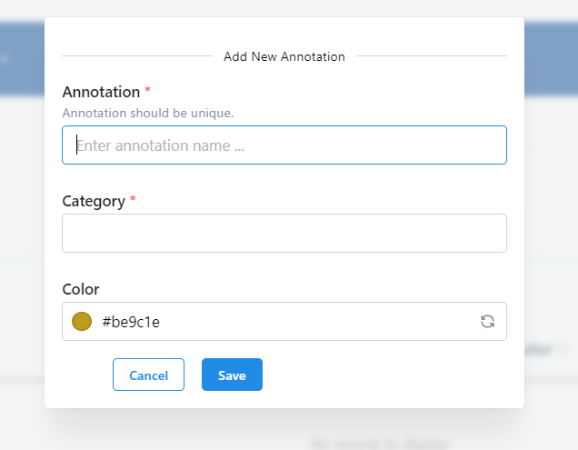
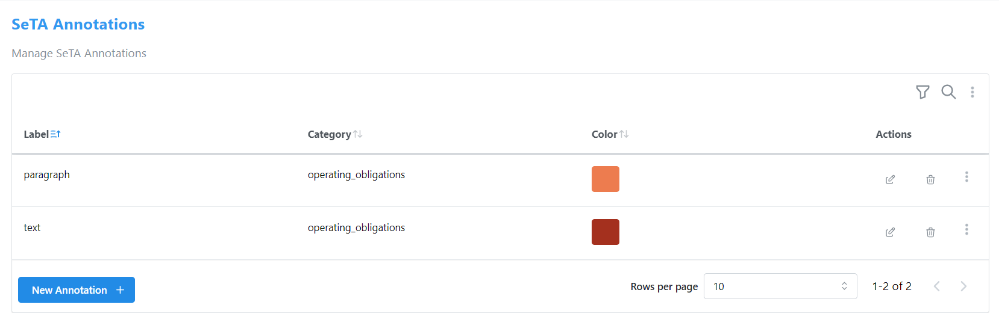
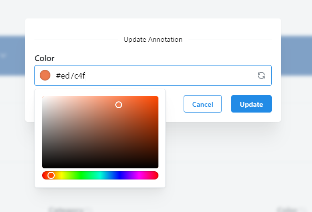
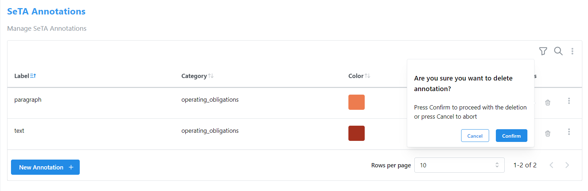
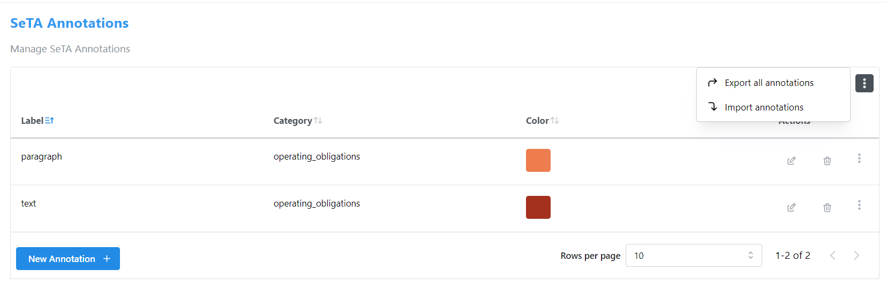
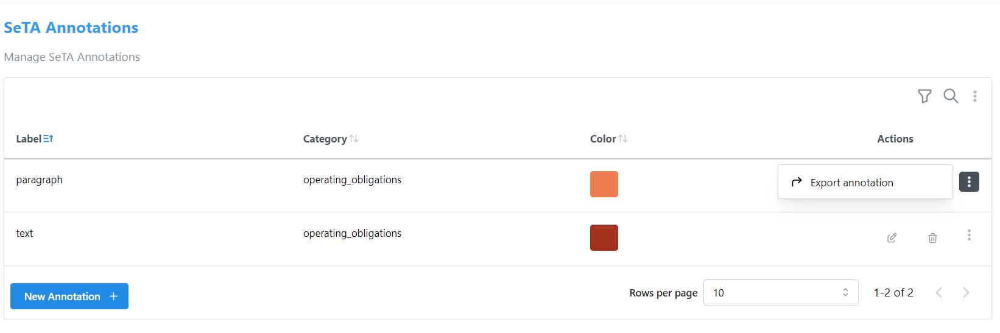
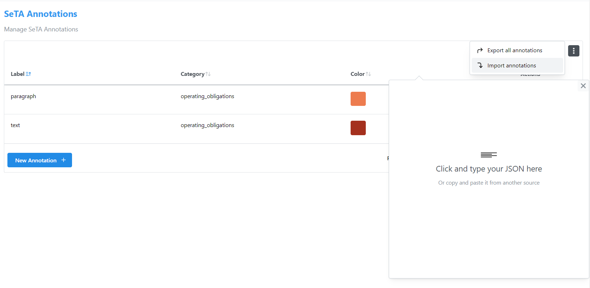
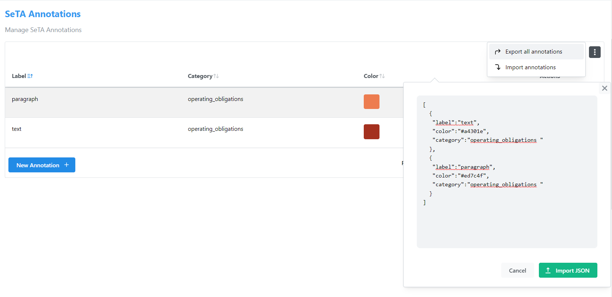

# SeTA Annotations

In SeTA, Annotations refer to additional information, comments, or metadata attached to specific documents, or content within the application. In various contexts, annotations serve to provide context, clarification, references or additional insights related to the primary information.

Initially, you don't have any annotation associated to your data. The list of annotations in the dedicated page will be empty.

!!! note
    This page is exclusive to administrators or privileged users. Regular users do not have access to it.

<figure markdown>
  
  <figcaption>Annotations page</figcaption>
</figure>

## Create Annotation

1. From the list click on bottom button ^^New Annotation +^^.  
2. Enter the Annotation name, Category and Color.  
4. Click **Save** to retain the stored annotation or **Cancel** to discard any changes made. 

<figure markdown>
  
  <figcaption>Create Annotation</figcaption>
</figure>

Once you've saved the annotation, the list will display as follows:

<figure markdown>
  
  <figcaption>Updated Annotation list</figcaption>
</figure>

## Update Annotation
1. From the list click the option :octicons-pencil-24: on actions column of the annotation.  
2. Choose application Color from the color panel or get a random color by clicking the refresh icon on the right side of the field.  
3. Click **Update** to save changes or **Cancel** to discard any changes made. 

<figure markdown>
  
  <figcaption>Update Annotation</figcaption>
</figure>

## Delete Annotation
1. From the list click the option :octicons-trash-24: on actions column of the annotation.  
2. A confirmation popup will appear.  
3. Press **Confirm** to proceed with the deletion or press **Cancel** to abort.

<figure markdown>
  
  <figcaption>Delete Annotation</figcaption>
</figure>

## Export Annotation / Annotations
For each annotation, alongside update and delete actions, there's an additional option :material-dots-vertical: that displays further actions.
Currently, the only available option is :material-arrow-right-top: Export Annotation. 
However, there's also a button located on the top right of the list like: :material-filter-outline: :material-magnify: :material-dots-vertical: .

In both cases, clicking on this icon :material-dots-vertical: provides the option to export annotations. The distinction lies in that clicking the one positioned at the top right of the list enables exporting all available annotations, whereas the other allows exporting only a single annotation at a time.

**Case A**:

1. Click :material-dots-vertical: positioned at the top right of the list.  
2. An action list popup will appear with two buttons: :material-arrow-right-top: Export Annotations and :material-arrow-down-right: Import Annotations.  
3. Press **:material-arrow-right-top: Export Annotations** to export all the annotations listed.
4. A file annotations*.json will be downloaded.

<figure markdown>
  
  <figcaption>Export All Annotations</figcaption>
</figure>

**Case B**:

1. Click :material-dots-vertical: positioned on one of the items of the list.  
2. An action list popup will appear with :material-arrow-right-top: Export Annotation button.
3. Press **:material-arrow-right-top: Export Annotation** to export that specific annotation.
4. A file annotation-name*.json will be downloaded.

<figure markdown>
  
  <figcaption>Export Annotation</figcaption>
</figure>

## Import Annotations
1. Click :material-dots-vertical: positioned at the top right of the list. 
2. An action list popup will appear with two buttons: :material-arrow-right-top: Export Annotations and :material-arrow-down-right: Import Annotations.  
3. A popup with message: "Click and type your JSON here appears".
4. Start typing or paste you json inside :material-code-brackets:.
5. Press **:material-arrow-up: Import JSON** to proceed with importing annotations or press **Cancel** to abort.

<figure markdown>
  
  <figcaption>Import Annotations</figcaption>
</figure>

<figure markdown>
  
  <figcaption>Import Annotations Example</figcaption>
</figure>
