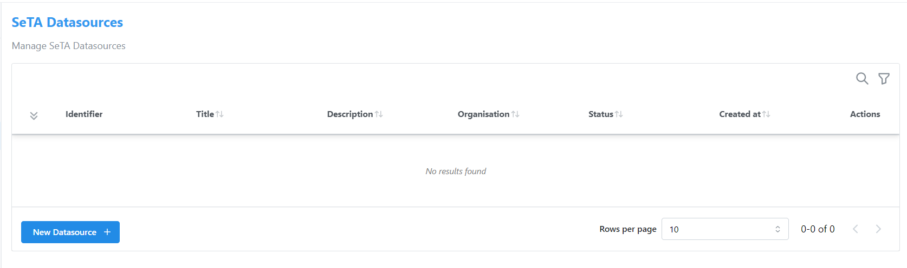
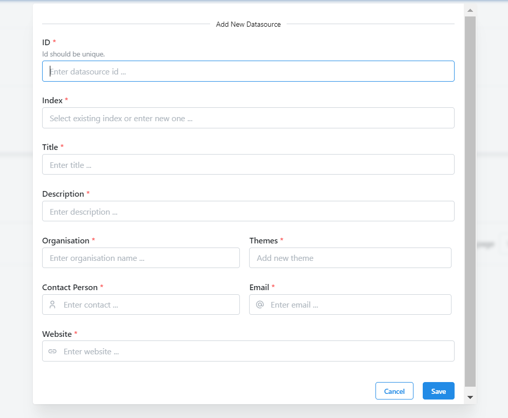
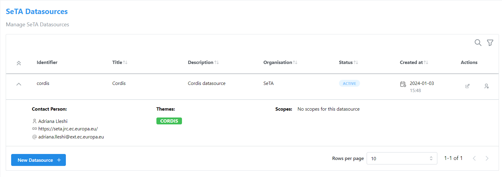
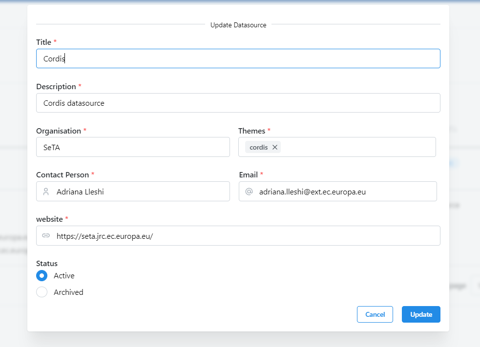
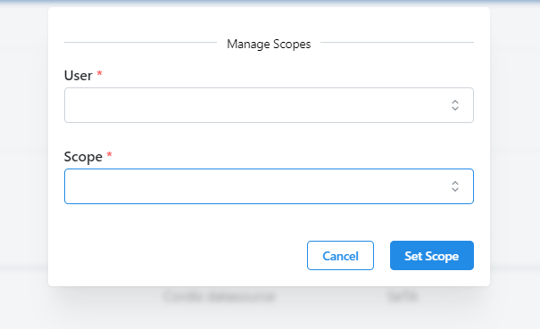

# SeTA Datasources
Initially, you don't have any datasource listed. The list of datasources in the dedicated page will be empty. A new datasource can be created or assigned under your administrations by its owner.

!!! note
    This page is exclusive to administrators or privileged users. Regular users do not have access to it.

<figure markdown>
  
  <figcaption>Datasources</figcaption>
</figure>

## Create a Datasource in SeTA administration panel
         
1. Click on bottom button of the list ^^New Datasource +^^.     
2. In the opened modal, setup the *ID, Index, Title, Description, Organisation, Themes, Contact Person, Email, Website*.
3. Click *Save*

<figure markdown>
  
  <figcaption>New Datasource</figcaption>
</figure>

Once you've saved the datasource, the list will display as follows:

<figure markdown>
  
  <figcaption>Updated Datasource list</figcaption>
</figure>

## Update Datasource
1. From the list click the option :octicons-pencil-24: on actions column of the datasource.  
2. In the pop-up window, you can update the *Title*, *Description*, *Organisation*, *Themes*, *Contact Person*, *Email*, *Website* and *Status*.   
3. Click **Update** to save changes or **Cancel** to discard any changes made. 

<figure markdown>
  
  <figcaption>Update Datasource</figcaption>
</figure>

## Manage Scopes
1. From the list click the option :material-account-badge-outline: on actions column of the datasource.  
2. In the pop-up window, you can select the *User*, and assign any *Scopes*.   
3. Click **Set Scope** to save changes or **Cancel** to discard any changes made. 

<figure markdown>
  
  <figcaption>Manage Scopes of Datasource</figcaption>
</figure>