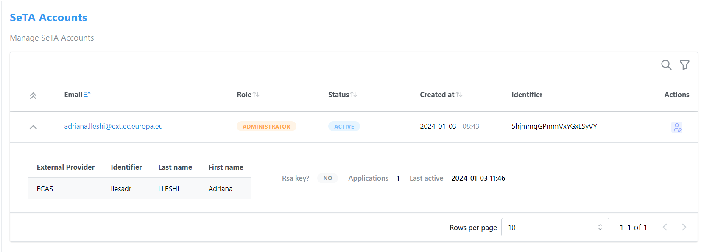

# SeTA Accounts
In this page, administrators or privileged users oversee and regulate user-related settings and permissions within a system or application.

This page serves as a control center for user-related management tasks, empowering administrators to efficiently oversee, modify, and maintain user accounts and their associated settings.

!!! note
    This page is exclusive to administrators or privileged users. Regular users do not have access to it.

Key features typically found on this page include:

1. User Listing: A comprehensive list of registered users, often including their basic information such as usernames, email addresses, roles, status and access levels.

2. Expanded User Profile View: Showcasing external provider details, RSA key presence, and active applications for each user.

3. User Role Assignment: Options to assign or modify user roles and permissions, granting or restricting access to specific features or functionalities.

4. Account Suspension or Deletion: Tools to delete, or disable user accounts based on requirements, ensuring streamlined management of active accounts.

<figure markdown>
  
  <figcaption>Manage Accounts</figcaption>
</figure>