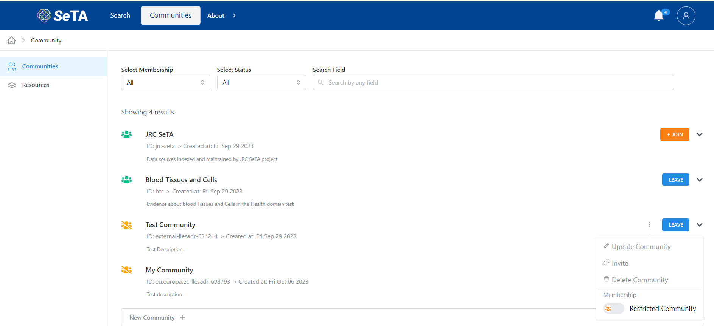

# SeTA Communities
The communities of the SeTA software application are a shared space where members engage with another to connect and learn about similar interests, opinions of different type of publications. 

In the SeTA web application, we have two types of communities: public communities and private communities.   

* **Public Community**:  Anyone with access to the web Application can view all discussion forums and information in the online Community. Anyone can join the Community and contribute to the Community.   

* **Private Community**:  The information and conversations can only be accessed by users with log-ins(often sent via invitation to a specific user). All users are forced to ask for authorization to join and then been able to see content and conversations. In this type of communities, the administrators have the ability to deny access to users who don't fit membership credentials.

## Discover Communities

On the main page of the Communities, it is possible to see the list of the Communities.

From this page it is possible to access to:

- Communities *(List of available Communities)*        
- Resources *(The Resources related to those communities)*        

<figure markdown>
  
  <figcaption>Communities page</figcaption>
</figure>

## List of Communities

1. You will see a list of the Communities in the page.   
2. You can filter by the different types display on top of the page: *Select Membership, Select Status* and search by *Field*.                  
<figure markdown>
  
  <figcaption>Communities</figcaption>
</figure>

   
## Create a Community
                     
1. From the main panel click on the top right bottom ^^New Community^^.  
3. Enter the Community id, Title and Description.  
4. Click Save.         

<figure markdown>
  
  <figcaption>New Community</figcaption>
</figure>

## Details of a Community                
                        
1. You can either enter in the search bar the name of the Community you are looking for or select from the Community list.  
2. Click on :octicons-chevron-down-12: at the right side of the Community row.  
3. If you are a member or the community, a detailed section will appear.  
4. If you are not a member of the Community you will only see a brief information about the community.          

## Update Details of a Community                

!!! info 

    To be able to update the Community details, you need to have the rights to do so.

1. You can either enter in the search bar the name of the Community you are looking for or select from the Community list.      
2. Click  :material-dots-vertical: at the left side of button ^^LEAVE^^ and select the option ^^:octicons-pencil-24: Update Community^^.       
3. A pop-up window will appear where you can update the *Title* and *Description*.      
4. Click ^^Update^^       

<figure markdown>
  
  <figcaption>Update a Community</figcaption>
</figure>

## Invite to Join a Community

1. You can either enter in the search bar the name of the Community you are looking for or select from the Community list.      
2. Click  :material-dots-vertical: at the left side of button ^^LEAVE^^ and select the option ^^:material-comment-multiple-outline: Invite^^.    
3. A pop-up window will appear where you can write the *Emails* and a *Message*.      
4. Click ^^Send^^.       

<figure markdown>
  
  <figcaption>Invite to Join Community</figcaption>
</figure>

## Request Switch to Open a Community                

!!! info 

    To be able to switch to Open Community, you need to have the rights to do so.

1. You can either enter in the search bar the name of the Community you are looking for or select from the Community list.      
2. Click  :material-dots-vertical: at the left side of button ^^LEAVE^^ and select the option ^^:material-arrow-projectile-multiple: Request switch to Opened^^.       
3. A pop-up window will appear where you can select the type of Privacy: *Restricted* or *Opened*.      
4. Click ^^Update^^       

<figure markdown>
  
  <figcaption>Update a Community</figcaption>
</figure>

## Delete a Community

1. You can either enter in the search bar the name of the Community you are looking for or select from the Communities list.   
2. Click on the :octicons-chevron-down-12: at the right side of the community row.    
3. Select the option ^^:octicons-trash-24: Delete Community^^.  *If there are resources related, a warning message will appear to inform that is neccesary to delete first the resources.*             
5. A confirm window will appear to delete the Community.              

<figure markdown>
  
  <figcaption>Delete a Community with a Resource related</figcaption>
</figure>

<figure markdown>
  
  <figcaption>Delete a Community</figcaption>
</figure>
      

