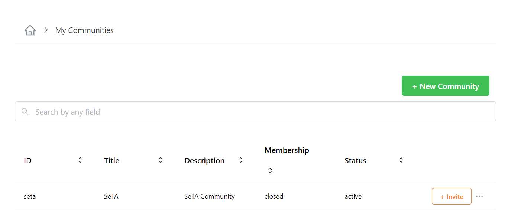
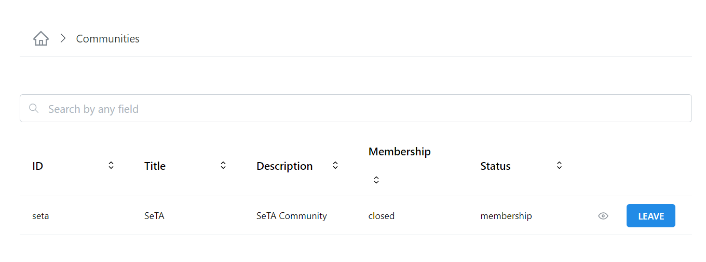
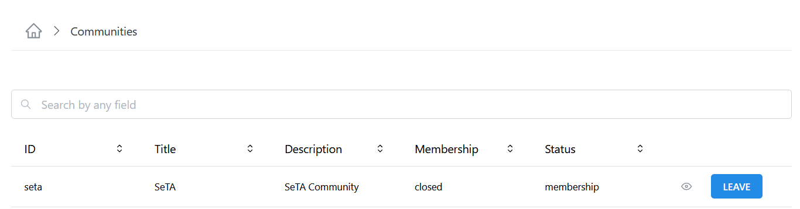
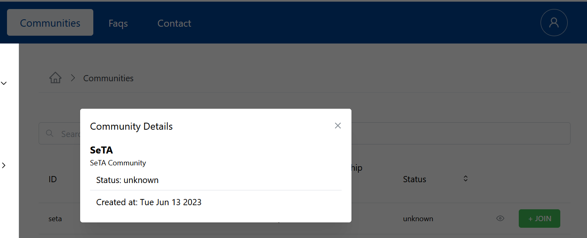
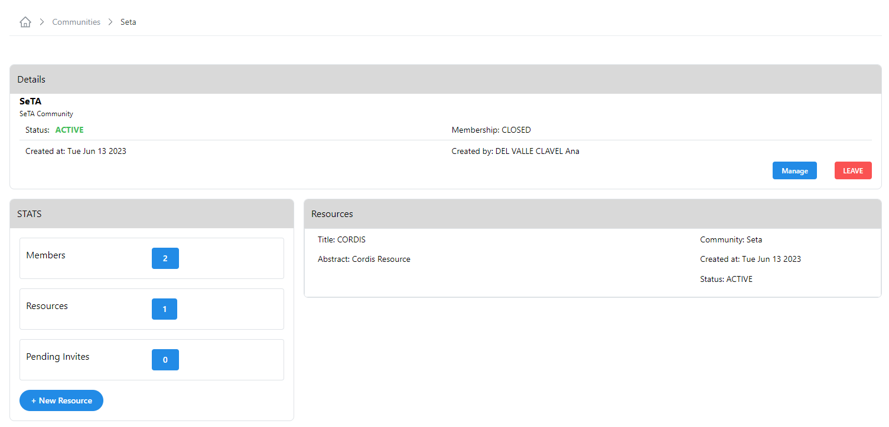
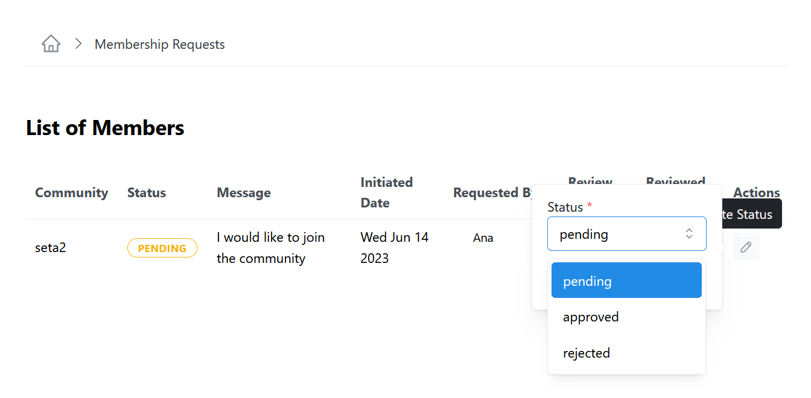
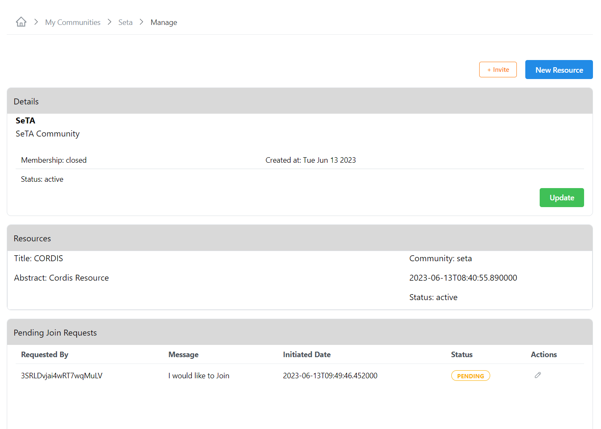
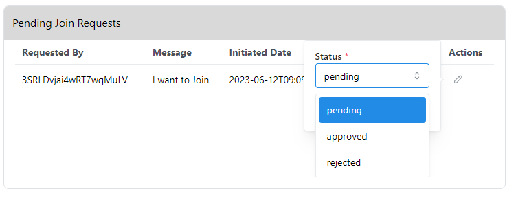
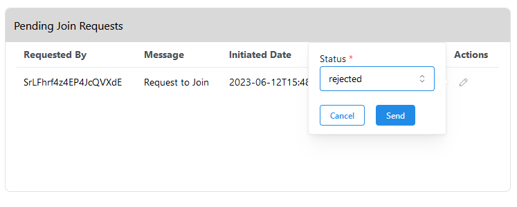
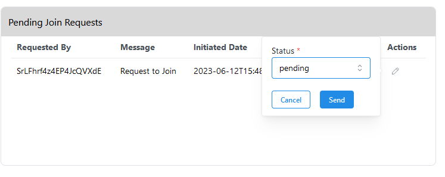

# SeTA Communities
The communities of the SeTA software application are a shared space where members engage with another to connect and learn about similar interests, opinions of different type of publications. 

In the SeTA web application, we have two types of communities: public communities and private communities.   

* **Public Community**:  Anyone with access to the web Application can view all discussion forums and information in the online Community. Anyone can join the Community and contribute to the Community.   

* **Private Community**:  The information and conversations can only be accessed by users with log-ins(often sent via invitation to a specific user). All users are forced to ask for authorization to join and then been able to see content and conversations. In this type of communities, the administrators have the ability to deny access to users who don't fit membership credentials.

## Communities

On the main page of the Communities, it is possible to see, two side panels on the left side: *Discovery* and *Manage* and in the centre, the list of the Communities.

On **Discovery** panel it is possible to access to:

- Communities *(List of available Communities)*        
- Resources *(The Resources related to those communities)*        

On **Manage** panel it is possible to access to:             

- My Communities                 
- My Resources               

<figure markdown>
  
  <figcaption>Communities page</figcaption>
</figure>

   
### Create a Community
                     
1. From the side panel click on ^^Manage^^ -> ^^My Communities^^.  
2. Click on the top right bottom ^^New Community^^.  
3. Enter the Community id, Title and Description.  
4. Click Save. Once you create your Community you will be sent back to your communities list. 
5. From your Community list you can invite new members.

<figure markdown>
  
  <figcaption>My Communities</figcaption>
</figure>

<figure markdown>
  
  <figcaption>New Community</figcaption>
</figure>

<figure markdown>
  
  <figcaption>My Communities</figcaption>
</figure>

### See the list of Communities

1. From the side menu click on ^^Manage^^ -> ^^My Communities^^.   
2. You will see a list of the Communities in the page.
3. You can enter in the search bar the name of the Community you are looking for.                 
<figure markdown>
  
  <figcaption>Communities</figcaption>
</figure>

### See the list of My Communities

1. From the side menu click on ^^Manage^^ -> ^^My Communities^^.   
2. You will see a list of the Communities in the page.
3. You can enter in the search bar the name of the Community you are looking for.                  

<figure markdown>
  
  <figcaption>My Communities</figcaption>
</figure>                

### See details of a Community                
                        
**From Communities list**

1. From the side menu click on ^^Discovery^^ -> ^^Communities^^.  
2. You can either enter in the search bar the name of the Community you are looking for or select from the Community list.  
3. Click in the ^^eye^^ icon at the right side of the Community row.  
4. If you are a member or the community, you will be redirect to the Community Details page.  
5. If you are not a member of the Community you will only see a pop-up window with a brief information about the community.

<figure markdown>
  
  <figcaption>Community Details</figcaption>
</figure>

<figure markdown>
  
  <figcaption>Community details for no Members</figcaption>
</figure>

**From My Communities list**

1. From the side menu click on ^^Manage^^ -> ^^My Communities^^.  
2. You can either enter in the search bar the name of the Community you are looking for or select from the Community list.  
3. Click in the three dots at the right side of button ^^Invite^^ and select the option ^^View Details^^.  
4. In the next window, you will see the Details page of the Community.        

<figure markdown>
  
  <figcaption>Community Details for Members</figcaption>
</figure>

### Delete a Community

1. From the side menu click on ^^Manage^^ -> ^^My Communities^^.  
2. You can either enter in the search bar the name of the Community you are looking for or select from the Communities list.  
3. After you select the Community, click on button ^^Delete^^ on the left top of the Communities list.
4. It is also possible to delete the Community by clicking in the three dots at the right side of each Community and select the option ^^Delete Community^^. 
5. A confirm window will appear to delete the Community.

> Please consider that before you can delete a Community, it is necessary to delete the Resources related.

<figure markdown>
  
  <figcaption>Delete a Community with a Resource related</figcaption>
</figure>

<figure markdown>
  
  <figcaption>Delete a Community</figcaption>
</figure>

### Update details of a Community                
                        
**From My Communities list**

1. From the side menu click on ^^Manage^^ -> ^^My Communities^^.  
2. You can either enter in the search bar the name of the Community you are looking for or select from the Community list.  
3. Click in the three dots at the right side of button ^^Invite^^ and select the option ^^Update^^.  
4. In the next window, you can update the *Title* and *Description*.  
5. Click ^^Update^^

**From Manage option**

1. From the side menu click on ^^Manage^^ -> ^^My Communities^^.  
2. You can either enter in the search bar the name of the Community you are looking for or select from the Community list.  
3. Click in the three dots at the right side of button ^^Invite^^ and select the option ^^Manage^^.  
4. In the next window, on section ^^Details^^, click on button ^^Update^^ 
5. You can update the *Title* and *Description*.  
6. Click ^^Update^^

**From View Details option**

1. From the side menu click on ^^Manage^^ -> ^^My Communities^^.  
2. You can either enter in the search bar the name of the Community you are looking for or select from the Community list.  
3. Click in the three dots at the right side of button ^^Invite^^ and select the option ^^View Details^^.  
4. In the next window, on section ^^Details^^, click on button ^^Manage^^ 
5. In the next window, on section ^^Details^^, click on button ^^Update^^ 
6. You can update the *Title* and *Description*.  
7. Click ^^Update^^

<figure markdown>
  
  <figcaption>Update a Community</figcaption>
</figure>

<figure markdown>
  
  <figcaption>Update a Community</figcaption>
</figure>

## Community Change Requests (to update with UI implementation)

### Retrieve all pending change requests for communities

> This option is only available to sysadmins 

1. From the side menu click on ^^Manage^^ -> ^^My Communities^^.  
2. You can either enter in the search bar the name of the Community you are looking for or select from the Community list.  
3. Click in the three dots at the right side of button ^^Invite^^ and select the option ^^View Details^^.  
4. In the next window, on section ^^Details^^, click on button ^^Manage^^ 
5. In the next window, on section ^^Pending Changes Requests^^, you can see the pending requests.                     
5. By clicking in the ^^:octicons-pencil-24:^^, under *actions* column you can change the status to: *approved*.
6. Click ^^Send^^.      

### Change community membership request 

> This option is available to community managers  

1. From the side menu click on ^^Manage^^ -> ^^My Communities^^.  
2. You can either enter in the search bar the name of the Community you are looking for or select from the Community list.  
3. Click in the three dots at the right side of button ^^Invite^^ and select the option ^^View Details^^.  
4. In the next window, on section ^^Details^^, click on button ^^Manage^^ 
5. In the next window, on section ^^Pending Changes Requests^^, you can see the pending requests.                     
5. By clicking in the ^^:octicons-pencil-24:^^, under *actions* column you can change the status to: *approved*.
6. Click ^^Send^^.      

### Retrieve change requests for My communities

1. From the side menu click on ^^Manage^^ -> ^^My Communities^^.       
2. You can either enter in the search bar the name of the Community you are looking for or select from the Community list.      
3. Click in the three dots at the right side of each Community and select the option ^^Manage^^.       
4. In the next window, in section ^^Pending Join Requests^^ you can see the pending requests.                     
5. By clicking in the ^^:octicons-pencil-24:^^, under *actions* column you can change the status to: *approved*.
6. Click ^^Send^^. 

### Update change requests for My communities

1. From the side menu click on ^^Manage^^ -> ^^My Communities^^.       
2. You can either enter in the search bar the name of the Community you are looking for or select from the Community list.      
3. Click in the three dots at the right side of each Community and select the option ^^Manage^^.       
4. In the next window, in section ^^Pending Join Requests^^ you can see the pending requests.                     
5. By clicking in the ^^:octicons-pencil-24:^^, under *actions* column you can change the status to: *approved*.
6. Click ^^Send^^. 

## Community Memberships

### Remove a member of the Community (*to update*)

1. From the side menu click on ^^Manage^^ -> ^^My Communities^^.       
2. You can either enter in the search bar the name of the Community you are looking for or select from the Community list.      
3. Click in the three dots at the right side of each Community and select the option ^^Manage^^.       
4. In the next window, in section ^^Members^^ click to see the list of the members.                     
5. By clicking in the ^^:octicons-pencil-24:^^, under *actions* column you can change the status to: *remove*.
6. Click ^^Send^^.            

### Block a member of the Community

1. From the side menu click on ^^Manage^^ -> ^^My Communities^^.       
2. You can either enter in the search bar the name of the Community you are looking for or select from the Community list.      
3. Click in the three dots at the right side of each Community and select the option ^^Manage^^.       
4. In the next window, in section ^^Members^^ click to see the list of the members.                     
5. By clicking in the ^^:octicons-pencil-24:^^, under *actions* column you can change the status to: *block*.
6. Click ^^Send^^. 

## My Community Membership Requests

### Join a Community

1. From the side menu click on ^^Discovery^^ -> ^^Communities^^.       
2. You can either enter in the search bar the name of the Community you are looking for or select from the Community list.      
3. Click on the button ^^Join^^.     
4. If the *Membership* status is *closed*, a pop-up window will appear to send a message to ask for the request.
5. The status changes to *pending* and the join button changes to ^^PENDING^^ until the Community manager approves or reject the request to join. If the request is approved, the status changes to *membership* and the button changes to ^^LEAVE^^, if the request is rejected the status changes to *rejected* and the button changes to ^^REJECTED^^.
5. If the *Membership* status is *opened*, it is possible to join without sending a request.  
    

<figure markdown>
  
  <figcaption>Join Community</figcaption>
</figure>

<figure markdown>
  
  <figcaption>Join Community (*waiting for approval*)</figcaption>
</figure>

<figure markdown>
  
  <figcaption>Join Community (*approved*)</figcaption>
</figure>

<figure markdown>
  
  <figcaption>Join Community (*rejected*)</figcaption>
</figure>

### Manage Request to Join My Community

#### From Pending Membership Requests

1. From the side menu on top you can see if you have Pending Membership Requests.  
2. Click in the number.           
3. In the next window, you will see the list.            
4. Click in the ^^:octicons-pencil-24:^^ under column *Actions* to update the status.

<figure markdown>
  
  <figcaption>Pending Membership Requests</figcaption>
</figure>

<figure markdown>
  
  <figcaption>List of Pending Membership Requests to Join Community</figcaption>
</figure>

#### From My Communities 

**Accept the request to Join My Community**        
                  
1. From the side menu click on ^^Manage^^ -> ^^My Communities^^.       
2. You can either enter in the search bar the name of the Community you are looking for or select from the Community list.      
3. Click in the three dots at the right side of each Community and select the option ^^Manage^^.       
4. In the next window, in section ^^Pending Join Requests^^ you can see the pending requests.                     
5. By clicking in the ^^:octicons-pencil-24:^^, under *actions* column you can change the status to: *approved*.
6. Click ^^Send^^.      

 
<figure markdown>
  { width="800" }
  <figcaption>List of requests to Join Community</figcaption>
</figure>

<figure markdown>
  
  <figcaption>Accept request to Join Community</figcaption>
</figure>

**Reject the request to Join My Community**        
                  
1. From the side menu click on ^^Manage^^ -> ^^My Communities^^.       
2. You can either enter in the search bar the name of the Community you are looking for or select from the Community list.      
3. Click in the three dots at the right side of each Community and select the option ^^Manage^^.       
4. In the next window, in section ^^Pending Join Requests^^ you can see the pending requests.                     
5. By clicking in the ^^:octicons-pencil-24:^^, under *actions* column you can change the status to: *rejected*.
6. Click ^^Send^^.      

 
<figure markdown>
  
  <figcaption>Reject request to Join Community</figcaption>
</figure>

**Keep Pending the request to Join My Community**        
                  
1. From the side menu click on ^^Manage^^ -> ^^My Communities^^.       
2. You can either enter in the search bar the name of the Community you are looking for or select from the Community list.      
3. Click in the three dots at the right side of each Community and select the option ^^Manage^^.       
4. In the next window, in section ^^Pending Join Requests^^ you can see the pending requests.                     
5. By clicking in the ^^:octicons-pencil-24:^^, under *actions* column you can change the status to: *pending*.
6. Click ^^Send^^.      

 
<figure markdown>
  
  <figcaption>Keep Pending the request to Join Community</figcaption>
</figure>

## Community My Membership

### Cancel a request to join a Community
1. From the side menu click on ^^Discovery^^ -> ^^Communities^^.        
2. You can either enter in the search bar the name of the Community you are looking for or select from the Community list.      
3. Click in the botton ^^PENDING^^ and choose cancel to remove the request.              

### Display the available memberships (*to check*)

## Community Invites

### Invite to Join a Community

**From My Communities list** 
                        
1. From the side menu click on ^^Manage^^ -> ^^My Communities^^.       
2. You can either enter in the search bar the name of the Community you are looking for or select from the Community list.      
3. Click on the button ^^Invite^^.       
4. In the pop-up window, write the emails of the users you want to invite and a message.    
5. Click ^^Send^^.       

<figure markdown>
  
  <figcaption>Invite to Join Community</figcaption>
</figure>

**From Manage Communities**        
                  
1. From the side menu click on ^^Manage^^ -> ^^My Communities^^.       
2. You can either enter in the search bar the name of the Community you are looking for or select from the Community list.      
3. Click in the three dots at the right side of each Community and select the option ^^Manage^^.       
4. In the next window, click on button ^^Invite^^ at the top right.
5. In the pop-up window, write the emails of the users you want to invite and a message.    
6. Click ^^Send^^.    

**From View Details option**                    

1. From the side menu click on ^^Manage^^ -> ^^My Communities^^.  
2. You can either enter in the search bar the name of the Community you are looking for or select from the Communities list.  
3. Click in the three dots at the right side of each Community and select the option ^^View Details^^.  
4. In the next window, on section Details, click on button ^^Manage^^ at the button.     
5. In the next window, click on button ^^Invite^^ at the top right.
6. In the pop-up window, write the emails of the users you want to invite and a message.    
7. Click ^^Send^^.   

<figure markdown>
  
  <figcaption>Invite to Join Community</figcaption>
</figure>

### See the Pending Invites Sent

1. From the side menu click on ^^Manage^^ -> ^^My Communities^^.  
2. You can either enter in the search bar the name of the Community you are looking for or select from the Communities list.  
3. Click in the three dots at the right side of each Community and select the option ^^View Details^^.  
4. In the next window, on section Stats, on row *Pending Invites* click in the number button.     
5. In the next window, you will see the list.

<figure markdown>
  
  <figcaption>Pending invites</figcaption>
</figure>

<figure markdown>
  
  <figcaption>List of Pending invites</figcaption>
</figure>

## Community Resources

### Create a Resource in a Community

**Create a Resource in a Community from Manage**   
1. From the side menu click on ^^Manage^^ -> ^^My Communities^^.  
2. You can either enter in the search bar the name of the Community you are looking for or select from the Community list.   
3. Click in the three dots at the right side of button ^^Invite^^ and select the option ^^Manage^^.    
4. In the next window, click on button ^^New Resource^^ on the top right.  
5. Setup the *Resource ID, Title, Abstract* and click *Save*

<figure markdown>
  
  <figcaption>New Resource in a Community</figcaption>
</figure>

**Create a Resource in a Community from View Details**   
1. From the side menu click on ^^Manage^^ -> ^^My Communities^^.  
2. You can either enter in the search bar the name of the Community you are looking for or select from the Community list.      
3. Click in the three dots at the right side of button ^^Invite^^ and select the option ^^View Details^^.       
4. In the next window, you can either go to section ^^Details^^ or section ^^STATS^^.    
5. On section ^^Details^^, click on button ^^Manage^^ or and click on button ^^New Resource^^ on the top right.  
5. On section ^^STATS^^, click on button ^^New Resource^^ at the button.  
6. On both options, setup the *Resource ID, Title, Abstract* and click *Save*.            

<figure markdown>
  
  <figcaption>New Resource in a Community</figcaption>
</figure>

<figure markdown>
  
  <figcaption>New Resource in a Community</figcaption>
</figure>

### See list of My Resources

1. From the side menu click on ^^Manage^^ -> ^^My Resources^^.              
2. You will see a list of the Resources in the page.                   
3. You can either enter in the search bar the name of the Resource you are looking for.        

<figure markdown>
  
  <figcaption>My Resources</figcaption>
</figure>

## Invites

### Retrieve my pending invites.

**From Communities main page**            
1. From the side menu on top you can see if you have pending invites.  
2. Click in the number.  
3. In the next window, you will see the list.

<figure markdown>
  
  <figcaption>Pending invites</figcaption>
</figure>

<figure markdown>
  
  <figcaption>List of Pending invites</figcaption>
</figure>

### Accept invitation to Join a Community

**From Communities main page**            
1. From the side menu on top you can see if you have pending invites.                
2. Click in the number.              
3. In the next window, you will see the list.       
4. Click in the button ^^Invited^^.             
5.     

<figure markdown>
  
  <figcaption>Pending invites</figcaption>
</figure>

<figure markdown>
  
  <figcaption>List of Pending invites</figcaption>
</figure>

**From Communities list**
1. From the side menu click on ^^Discovery^^ -> ^^Communities^^.       
2. You can either enter in the search bar the name of the Community you are looking for or select from the Community list.      
3. Click the button ^^Invited^^ in the Community row.                  

<figure markdown>
  
  <figcaption>Invitation to Join Community</figcaption>
</figure>

## Resources

### List of Resources

1. From the side menu click on ^^Discover^^ -> ^^Resources^^.      
2. You will see a list of the Resources in the page.                        
3. You can either enter in the search bar the name of the Resource you are looking for.              

<figure markdown>
  
  <figcaption>Resources</figcaption>
</figure>

### Update details of a Resource                

**From Update option**

1. From the side menu click on ^^Manage^^ -> ^^My Resources^^.  
2. You can either enter in the search bar the name of the Resource you are looking for or select from the Resources list.  
3. Click in the three dots at the right side of each Resource and select the option ^^Update^^.  
4. In the next window, you can update the *Title* and *Abstract*.  
5. Click ^^Update^^.

<figure markdown>
  
  <figcaption>Update a Resource from My Resources</figcaption>
</figure>

**From View Details option**                    

1. From the side menu click on ^^Manage^^ -> ^^My Resources^^.  
2. You can either enter in the search bar the name of the Resource you are looking for or select from the Resources list.  
3. Click in the three dots at the right side of each Resource and select the option ^^View Details^^.  
4. In the next window, click on button ^^Update^^ at the button.  
5. You can update the *Title* and *Abstract*.  
6. Click ^^Update^^.

<figure markdown>
  
  <figcaption>Update a Resource from View Details</figcaption>
</figure>

<figure markdown>
  
  <figcaption>Update a Resource</figcaption>
</figure>

### Delete a Resource    

**From My Resources list**

1. From the side menu click on ^^Manage^^ -> ^^My Resources^^.  
2. You can either enter in the search bar the name of the Resource you are looking for or select from the Resources list.  
3. After you select the Resource, click on button ^^Delete^^ on the left top of the Resource list.
4. It is also possible to delete the Resource by clicking in the three dots at the right side of each Resource and select the option ^^Delete Resource^^.  

**From View Details option**     
1. From the side menu click on ^^Manage^^ -> ^^My Resources^^.  
2. You can either enter in the search bar the name of the Resource you are looking for or select from the Resources list.  
3. After you select the Resource, click in the three dots at the right side of each Resource and select the option ^^View Details^^.      
4. In the next window, click on button ^^Delete^^ on the right bottom.  
5. A confirm window will appear to delete the resource.    

<figure markdown>
  
  <figcaption>Delete a Resource</figcaption>
</figure>

## Resource Change Requests

**TO DO**

### See the members of a Community

**From Discovery**             
1. From the side menu click on ^^Discovery^^ -> ^^Communities^^.       
2. You can either enter in the search bar the name of the Community you are looking for or select from the Community list.      
3. Click on the ^^eye^^ icon to view the details.                  
4. In the next window, in section ^^STATS^^, you can see the number of members.              

!!! info
  If you are not a member of the Community you will only see the number of members.               

**From My Communities list** 
                        
1. From the side menu click on ^^Manage^^ -> ^^My Communities^^.       
2. You can either enter in the search bar the name of the Community you are looking for or select from the Community list.      
3. Click in the three dots at the right side of each Community and select the option ^^View Details^^.                    
4. In the next window, in section ^^STATS^^, you can click in the number of members to go to the list of members.              

<figure markdown>
  
  <figcaption>Members of a Community</figcaption>
</figure>

      

