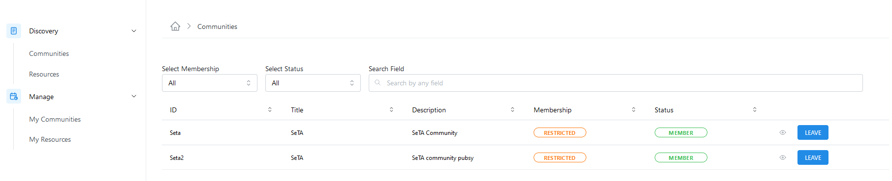
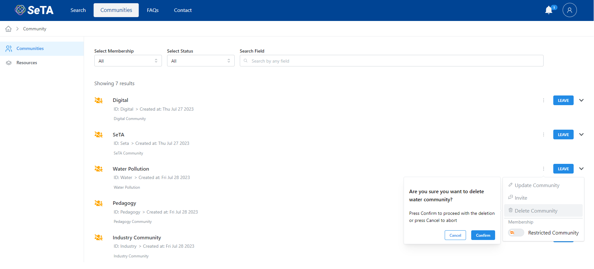
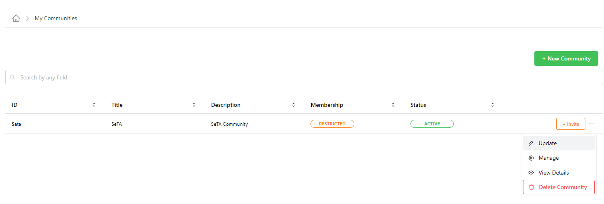
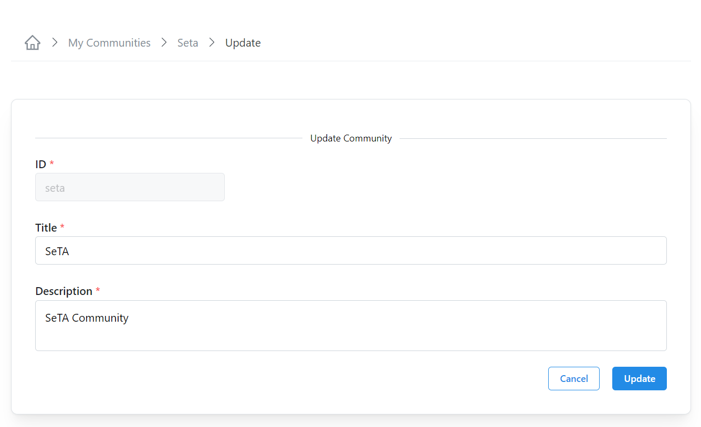

# SeTA Communities
The communities of the SeTA software application are a shared space where members engage with another to connect and learn about similar interests, opinions of different type of publications. 

In the SeTA web application, we have two types of communities: public communities and private communities.   

* **Public Community**:  Anyone with access to the web Application can view all discussion forums and information in the online Community. Anyone can join the Community and contribute to the Community.   

* **Private Community**:  The information and conversations can only be accessed by users with log-ins(often sent via invitation to a specific user). All users are forced to ask for authorization to join and then been able to see content and conversations. In this type of communities, the administrators have the ability to deny access to users who don't fit membership credentials.

## Discover Communities

On the main page of the Communities, it is possible to see the list of the Communities.

From this page it is possible to access to:

- Communities *(List of available Communities)*        
- Resources *(The Resources related to those communities)*        

<figure markdown>
  
  <figcaption>Communities page</figcaption>
</figure>

   
## Create a Community
                     
1. From the main panel click on the top right bottom ^^New Community^^.  
3. Enter the Community id, Title and Description.  
4. Click Save.         

<figure markdown>
  
  <figcaption>My Communities</figcaption>
</figure>

<figure markdown>
  
  <figcaption>New Community</figcaption>
</figure>

## List of Communities

1. You will see a list of the Communities in the page.   
2.  You can enter in the search bar the name of the Community you are looking for.                  
<figure markdown>
  
  <figcaption>Communities</figcaption>
</figure>

## Details of a Community                
                        
1. You can either enter in the search bar the name of the Community you are looking for or select from the Community list.  
2. Click on :octicons-eye-24: at the right side of the Community row.  
3. If you are a member or the community, you will be redirect to the Community Details page.  
4. If you are not a member of the Community you will only see a pop-up window with a brief information about the community.          

## Delete a Community

1. From the side menu click on ^^Manage^^ -> ^^My Communities^^.  
2. You can either enter in the search bar the name of the Community you are looking for or select from the Communities list.  
3. After you select the Community, click on button ^^Delete^^ on the left top of the Communities list.
4. It is also possible to delete the Community by clicking :material-dots-horizontal: at the right side of each Community and select the option ^^:octicons-trash-24: Delete Community^^. 
5. A confirm window will appear to delete the Community.

> Please consider that before you can delete a Community, it is necessary to delete the Resources related.

<figure markdown>
  
  <figcaption>Delete a Community with a Resource related</figcaption>
</figure>

<figure markdown>
  
  <figcaption>Delete a Community</figcaption>
</figure>

## Update Details of a Community                
                        
### From My Communities

1. From the side menu click on ^^Manage^^ -> ^^My Communities^^.  
2. You can either enter in the search bar the name of the Community you are looking for or select from the Community list.  
3. Click  :material-dots-horizontal: at the right side of button ^^Invite^^ and select the option ^^:octicons-pencil-24: Update^^.  
4. In the next window, you can update the *Title* and *Description*.  
5. Click ^^Update^^

### From Manage

1. From the side menu click on ^^Manage^^ -> ^^My Communities^^.  
2. You can either enter in the search bar the name of the Community you are looking for or select from the Community list.  
3. Click on :material-dots-horizontal: at the right side of button ^^Invite^^ and select the option ^^:octicons-gear-24: Manage^^.  
4. In the next window, on section ^^Details^^, click on button ^^Update^^ 
5. You can update the *Title* and *Description*.  
6. Click ^^Update^^

### From View Details

1. From the side menu click on ^^Manage^^ -> ^^My Communities^^.  
2. You can either enter in the search bar the name of the Community you are looking for or select from the Community list.  
3. Click on :material-dots-horizontal: at the right side of button ^^Invite^^ and select the option ^^:octicons-eye-24: View Details^^.  
4. In the next window, on section ^^Details^^, click on button ^^Manage^^ 
5. In the next window, on section ^^Details^^, click on button ^^Update^^ 
6. You can update the *Title* and *Description*.  
7. Click ^^Update^^

<figure markdown>
  
  <figcaption>Update a Community</figcaption>
</figure>

<figure markdown>
  
  <figcaption>Update a Community</figcaption>
</figure>

      

