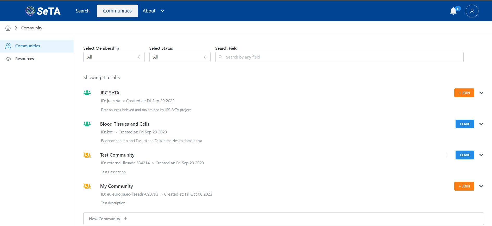
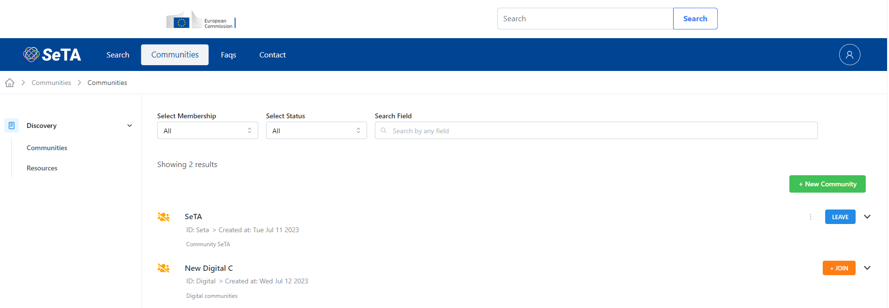
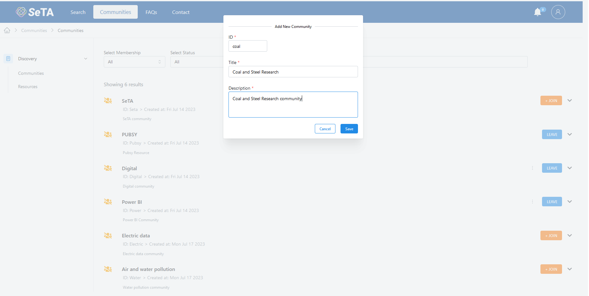

# Communities
The communities of the SeTA software application are a shared space where members engage with another to connect and learn about similar interests, opinions of different type of publications. 

In the SeTA web application, we have two types of communities: public communities and private communities.   

* **Public Community**:  Anyone with access to the web Application can view all discussion forums and information in the online Community. Anyone can join the Community and contribute to the Community.   

* **Private Community**:  The information and conversations can only be accessed by users with log-ins(often sent via invitation to a specific user). All users are forced to ask for authorization to join and then been able to see content and conversations. In this type of communities, the administrators have the ability to deny access to users who don't fit membership credentials.

## Communities Web Interface

On the main page of the Communities, there are two side panels on the left side: *Discovery* and *Manage* and in the center, there is a list of the Communities the user had Join.

On the Discovery panel it is possible to access to:

- Communities *(Communities joined)*        
- Resources *(The Resources related to those communities)*        

On the Manage panel it is possible to access to:             

- My Communities                 
- My Resources               

<figure markdown>
  
  <figcaption>Communities page</figcaption>
</figure>

### Create a Community
                     
1. From the side panel click on ^^Manage^^ -> ^^My Communities^^.  
2. Click on the top right bottom ^^New Community^^.  
3. Enter the Community id, title and description.  
4. Click Save. Once you create your Community you will be sent back to your communities list. 
5. From your Community list you can invite new members.
<!--4. Select the ^^Membership^^ option: *Private, Public*.  
5. Select the ^^Data Type^^: *Evidence, Representative*.  -->

<figure markdown>
  
  <figcaption>My Communities</figcaption>
</figure>

<figure markdown>
  
  <figcaption>New Community</figcaption>
</figure>

### Change the name of a Community                
                        
Only **users with rights to edit** can change the Community name.  

1. From the side menu click on ^^Manage^^ -> ^^My Communities^^.  
2. From the communities list click on the Community you want to change.  
2. On the top of the community window click on button ^^Manage^^.  
3. In the next window, in section ^^Details^^ click on button at the bottom of the section ^^Update^^.  
4. You can change the details of your Community: *Community ID, Title, Description, Data Type, Membership*.     
5. Click *Update*

 
### Difference between a manager and a creator in a Community
              
**As a Community creator he will have the following tasks:**

- Make another member a manager or contributor. 
- Remove a manager or contributor. 
- Manage Community settings (ex: change the Community name or privacy settings). 
- Approve or deny membership requests and participant requests. 
- Approve or deny documents in the Community. 
- Remove documents and comments on documents. 
- Remove and block people from the Community. 
- Upload or remove a document. 

**As a Community manager he will have the following tasks:**

- Approve or deny membership requests and participant requests. 
- Approve or deny documents in the Community. 
- Remove documents and comments on documents. 
- Remove people from the Community. 
- Upload or remove a document.  

!!! warning
    All communities must have a manager. 

<!--### Claim the manager role

<!-- ask if there could be more than one manager

1. From the side menu click on ^^Manage^^ -> ^^My Communities^^.    
2. From the communities list click on the Community you want to change.  
3. On the top of the window click on button ^^Manage^^.  
4. In the next window, in section ^^Details^^ click on button at the bottom of the section ^^Update^^.
5. Click Confirm. 

!!! danger "Note"
    Only one manager spot can be claimed. -->
    
<!--check if this is true:  Once the creator has left the Community, creator status can't be granted to a manager or moderator. If you can't claim the manager role in a Community it may be because there are managers or other people have recently been accepted to become a manager.-->

### Difference between a viewer and contributor in public communities
                        
In public communities you can interact with a Community as a viewer or as a contributor.   

-  **Contributor**:  someone who has joined the Community. 
    - Can upload a document. 
    
- **Viewer**: someone who isn't a member of the Community. 
    - No manager approval required. 
    - Can view tghe resources and documents related. 
    

### Manage the upload of documents for a Community
               
As a manager you can review and approve people before they can upload a document.

### Remove documents in a Community
               
Creators and managers can remove documents from their Community.

**To remove a document from your Community:**  

1. From the side menu click on ^^Manage^^ -> ^^My Resources^^.    
2. From the resources list click on the delete icon.  
3. Click Confirm. 

### Remove someone from a Community
                     
**To remove a member:**   

1. From the side menu click on ^^Manage^^ -> ^^My Communities^^.     
2. From the communities list click on the Community you want to change.  
3. On the top of the window click on button ^^Manage^^.    
4. On section *Members* click on the member you want to remove.  
5. Click on the delete icon and select ^^Remove^^ member from Community. 
6. Click ^^Confirm^^.   

!!! info
    Removed members will have to request to join the Community again if they wish to re-join.

### Delete a Community
           
<!--{== If you are a Community manager you can delete your Community by removing all members (in private communities) or blocking all members (in public communities) and then leaving the Community as long as the Community creator has left the Community or you are the Community creator.==}  Deleting a Community is permanent and cannot be reversed. Alternatively, you can pause a Community.   -->

**To delete a Community:**   

1. From the side menu click on ^^Manage^^ -> ^^My Communities^^. 
2. Click on the check option of the Community you want to delete.  
3. Click on the *delete* icon.  
4. Click Confirm. 

### To join a Community
                        
1. From the side menu click on ^^Discover^^ -> ^^Communities^^.  
2. In the search bar enter the name of the Community you are looking for.   
3. Select the Community then click + ^^Join^^.  
4. On the pop-up window write a message and click ^^Join^^

### See the members of a Community
Anyone can see who is a member of a public Community. In a private Community you have to be a member to see who the other members are. 

1. From the side menu click on ^^Manage^^ -> ^^My Communities^^.    
2. Click ^^Members^^ in section ^^Stats^^. 

### Create a Resource in a Community

You can create a Resource inside a Community or from the menu My Resources

**Create a Resource in a Community**   
1. From the side menu click on ^^Manage^^ -> ^^My Communities^^.  
2. You can either enter in the search bar the name of the Community you are looking for or select from the Community list.   
3. Click in the Community you want to add the resource.  
4. Click in button ^^New Resource^^  
5. Setup the *Title, Abstract, Membership, To be Approved* and click *Save*

**Create a Resource from My Resources**   
1. From the side menu click on ^^Manage^^ -> ^^My Resources^^.  
2. Click in button ^^Add Resource^^  
3. Setup the *Title, Abstract, Membership, To be Approved* and click *Save*

### Upload document in a Community

You can upload a document inside a Community Resource or from the menu My Resources

**Upload a document in a Community**   

1. From the side menu click on ^^Manage^^ -> ^^My Communities^^.   
2. You can either enter in the search bar the name of the Community you are looking for or select it from the Community list.
3. On the *Resources* section, click on the ^^Resource^^ you want to upload the document. 
4. After you upload the document, click ^^Next^^.   
5. Setup the *Metadata* information, click ^^Next^^.    
6. Setup the *Taxonomy* or *Taxonomies*,  they can be one of the existing or create new.  
7. Review the data and save the document. 

**Upload a document in a Resource**   

1. From the side menu click on ^^Manage^^ -> ^^My Resources^^.   
2. You can either enter in the search bar the name of the Resource you are looking for or select it from Resources list 
3. Click on button ^^Upload^^ on the *Documents* section. 
4. After you upload the document, click ^^Next^^.   
5. Setup the *Metadata* information, click ^^Next^^.    
6. Setup the *Taxonomy* or *Taxonomies*,  they can be one of the existing or create new.  
7. Review the data and save the document. 

!!! note
    In public communities creators might require approval before you can upload a document for the first time.

### Delete Documents from a Community

You can delete a document inside a Community Resource or from the menu My Resources:      

**Delete documents in a Community:**   
1. From the side menu click on ^^Manage^^ -> ^^My Communities^^.   
2. You can either enter in the search bar the name of the Community you are looking for, or select it from the Community list.     
3. On the *Resources* section, click on the ^^Resource^^ you want to delete the document.     
4. On the Resources page, from the Documents list select the document and click on the delete button.       

**Delete all your documents you've shared in the Community:**   
1. From the side menu click on ^^Manage^^ -> ^^My Resources^^.   
2. You can either enter in the search bar the name of the Resource you are looking for, or select it from Resources list.    
3. On the *Resources* section, click on the ^^Resource^^ you want to delete the document.    
4. On the Resources page, from the Documents list select the document and click on the delete button. 

<!-- ### Trouble to upload a document or participate in a Community

If your ability to upload a document or participate in a Community has been turned off it may be because a Community manager has temporarily turned off your ability to upload a document or participate in their Community. They might have temporarily suspended you or temporarily limited how frequently you can upload a document.

### Leave a Community

1. From the side menu click on ^^Discover^^ -> ^^Communities^^.   
2. You can either enter in the search bar the name of the Community you are looking for, or select it from the Community list.  
3. Click on ^^Joined^^  and confirm to leave the Community. 

!!! note "When you leave a Community:" 
    - Members won't be notified if you leave. 
    - You are removed from the member list and the Community will be removed from your list of communities.

-->
### See a list of My Communities

1. From the side menu click on ^^Manage^^ -> ^^My Communities^^.   
2. You will see a list of the Communities in the page.

### See a list of My Resources

1. From the side menu click on ^^Manage^^ -> ^^My Resources^^.   
2. You will see a list of the Resources in the page.

### See a list of Resources
<!--{== *are public Resources from other communities?*==}-->

1. From the side menu click on ^^Discover^^ -> ^^Resources^^.   
2. You can either enter in the search bar the name of the Resource you are looking for, or select it from the Resource list.

<!--### {== How to report something in a Community ==}
                       
1. From the side menu click on ^^Manage^^ -> ^^My Communities^^.   
2. Go to the document you want to report.  
3. Click in the top right of the document.  
4. Select ^^Report document to Community creators^^ to report the document to a manager. 

!!! warning
    Creators may or may not choose to remove the document or block the person who shared the document.-->