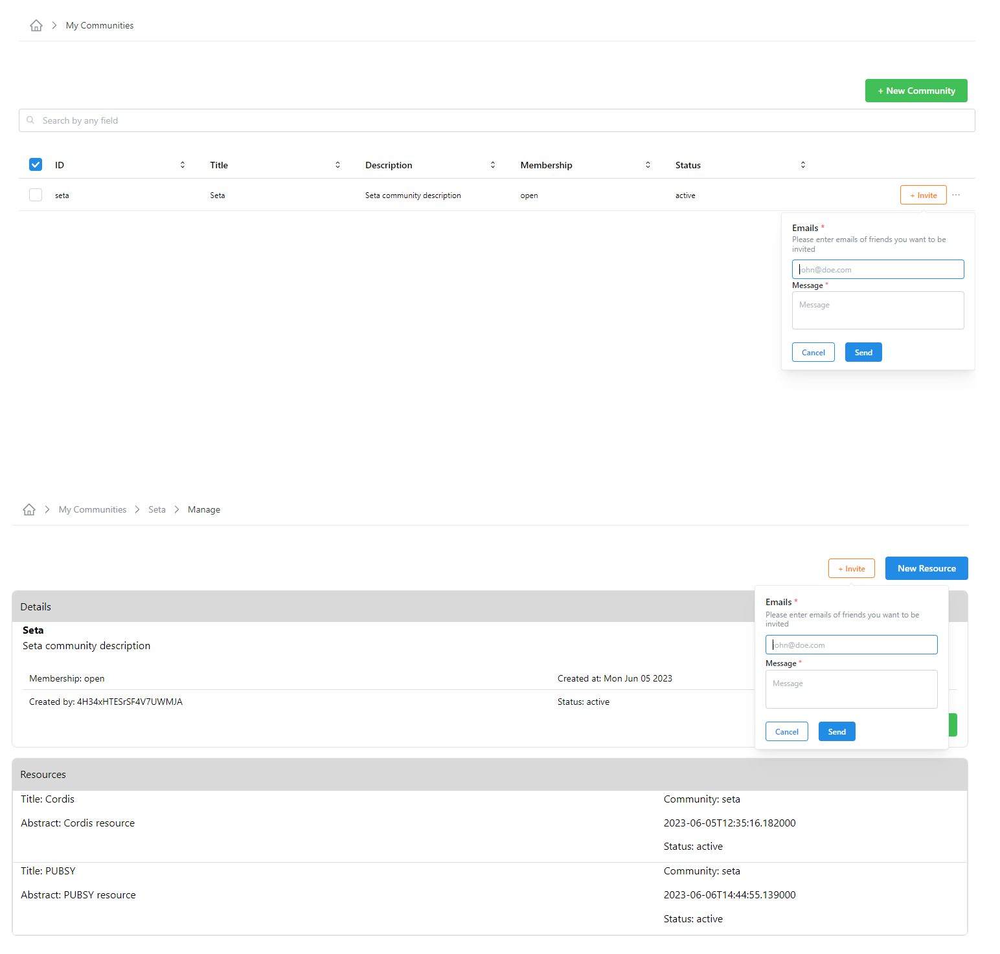

# Communities
The communities of the SeTA software application are a shared space where members engage with another to connect and learn about similar interests, opinions of different type of publications. 

In the SeTA web application, we have two types of communities: public communities and private communities.   

* **Public Community**:  Anyone with access to the web Application can view all discussion forums and information in the online Community. Anyone can join the Community and contribute to the Community.   

* **Private Community**:  The information and conversations can only be accessed by users with log-ins(often sent via invitation to a specific user). All users are forced to ask for authorization to join and then been able to see content and conversations. In this type of communities, the administrators have the ability to deny access to users who don't fit membership credentials.

## Communities Web Interface

On the main page of the Communities, there are two side panels on the left side: *Discovery* and *Manage* and in the centre, there is a list of the Communities the user had Join.

On **Discovery** panel it is possible to access to:

- Communities *(List of Communities)*        
- Resources *(The Resources related to those communities)*        

On **Manage** panel it is possible to access to:             

- My Communities                 
- My Resources               

<figure markdown>
  
  <figcaption>Communities page</figcaption>
</figure>

### Create a Community
                     
1. From the side panel click on ^^Manage^^ -> ^^My Communities^^.  
2. Click on the top right bottom ^^New Community^^.  
3. Enter the Community id, title and description.  
4. Click Save. Once you create your Community you will be sent back to your communities list. 
5. From your Community list you can invite new members.
<!--4. Select the ^^Membership^^ option: *Private, Public*.  
5. Select the ^^Data Type^^: *Evidence, Representative*.  -->

<figure markdown>
  
  <figcaption>My Communities</figcaption>
</figure>

<figure markdown>
  
  <figcaption>New Community</figcaption>
</figure>

### Update details of a Community                
                        
Only **users with rights to edit** can change the Community name.                  

**From My Communities list**

1. From the side menu click on ^^Manage^^ -> ^^My Communities^^.  
2. You can either enter in the search bar the name of the Community you are looking for or select from the Community list.  
3. Click in the three dots at the right side of button ^^Invite^^ and select the option ^^Update^^.  
4. In the next window, you can update the *Title* and *Description*.  
5. Click ^^Update^^

**From Manage option**

1. From the side menu click on ^^Manage^^ -> ^^My Communities^^.  
2. You can either enter in the search bar the name of the Community you are looking for or select from the Community list.  
3. Click in the three dots at the right side of button ^^Invite^^ and select the option ^^Manage^^.  
4. In the next window, on section ^^Details^^, click on button ^^Update^^ 
5. You can update the *Title* and *Description*.  
6. Click ^^Update^^

**From View Details option**

1. From the side menu click on ^^Manage^^ -> ^^My Communities^^.  
2. You can either enter in the search bar the name of the Community you are looking for or select from the Community list.  
3. Click in the three dots at the right side of button ^^Invite^^ and select the option ^^View Details^^.  
4. In the next window, on section ^^Details^^, click on button ^^Manage^^ 
5. In the next window, on section ^^Details^^, click on button ^^Update^^ 
6. You can update the *Title* and *Description*.  
7. Click ^^Update^^

<figure markdown>
  
  <figcaption>Update a Community</figcaption>
</figure>

<figure markdown>
  
  <figcaption>Update a Community</figcaption>
</figure>

### Create a Resource in a Community

**Create a Resource in a Community from Manage**   
1. From the side menu click on ^^Manage^^ -> ^^My Communities^^.  
2. You can either enter in the search bar the name of the Community you are looking for or select from the Community list.   
3. Click in the three dots at the right side of button ^^Invite^^ and select the option ^^Manage^^.    
4. In the next window, click on button ^^New Resource^^ on the top right.  
5. Setup the *Resource ID, Title, Abstract* and click *Save*

**Create a Resource in a Community from View Details**   
1. From the side menu click on ^^Manage^^ -> ^^My Communities^^.  
2. You can either enter in the search bar the name of the Community you are looking for or select from the Community list.      
3. Click in the three dots at the right side of button ^^Invite^^ and select the option ^^View Details^^.       
4. In the next window, you can either go to section ^^Details^^ or section ^^STATS^^.    
5. On section ^^Details^^, click on button ^^Manage^^ or and click on button ^^New Resource^^ on the top right.  
5. On section ^^STATS^^, click on button ^^New Resource^^ at the button.  
6. On both options, setup the *Resource ID, Title, Abstract* and click *Save*.            

<figure markdown>
  
  <figcaption>New Resource in a Community</figcaption>
</figure>

<figure markdown>
  
  <figcaption>New Resource in a Community</figcaption>
</figure>

### Update details of a Resource                

**From Update option**

1. From the side menu click on ^^Manage^^ -> ^^My Resources^^.  
2. You can either enter in the search bar the name of the Resource you are looking for or select from the Resources list.  
3. Click in the three dots at the right side of each Resource and select the option ^^Update^^.  
4. In the next window, you can update the *Title* and *Abstract*.  
5. Click ^^Update^^.

**From View Details option**                    

1. From the side menu click on ^^Manage^^ -> ^^My Resources^^.  
2. You can either enter in the search bar the name of the Resource you are looking for or select from the Resources list.  
3. Click in the three dots at the right side of each Resource and select the option ^^View Details^^.  
4. In the next window, click on button ^^Update^^ at the button.  
5. You can update the *Title* and *Abstract*.  
6. Click ^^Update^^.

<figure markdown>
  
  <figcaption>Update a Resource</figcaption>
</figure>

<figure markdown>
  
  <figcaption>Update a Resource</figcaption>
</figure>

### Join a Community

**From Discovery** 
                        
1. From the side menu click on ^^Discovery^^ -> ^^Communities^^.       
2. You can either enter in the search bar the name of the Community you are looking for or select from the Community list.      
3. Click on the button ^^Join^^.       
    

### Invite to Join a Community

**From My Communities list** 
                        
1. From the side menu click on ^^Manage^^ -> ^^My Communities^^.       
2. You can either enter in the search bar the name of the Community you are looking for or select from the Community list.      
3. Click on the button ^^Invite^^.       
4. In the pop-up window, write the emails of the users you want to invite and a message.    
5. Click ^^Send^^.       

**From Manage Communities**        
                  
1. From the side menu click on ^^Manage^^ -> ^^My Communities^^.       
2. You can either enter in the search bar the name of the Community you are looking for or select from the Community list.      
3. Click in the three dots at the right side of each Community and select the option ^^Manage^^.       
4. In the next window, click on button ^^Invite^^ at the top right.
5. In the pop-up window, write the emails of the users you want to invite and a message.    
6. Click ^^Send^^.       

**From View Details option**                    

1. From the side menu click on ^^Manage^^ -> ^^My Communities^^.  
2. You can either enter in the search bar the name of the Community you are looking for or select from the Communities list.  
3. Click in the three dots at the right side of each Community and select the option ^^View Details^^.  
4. In the next window, on section Details, click on button ^^Manage^^ at the button.     
5. In the next window, click on button ^^Invite^^ at the top right.
6. In the pop-up window, write the emails of the users you want to invite and a message.    
7. Click ^^Send^^.   

<figure markdown>
  
  <figcaption>Invite to Join a Community</figcaption>
</figure>

### See the members of a Community
<!--Anyone can see who is a member of a public Community. In a private Community you have to be a member to see who the other members are. -->
**From Discovery**             
1. From the side menu click on ^^Discovery^^ -> ^^Communities^^.       
2. You can either enter in the search bar the name of the Community you are looking for or select from the Community list.      
3. Click on the ^^eye^^ icon to view the details.                  
4. In the next window, in section ^^STATS^^, you can see the number of members.              

!!! info
	If you are not a member of the Community you will only see the number of members.               

**From My Communities list** 
                        
1. From the side menu click on ^^Manage^^ -> ^^My Communities^^.       
2. You can either enter in the search bar the name of the Community you are looking for or select from the Community list.      
3. Click in the three dots at the right side of each Community and select the option ^^View Details^^.                    
4. In the next window, in section ^^STATS^^, you can click in the number of members to go to the list of members.              

<figure markdown>
  
  <figcaption>Members of a Community</figcaption>
</figure>

      
### Delete a Resource    

**From My Resources list**

1. From the side menu click on ^^Manage^^ -> ^^My Resources^^.  
2. You can either enter in the search bar the name of the Resource you are looking for or select from the Resources list.  
3. After you select the Resource, click on button ^^Delete^^ on the left top of the Resource list.
4. It is also possible to delete the Resource by clicking in the three dots at the right side of each Resource and select the option ^^Delete Resource^^.  

**From View Details option**     
1. From the side menu click on ^^Manage^^ -> ^^My Resources^^.  
2. You can either enter in the search bar the name of the Resource you are looking for or select from the Resources list.  
3. After you select the Resource, click in the three dots at the right side of each Resource and select the option ^^View Details^^.      
4. In the next window, click on button ^^Delete^^ on the right bottom.      

<figure markdown>
  
  <figcaption>Delete a Resource</figcaption>
</figure>

### Delete a Community
!!! warning
    Please consider that before you can delete a Community you need to delete the Resources related.

**From My Communities list**

1. From the side menu click on ^^Manage^^ -> ^^My Communities^^.  
2. You can either enter in the search bar the name of the Community you are looking for or select from the Communities list.  
3. After you select the Community, click on button ^^Delete^^ on the left top of the Communities list.
4. It is also possible to delete the Community by clicking in the three dots at the right side of each Community and select the option ^^Delete Community^^. 

<figure markdown>
  
  <figcaption>Delete a Community</figcaption>
</figure>

### See the list of Communities

1. From the side menu click on ^^Manage^^ -> ^^My Communities^^.   
2. You will see a list of the Communities in the page.
3. You can enter in the search bar the name of the Community you are looking for.                 
<figure markdown>
  
  <figcaption>Communities</figcaption>
</figure>

### See the list of My Communities

1. From the side menu click on ^^Manage^^ -> ^^My Communities^^.   
2. You will see a list of the Communities in the page.
3. You can enter in the search bar the name of the Community you are looking for.                  

<figure markdown>
  
  <figcaption>My Communities</figcaption>
</figure>                 

### See the list of Resources
<!--{== *are public Resources from other communities?*==}-->

1. From the side menu click on ^^Discover^^ -> ^^Resources^^.      
2. You will see a list of the Resources in the page.                        
3. You can either enter in the search bar the name of the Resource you are looking for.              

<figure markdown>
  
  <figcaption>Resources</figcaption>
</figure>

### See the list of My Resources

1. From the side menu click on ^^Manage^^ -> ^^My Resources^^.              
2. You will see a list of the Resources in the page.                   
3. You can either enter in the search bar the name of the Resource you are looking for.        

<figure markdown>
  
  <figcaption>My Resources</figcaption>
</figure>

