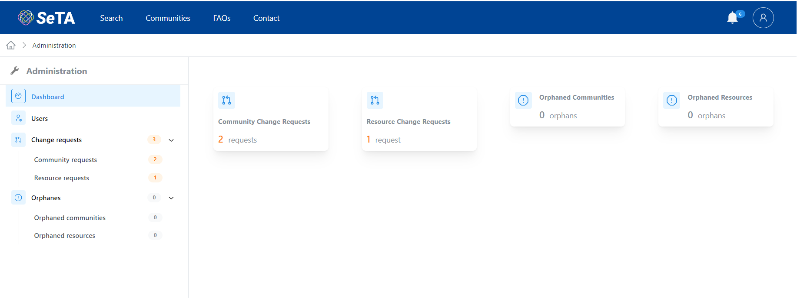
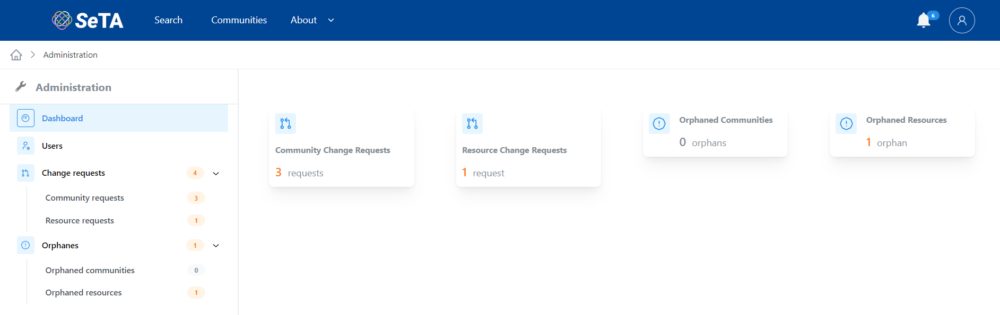
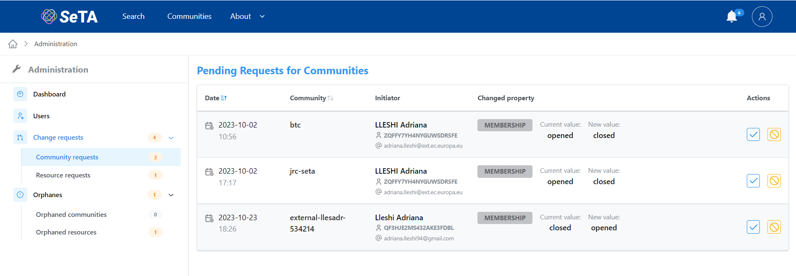
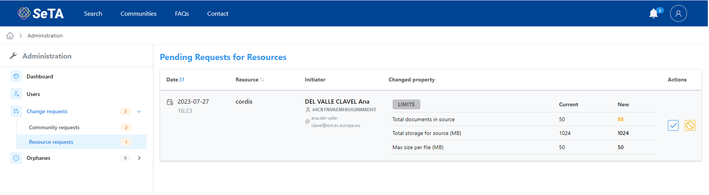

## Administration

The Administrator profile can handle different options related to the management of the communities and the users. To access go to the user profile and select from the dropdown menu the option :fontawesome-solid-wrench: Administration.       

<figure markdown>
  
  <figcaption>Administration profile</figcaption>
</figure>

On the new page on the left side, there will be a menu:         
      1. Dashboard            
      2. Users              
      3. Change requests               
      4. Orphanes           

<figure markdown>
  
  <figcaption>Administration</figcaption>
</figure>

### Dashboard
The main page of the Administration is the dashboard where is possible to see a list of all the requests arrived on the different options.

<figure markdown>
  
  <figcaption>Dashboard</figcaption>
</figure>

### Users

### Change requests
In this page it is possible to see the requested changes for the Communities and the Resources

#### Community requests
On the Community requests page appears a list with the changes requests to made to some Communities. Under column *Changed property* it is possible to see the change request. The administrator can approve or reject this requests by clicking under column *Actions* the option *Approve* :material-checkbox-marked-outline: or *Reject* :material-cancel:.

<figure markdown>
  
  <figcaption>Community requests</figcaption>
</figure>

#### Resources requests

On the Resources requests page appears a list with the changes requests to made to some Resources. Under column *Changed property* it is possible to see the change request. The administrator can approve or reject this requests by clicking under column *Actions* the option *Approve* :material-checkbox-marked-outline: or *Reject* :material-cancel:.

<figure markdown>
  
  <figcaption>Resources requests</figcaption>
</figure>

### Orphanes

#### Orphaned communities

#### Orphaned resources

