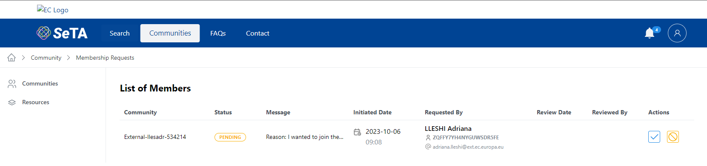
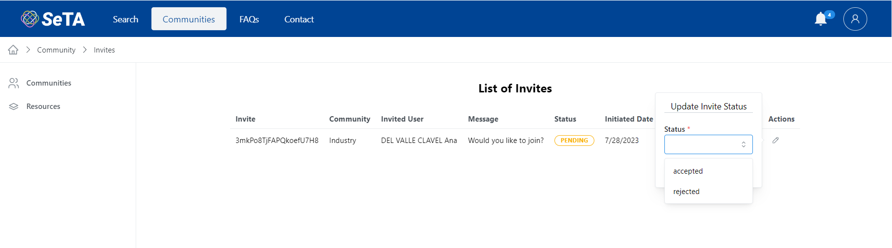
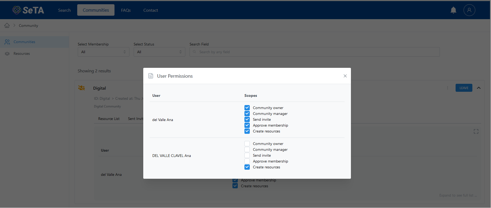

## Join a Community

1. You can either use the filters to search the Community or select from the Communities list.      
2. Click on the button ^^JOIN^^.     
3. If the *Community* access is *Restricted*, a pop-up window will appear to send a message to ask for the request.      
4. The join button label changes to ^^PENDING^^ until the Community manager approves or reject the request to join. If the request is approved, the user joins the community and the button label changes to ^^LEAVE^^, if the request is rejected the button label changes to ^^REJECTED^^.
5. If the *Community* access is *opened*, after clicking in button ^^JOIN^^ automatically the user joins the community and the button label changes to ^^LEAVE^^.  
    

<figure markdown>
  
  <figcaption>Join Community</figcaption>
</figure>

<figure markdown>
  
  <figcaption>Join Community (waiting for approval)</figcaption>
</figure>

<figure markdown>
  
  <figcaption>Join Community (approved)</figcaption>
</figure>

<figure markdown>
  
  <figcaption>Join Community (rejected)</figcaption>
</figure>

## Leave a Community

1. You can either use the filters to search the Community or select from the Communities list.      
2. Click on button ^^LEAVE^^. *If you are the only member, a warning message will appear*       
3. The button label will change to ^^JOIN^^.              

<figure markdown>
  
  <figcaption>Leave a Community</figcaption>
</figure>

## Request to Join My Community

### From the main page
1. You can either use the filters to search the Community or select from the Communities list.             
2. Click on :octicons-chevron-down-12: at the right side of the Community row.      
3. On the opened section, click on tab *Pending Membership Requests*.           
4. You can see a list of the pending membership requests.            
5. Click in the ^^:octicons-check-24:^^ or ^^:octicons-circle-slash-24:^^ under column *Actions* to update the status (*approved, rejected*).     
6. Click *send*
7. The request disappear from the Pending Membership Requests list.

> It is possible to enlarge the list and see all the *Pending Membership Requests*, by clicking on :fontawesome-solid-expand:         

<figure markdown>
  
  <figcaption>Pending Membership Requests</figcaption>
</figure>

> If the status is not update, the status will remain *PENDING*, if the request is set to *Rejected* the status in the communities list will be *REJECTED*

### From Notifications

1. On the :material-bell-badge: on top of the page, a number notification appears.             
2. Click on the icon and click on the number aside ^^Pending membership requests^^.              
3. It will open the page with the list of Members asking to join.                    
4. Click in the ^^:octicons-check-24:^^ or ^^:octicons-circle-slash-24:^^ under column *Actions* to update the status (*approved, rejected*).
5. Click *send*     

<figure markdown>
  
  <figcaption>Notifications of Membership Request</figcaption>
</figure>

<figure markdown>
  
  <figcaption>List of Members</figcaption>
</figure>

## See the Invites Sent
1. You can either use the filters to search the Community or select from the Communities list.             
2. Click on :octicons-chevron-down-12: at the right side of the Community row.      
3. On the opened section, click on tab *Sent Invites*.           
4. You can see a list of the Invites sent.            

> It is possible to enlarge the list and see all the *Sent Invites*, by clicking on :fontawesome-solid-expand:         

<figure markdown>
  
  <figcaption>Sent Invites</figcaption>
</figure>

## Accept Invitation to Join a Community.

1. On the :material-bell-badge: on top of the page, a number notification appears.             
2. Click on the icon and click on the number aside ^^Pending invites^^.              
3. It will open the page with the list of Invites.                    
4. Click in the ^^:octicons-check-24:^^ or ^^:octicons-circle-slash-24:^^ under column *Actions* to update the status (*accepted, rejected*).
5. Click *send*     

<figure markdown>
  
  <figcaption>Notifications of Invites</figcaption>
</figure>

<figure markdown>
  
  <figcaption>List of Invites</figcaption>
</figure>

## List of Community Members

1. You can either use the filters to search the Community or select from the Communities list.             
2. Click on :octicons-chevron-down-12: at the right side of the Community row.      
3. A new section will appear where you can see different tabs: *Resource List, Sent Invites, My Change Requests, Pending Membership Requests, Permissions*.                  
4. On tab *Permissions* you can see a list of the members and their scopes.              

<figure markdown>
  
  <figcaption>Community Members</figcaption>
</figure>

### Scopes

On tab *Permissions*, it is possible to set-up dynamically the permissions of the users in the Community

1. You can either use the filters to search the Community or select from the Communities list.             
2. Click on :octicons-chevron-down-12: at the right side of the Community row.      
3. A new section will appear, click on tab *Permissions* to see a list of the members and their scopes.                  
4. To enlarge the list and see all the members, click on :fontawesome-solid-expand:         
5. From here it is possible to set up the permissions by checking or unchecking the permissions.     

<figure markdown>
  
  <figcaption>User Permissions</figcaption>
</figure>

