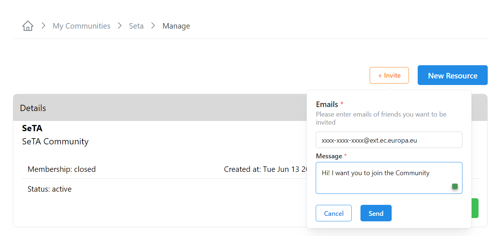
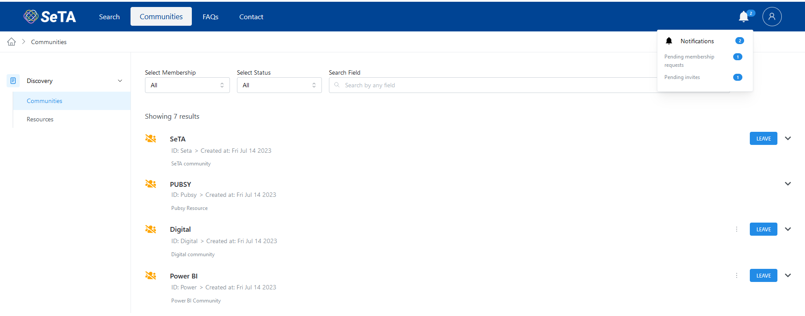
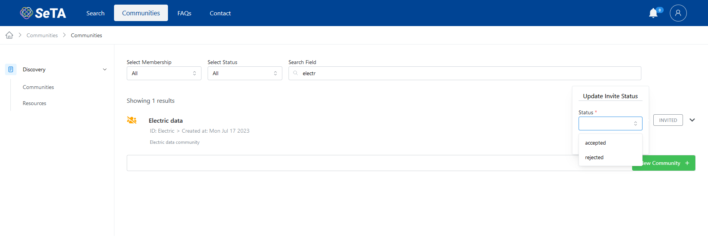
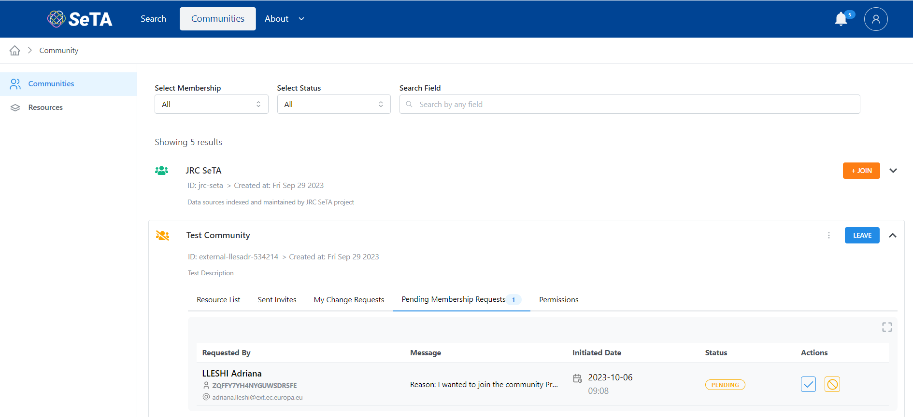
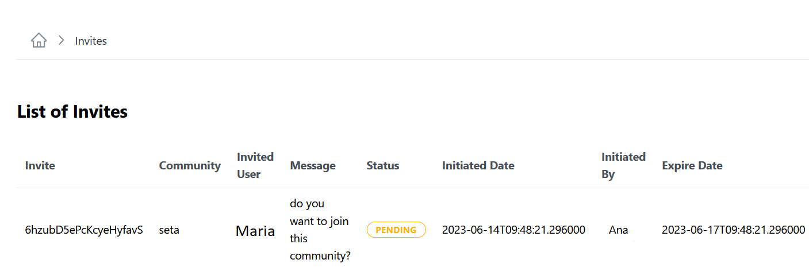
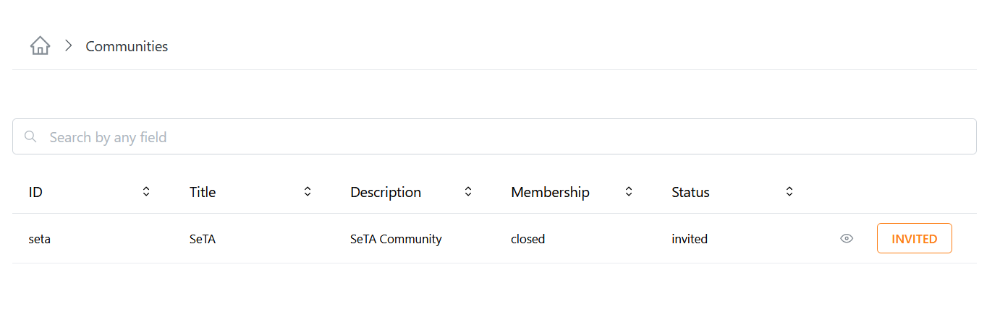

### Invite to Join a Community

#### From My Communities list
1. From the side menu click on ^^Manage^^ -> ^^My Communities^^.       
2. You can either enter in the search bar the name of the Community you are looking for or select from the Community list.      
3. Click on the button ^^Invite^^.       
4. In the pop-up window, write the emails of the users you want to invite and a message.    
5. Click ^^Send^^.       

<figure markdown>
  
  <figcaption>Invite to Join Community</figcaption>
</figure>

#### From Manage Communities                  
1. From the side menu click on ^^Manage^^ -> ^^My Communities^^.       
2. You can either enter in the search bar the name of the Community you are looking for or select from the Community list.      
3. Click in the three dots at the right side of each Community and select the option ^^Manage^^.       
4. In the next window, click on button ^^Invite^^ at the top right.
5. In the pop-up window, write the emails of the users you want to invite and a message.    
6. Click ^^Send^^.    

#### From View Details option
1. From the side menu click on ^^Manage^^ -> ^^My Communities^^.  
2. You can either enter in the search bar the name of the Community you are looking for or select from the Communities list.  
3. Click in the three dots at the right side of each Community and select the option ^^View Details^^.  
4. In the next window, on section Details, click on button ^^Manage^^ at the button.     
5. In the next window, click on button ^^Invite^^ at the top right.
6. In the pop-up window, write the emails of the users you want to invite and a message.    
7. Click ^^Send^^.   

<figure markdown>
  
  <figcaption>Invite to Join Community</figcaption>
</figure>

### See the Pending Invites Sent

1. From the side menu click on ^^Manage^^ -> ^^My Communities^^.  
2. You can either enter in the search bar the name of the Community you are looking for or select from the Communities list.  
3. Click in the three dots at the right side of each Community and select the option ^^View Details^^.  
4. In the next window, on section Stats, on row *Pending Invites* click in the number button.     
5. In the next window, you will see the list.

<figure markdown>
  
  <figcaption>Pending invites</figcaption>
</figure>

<figure markdown>
  
  <figcaption>List of Pending invites</figcaption>
</figure>

## Invites

### Retrieve my pending invites.

#### From Communities main page
1. From the side menu on top you can see if you have pending invites.  
2. Click in the number.  
3. In the next window, you will see the list.

<figure markdown>
  
  <figcaption>Pending invites</figcaption>
</figure>

<figure markdown>
  
  <figcaption>List of Pending invites</figcaption>
</figure>

### Accept invitation to Join a Community

#### From Communities main page
1. From the side menu on top you can see if you have pending invites.                
2. Click in the number.              
3. In the next window, you will see the list.       
4. Click in the button ^^Invited^^.             
5.     

<figure markdown>
  
  <figcaption>Pending invites</figcaption>
</figure>

<figure markdown>
  
  <figcaption>List of Pending invites</figcaption>
</figure>

#### From Communities list
1. From the side menu click on ^^Discovery^^ -> ^^Communities^^.       
2. You can either enter in the search bar the name of the Community you are looking for or select from the Community list.      
3. Click the button ^^Invited^^ in the Community row.                  

<figure markdown>
  
  <figcaption>Invitation to Join Community</figcaption>
</figure>