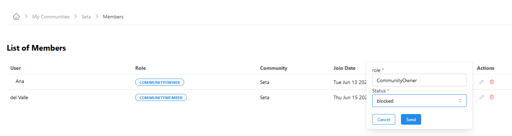

## List of Community Members

1. You can either enter in the search bar the name of the Community you are looking for or select from the Community list.             
2. Click on :octicons-chevron-down-12: at the right side of the Community row.      
3. A new section will appear where you can see different tabs: *Resource List, Sent Invites, My Change Requests, Pending Membership Requests, Permission*.                  
4. On tab *Permission* you can see a list of the memebers and their scopes.              

<figure markdown>
  
  <figcaption>Community Members</figcaption>
</figure>

<!-- ## Remove a Member of the Community 

### From Communities 
1. From the side menu click on ^^Discovery^^ -> ^^Communities^^.       
2. You can filter by ^^Status^^ (*MEMBER*) and either enter in the search bar the name of the Community you are looking for or select from the Community list.      
3. Click on :octicons-eye-24: at the right side of the Community row.       
4. On the Community page, on section ^^STATS^^, click on the badge with the number of members.
5. On the List of Members page, under column ^^Actions^^ click on the :octicons-trash-24: to remove the member.
6. Click ^^Confirm^^            

<figure markdown>
  
  <figcaption>Communities</figcaption>
</figure>
  

<figure markdown>
  
  <figcaption>Remove Community Member</figcaption>
</figure>

## Block a member of the Community

### From Communities 
1. From the side menu click on ^^Discovery^^ -> ^^Communities^^.       
2. You can filter by ^^Status^^ (*member*) and either enter in the search bar the name of the Community you are looking for or select from the Community list.      
3. Click on :octicons-eye-24: at the right side of the Community row.       
4. On the Community page, on section ^^STATS^^, click on the badge with the number of members.
5. On the List of Members page, under column ^^Actions^^ click on the :octicons-pencil-24: and change the status to *blocked*.
6. Click ^^Send^^            

<figure markdown>
  
  <figcaption>Communities</figcaption>
</figure>

<figure markdown>
  
  <figcaption>Block Community Member</figcaption>
</figure>

<!--### Display the available memberships 
> (*to check*)-->

## Join a Community

1. You can either enter in the search bar the name of the Community you are looking for or select from the Community list.      
2. Click on the button ^^Join^^.     
3. If the *Membership* status is *Restricted*, a pop-up window will appear to send a message to ask for the request.      
4. The join button changes to ^^PENDING^^ until the Community manager approves or reject the request to join. If the request is approved, the status changes to *membership* and the button changes to ^^LEAVE^^, if the request is rejected the status changes to *rejected* and the button changes to ^^REJECTED^^.
5. If the *Membership* status is *opened*, it is possible to join without sending a request.  
    

<figure markdown>
  
  <figcaption>Join Community</figcaption>
</figure>

<figure markdown>
  
  <figcaption>Join Community (*waiting for approval*)</figcaption>
</figure>

<figure markdown>
  
  <figcaption>Join Community (*approved*)</figcaption>
</figure>

<figure markdown>
  
  <figcaption>Join Community (*rejected*)</figcaption>
</figure>

## Leave a Community

### From Communities 

1. From the side menu click on ^^Discovery^^ -> ^^Communities^^.       
2. You can filter by ^^Status^^ (*member*) and either enter in the search bar the name of the Community you are looking for or select from the Community list.      
3. Click on button ^^LEAVE^^.       
4. The button label change to ^^JOIN^^ and the Status to *NOT MEMBER*.              

<figure markdown>
  
  <figcaption>Leave a Community</figcaption>
</figure>

### From My Communities

1. From the side menu click on ^^Manage^^ -> ^^My Communities^^.       
2. You can either enter in the search bar the name of the Community you are looking for or select from the Community list.      
3. Click on :material-dots-horizontal: at the right side of each Community and select the option ^^:octicons-eye-24: View Details^^.       
4. On the Community page, on section ^^Details^^, click on the button ^^LEAVE^^.                 
5. You are sent to the My Communities page.

<figure markdown>
  
  <figcaption>Leave a Community</figcaption>
</figure>

## Manage Request to Join My Community

### From Pending Membership Requests

1. From the side menu on top you can see if you have Pending Membership Requests.  
2. Click in the number.           
3. In the next window, you will see the list.            
4. Click in the ^^:octicons-pencil-24:^^ under column *Actions* to update the status.

<figure markdown>
  
  <figcaption>Pending Membership Requests</figcaption>
</figure>

<figure markdown>
  
  <figcaption>List of Pending Membership Requests to Join Community</figcaption>
</figure>

### From My Communities 

#### Accept the request to Join My Community
                  
1. From the side menu click on ^^Manage^^ -> ^^My Communities^^.       
2. You can either enter in the search bar the name of the Community you are looking for or select from the Community list.      
3. Click on :material-dots-horizontal: at the right side of each Community and select the option  ^^:octicons-gear-24: Manage^^.       
4. In the next window, in section ^^Pending Join Requests^^ you can see the pending requests.                     
5. By clicking in the ^^:octicons-pencil-24:^^, under *actions* column you can change the status to: *approved*.
6. Click ^^Send^^.      

 
<figure markdown>
  { width="800" }
  <figcaption>List of requests to Join Community</figcaption>
</figure>

<figure markdown>
  
  <figcaption>Accept request to Join Community</figcaption>
</figure>

#### Reject the request to Join My Community        
                  
1. From the side menu click on ^^Manage^^ -> ^^My Communities^^.       
2. You can either enter in the search bar the name of the Community you are looking for or select from the Community list.      
3. Click on :material-dots-horizontal: at the right side of each Community and select the option ^^Manage^^.       
4. In the next window, in section ^^Pending Join Requests^^ you can see the pending requests.                     
5. By clicking in the ^^:octicons-pencil-24:^^, under *actions* column you can change the status to: *rejected*.
6. Click ^^Send^^.      

 
<figure markdown>
  
  <figcaption>Reject request to Join Community</figcaption>
</figure>

### Keep Pending the request to Join My Community        
                  
1. From the side menu click on ^^Manage^^ -> ^^My Communities^^.       
2. You can either enter in the search bar the name of the Community you are looking for or select from the Community list.      
3. Click on :material-dots-horizontal: at the right side of each Community and select the option  ^^:octicons-gear-24: Manage^^.       
4. In the next window, in section ^^Pending Join Requests^^ you can see the pending requests.                     
5. By clicking in the ^^:octicons-pencil-24:^^, under *actions* column you can change the status to: *pending*.
6. Click ^^Send^^.      

 
<figure markdown>
  
  <figcaption>Keep Pending the request to Join Community</figcaption>
</figure>

