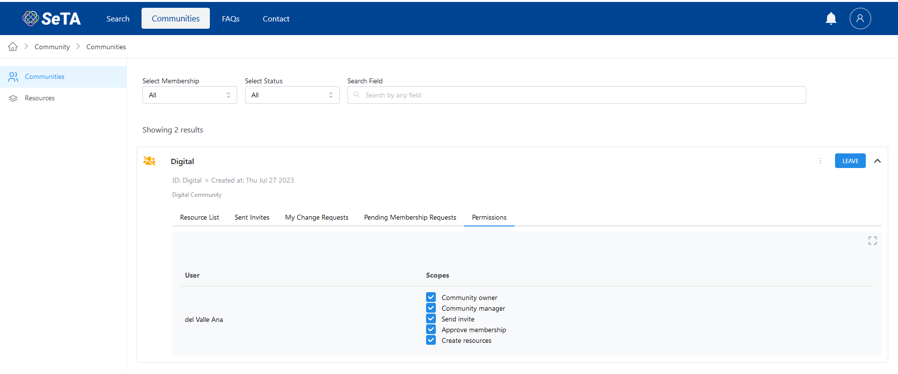
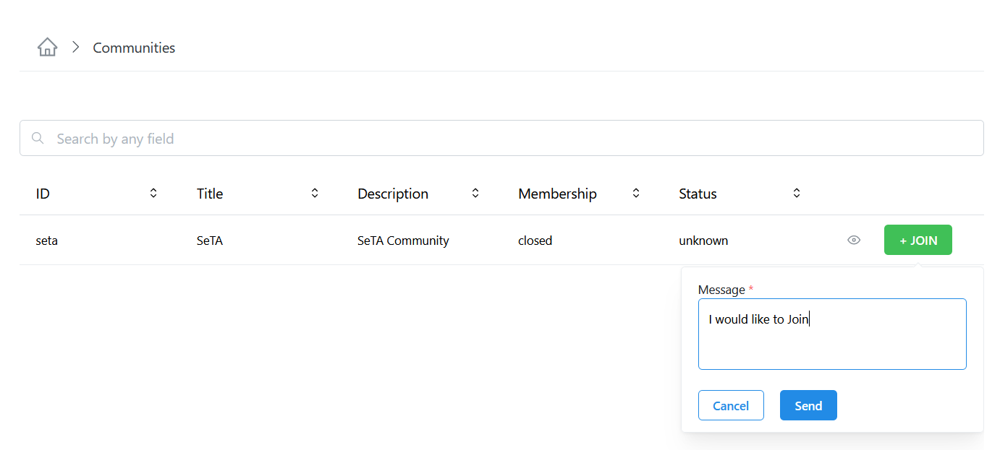
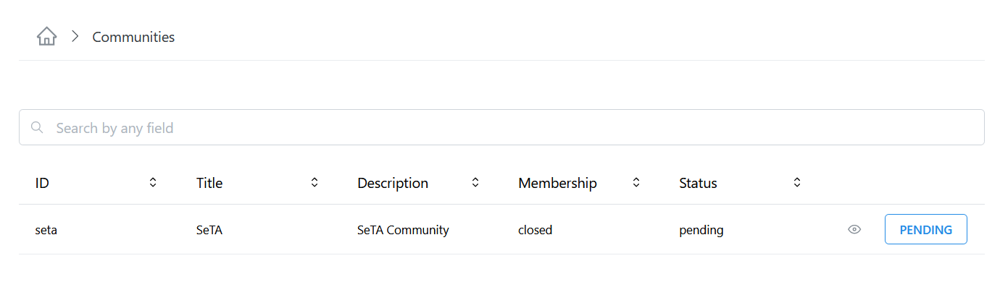
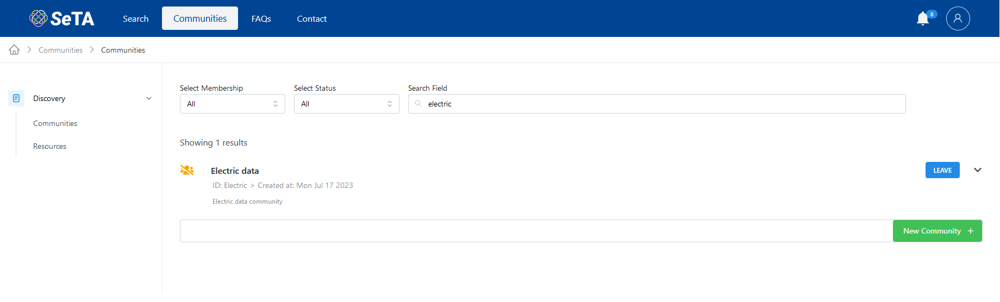
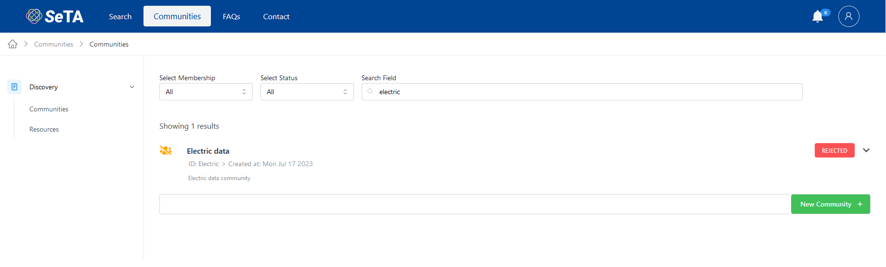
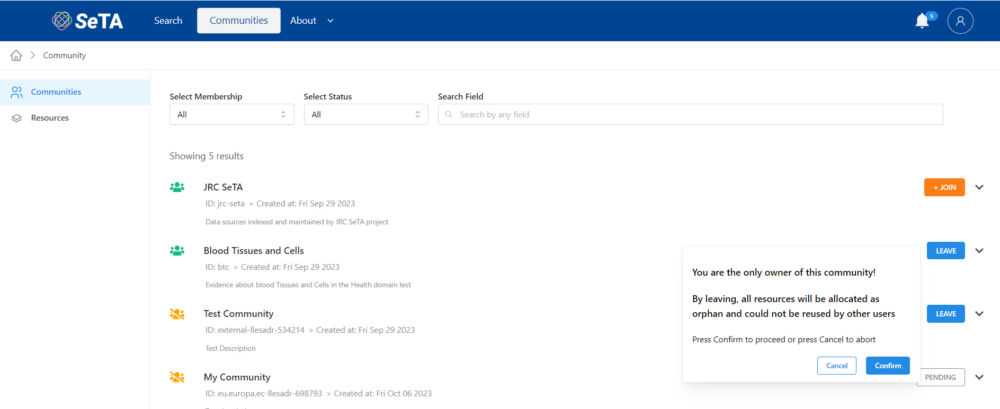
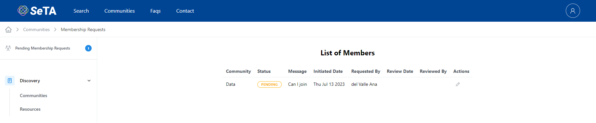
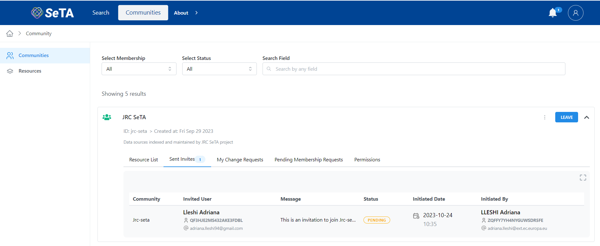

## List of Community Members

1. You can either use the filters to search the Community or select from the Communities list.             
2. Click on :octicons-chevron-down-12: at the right side of the Community row.      
3. A new section will appear where you can see different tabs: *Resource List, Sent Invites, My Change Requests, Pending Membership Requests, Permission*.                  
4. On tab *Permission* you can see a list of the members and their scopes.              

<figure markdown>
  
  <figcaption>Community Members</figcaption>
</figure>

## Join a Community

1. You can either use the filters to search the Community or select from the Communities list.      
2. Click on the button ^^Join^^.     
3. If the *Membership* status is *Restricted*, a pop-up window will appear to send a message to ask for the request.      
4. The join button changes to ^^PENDING^^ until the Community manager approves or reject the request to join. If the request is approved, the status changes to *membership* and the button changes to ^^LEAVE^^, if the request is rejected the status changes to *rejected* and the button changes to ^^REJECTED^^.
5. If the *Membership* status is *opened*, it is possible to join without sending a request.  
    

<figure markdown>
  
  <figcaption>Join Community</figcaption>
</figure>

<figure markdown>
  
  <figcaption>Join Community (*waiting for approval*)</figcaption>
</figure>

<figure markdown>
  
  <figcaption>Join Community (*approved*)</figcaption>
</figure>

<figure markdown>
  
  <figcaption>Join Community (*rejected*)</figcaption>
</figure>

## Leave a Community

1. You can either use the filters to search the Community or select from the Communities list.      
2. Click on button ^^LEAVE^^. *If you are the only member, a warning message will appear*       
3. The button label will change to ^^JOIN^^.              

<figure markdown>
  
  <figcaption>Leave a Community</figcaption>
</figure>

## Request to Join My Community

### From the main page
1. You can either use the filters to search the Community or select from the Communities list.             
2. Click on :octicons-chevron-down-12: at the right side of the Community row.      
3. On the opened section, click on tab *Pending Membership Requests*.           
4. You can see a list of the pending membership requests.            
5. Click in the ^^:octicons-pencil-24:^^ under column *Actions* to update the status (*pending, approved, rejected*).
6. Click *send*
7. The request disappear from the Pending Membership Requests list.

<figure markdown>
  
  <figcaption>Pending Membership Requests</figcaption>
</figure>

> If the status is not update, the status will remain *PENDING*, if the request is set to *Rejected* the status in the communities list will be *REJECTED*

### From the side menu
1. From the side menu on top you can see if you have *Pending Invites*.  
2. Click in the number badge.  
3. In the main window, you will see a List of Invites.
4. Click in the ^^:octicons-pencil-24:^^, under *actions* column to change the status to: *accepted* or *rejected*.
6. Click ^^Send^^.     

<figure markdown>
  
  <figcaption>Pending Membership Requests</figcaption>
</figure>

## See the Invites Sent

1. You can either use the filters to search the Community or select from the Communities list.             
2. Click on :octicons-chevron-down-12: at the right side of the Community row.      
3. On the opened section, click on tab *Sent Invites*.           
4. You can see a list of the Invites sent.            

<figure markdown>
  
  <figcaption>Sent Invites</figcaption>
</figure>

## Accept Invitation to Join a Community.

1. From the side menu on top you can see if you have *Pending Invites*.  
2. Click in the number badge.  
3. In the main window, you will see a List of Invites.
4. Click in the ^^:octicons-pencil-24:^^, under *actions* column to change the status to: *accepted* or *rejected*.
6. Click ^^Send^^.      

<figure markdown>
  
  <figcaption>Sent Invites</figcaption>
</figure>
