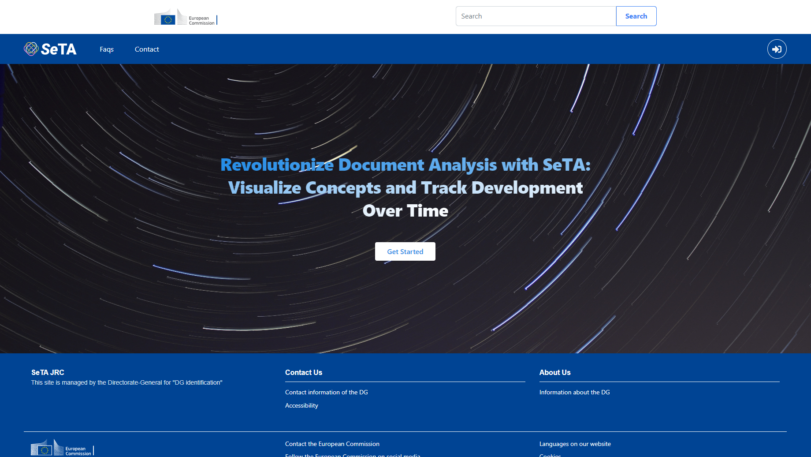
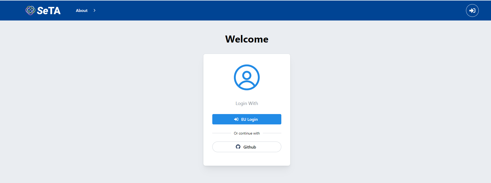

The SeTA Web App is a user-friendly interface that allows the user to access the content in a Web browser. 
 
<figure markdown>

<figcaption>SeTA main page</figcaption>
</figure>

In the SeTA Web App, we can find:

- Communities: A digital platform where people with a common interest can share, connect and communicate with one another.               

- Search tool: An online search engine tool designed to search for metadata on the SeTA community database. It sorts the results, and makes an ordered list of these results according to the search algorithms.

To access these features, you need to login either with an EU login[^1] account or with a GitHub[^2] authentication.

<figure markdown>

<figcaption>Login</figcaption>
</figure>

<figure markdown>

<figcaption>Login with GitHub</figcaption>
</figure>

Once you are logged in, you can see in the top menu the link to the Search and to the Communities:

<figure markdown>

<figcaption>Top Menu</figcaption>
</figure>

[^1]:https://webgate.ec.europa.eu/ern/userguide/Content/A.HOW%20TO%20JOIN/Register%20on%20EU-Login.htm
[^2]:https://github.com/

