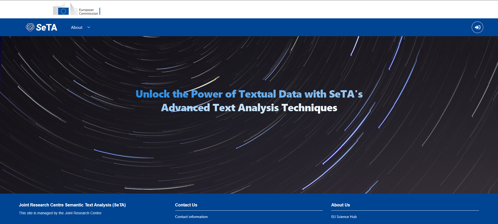

The SeTA Web App is a user-friendly interface that allows the user to access the content in a Web browser. 
 
<figure markdown>

<figcaption>SeTA main page</figcaption>
</figure>

In the SeTA Web App, we can find:

- Datasources: A digital platform where people with a common interest can explore among different repository of information.

- Search tool: An online search engine tool designed to search for metadata on the SeTA datasource database. It sorts the results, and makes an ordered list of these results according to the search algorithms.

To access these features, you need to login either with an EU login[^1] account or with a GitHub[^2] authentication.

<figure markdown>

<figcaption>Login</figcaption>
</figure>

<figure markdown>

<figcaption>Login with GitHub</figcaption>
</figure>

Once logged in, the top menu provides access to the Search and Datasources links. Additionally, the About dropdown offers access to FAQs, Contact, and Take a Tour pages:

<figure markdown>

<figcaption>Top Menu</figcaption>
</figure>

[^1]:https://webgate.ec.europa.eu/ern/userguide/Content/A.HOW%20TO%20JOIN/Register%20on%20EU-Login.htm
[^2]:https://github.com/

