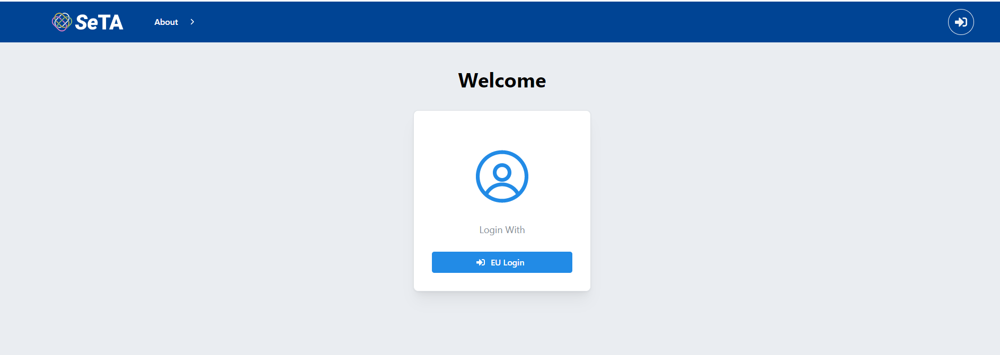

# Setup
SeTA has two user interfaces:

- Web App: Allows the user to interact through the Web page with the content in a Web browser, which acts as a client.

- API: An Application Programming Interface exposing data and functionality in a consistent format.

## Web App
The SeTA Web App is a user-friendly interface that allows the user to access the content in a Web browser. 
 
<figure markdown>

<figcaption>SeTA main page</figcaption>
</figure>

In the SeTA Web App, we can find:

- Search tool: An online search engine tool designed to search for metadata on the SeTA database based on the user's search query. It sorts the results, and makes an ordered list of these results according to the search algorithms.

- Communities: A digital platform for people with a common interest to discuss or share and connect and communicate with one another.

To access these features, first, you need either to login with an EU login[^1] account or with a GitHub[^2] authentication.

<figure markdown>

<figcaption>Login</figcaption>
</figure>

Once you are logged in, you can see in the top menu the link to the Search and to the Communities:

<figure markdown>

<figcaption>Search</figcaption>
</figure>

[^1]:https://webgate.ec.europa.eu/ern/userguide/Content/A.HOW%20TO%20JOIN/Register%20on%20EU-Login.htm
[^2]:https://github.com/

