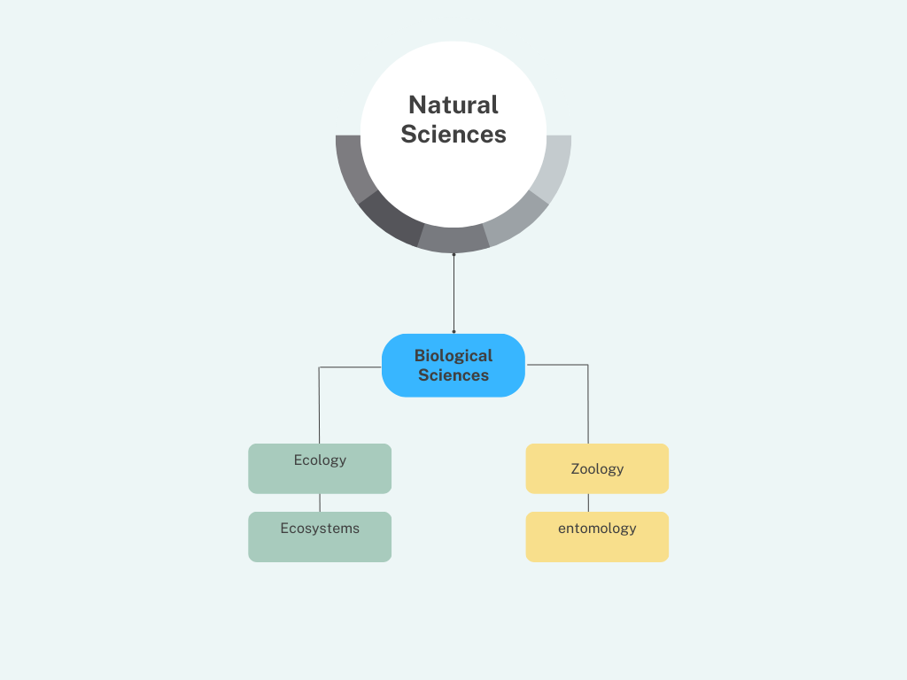

The Search tool in SeTA follows a series of steps for the preparation of the knowledge data. The first two steps concern document collection, cleaning and storage, and the second two steps concern text analysis and modelling.   
\       
{ align=right width=400 }   
1. Everything starts by receiving as input from different sources the data that will fill the database.      
2. The data is processed (cleaned, algorithms)      
3. The processed data is used to create the AI Models       
4. The parsed and labelled data is ready to use for the searching.                              
\                               
\                                                      
\                                                        
\                                                         
\                                                           
\                                   

## Corpus preparation

The corpus offered with SeTA comes from the following European Union sources: EUR-LEX, CORDIS, JRC PUBSY, EUROPARL.

All the texts collected are in English only (except for some older legal texts where multiple languages are interleaved on the same page). 

The reasons for this decision are:

- [x] English language sentence dependency parsing is rather straightforward and there are several open source semantic parsers with excellent tuning for this language.

- [x] We are interested in extracting knowledge from plain text and as the translation of, for example, a directive into all EU languages does not create new knowledge, processing a single language well should capture the available information.


### Taxonomy

The term **'Taxonomy'** refers to the science of categorizing things. Thus, a taxonomy is a controlled vocabulary in which all terms have parent/child or broader/narrower relationships to other terms and belong to a single hierarchical structure. The structure is also referred to as a 'tree'. Non-preferred terms/synonyms may or may not be included in a taxonomy. Taxonomy has recently gained popularity as a term for any type of controlled vocabulary, whether a term list, authority file, thesaurus, or any hybrid combination. [^1]

Large amounts of information need to be well-organized in order to avoid the storage in unstructured ways in many repositories, databases, and libraries, often with ambiguous naming conventions that provide little insight into the material and its value to the user.      
The implementation of taxonomy in the preparation of the SeTA Corpus, is an effort to provide organization and increase productivity through quicker, more efficient retrieval and use.        
In order to make it simpler to identify related information, taxonomy uses a regulated vocabulary to represent the formal structure of classes or types of things inside a knowledge domain. The taxonomy aids in the hierarchical organization of the assets and material. It can be much simpler to search for or explore an asset and do content management by classifying the content and assets in a taxonomy. [^2]        

Taxonomies can be of several kind, such as *flat, hierarchical, network*, and so on. In SeTA, a hierarchical structure was chosen, with a single root that is subdivided into categories as needed to organise the information and represented as a tree. 

#### How to design a good Taxonomy

When creating a Taxonomy, consider:       
1. Decide what topics the Taxonomy must include.    
2. Consider how specific the Taxonomy needs to be.    
3. Provide names for each object in relation to other objects and follow a hierarchical style.     
4. Have particular guidelines that are followed while classifying or categorising any object inside a domain. These guidelines must be comprehensive, consistent, and clear.      
5. Apply strict specification to ensure that any newly discovered object can only belong to one specific category or type of object.      
6. Inherit every property from the class above it and also have the option of adding new properties.      
7. Objects membership attributes in relation to other objects may also be captured.     

The following example describes a simple Taxonomy:

{width=600}

<!--```
  /natural sciences
  /natural sciences/biological sciences
  /natural sciences/biological sciences/ecology
  /natural sciences/biological sciences/ecology/ecosystems
  /natural sciences/biological sciences/zoology
  /natural sciences/biological sciences/zoology/entomology
``` -->


#### Taxonomy in SeTA
SeTA, currently works with EuroVoc.  EuroVoc is a multilingual thesaurus originally built for processing the documentary information of the EU institutions.[^3]      

However, users have the possibility to define new taxonomies if necessary.    

To create a new taxonomy, users can set it together with the document they are uploading:

- In the SeTA API, through the function *PUT /corpus* it is possible to upload the new taxonomy(*see example below*) .   

- In the Communities Web Interface, it is also possible to create new taxonomies. When uploading a new document, inside the resource menu, the user finds the option to create a new taxonomy. 

<!-- set up a screen shot from the communities  web app-->

<!-- taxonomies to search by path and by code  -->
There can be more than one taxonomy for every document.    

The following is an example of how to setup a new taxonomy within a document when loading into the API:

```json
{
  "source": "cordis",
  "mime_type": "URL",
  "language": "en",
  "id": "cordis:project:96956",
  "id_alias": "CORDIS:project:96956",
  "title": "ULTRAVEG: Development of a high power ultrasound system for the low-cost, fast, effective and quality drying of fruit and vegetables",
  "abstract": "Dried food is a major element in modern food processing and a staple ingredient for an increasing variety of foodstuffs...",
  "text": "Dried food offers many advantages for the mass production of commercially prepared goods, not least cheaper transportation costs, longer storage life and ease of use. ",
  "date": "2019-08-01",
  "link_related": [
    "https://cordis.europa.eu/article/rcn/92388"
  ],
  "author": [
    "HEBOLD MIXING & MORE GMBH",
    "Gefriertrocknung Greven GmbH",
    "VEREIN ZUR FORDERUNG DES TECHNOLOGIETRANSFERS AN DER HOCHSCHULE BREMERHAVEN EV",
    "TECHNISCHE UNIVERSITAT BERLIN",
    "FULLWELL MILL LIMITED",
    "AKTIVE ARC SARL",
    "GOKSER MAKINA SANAYI VE TICARET LIMITED SIRKETI",
    "IRIS TECHNOLOGY SOLUTIONS, SOCIEDAD LIMITADA"
  ],
  "collection": "project;Project",
  "taxonomy": [
    {
      "code": "/25",
      "label": "engineering and technology",
      "longLabel": "/engineering and technology",
      "validated": "true",
      "classifier": "cordis",
      "version": "1",
      "name": "euro_sci_voc",
      "name_in_path": "engineering_and_technology"
    },
    {
      "code": "/25/59",
      "label": "other engineering and technologies",
      "longLabel": "/engineering and technology/other engineering and technologies",
      "validated": "true",
      "classifier": "cordis",
      "version": "1",
      "name": "euro_sci_voc",
      "name_in_path": "other_engineering_and_technologies"
    }
  ]
}
```


### Document cleaning pipeline
The document gathering process is the initial step in the pipeline's overall procedure. 

The typical process to create a general corpus involves:       

- Conversion from original formats (PDF, HTML, XML, MSWord, …) to plain text.

- Conversion to Unicode, removal of text conversion artefacts, removal of non-alphanumeric characters, transposition of diacritics to ascii characters.

- De-hyphenation.

- Sentence separation based on dependency parsing (allowing the reconstruction even of sentences split over several lines).

This stage produces a document repository containing the thoroughly cleaned unified plain text. 

### Neural networks training

Neural networks may learn any function, and the only limitation is the availability of data. As a result, data preparation, feature engineering, and domain coverage become critical components for producing relevant and understandable results from neural network training.     

For SeTA we use chunk compositionality and word embedding for the training.    

By using supervised learning, which involves providing the network with a huge collection of training data comprised of input chunks, we can train neural networks. 

### Chunk compositionality

**"Chunking"** is the process of combining several pieces of information into more comprehensible or significant portions.[^4]. 

By selecting chunk shapes and sizes wisely, significant performance benefits can be achieved. Chunking also provides efficient per-chunk compression and efficiently extending multidimensional data along multiple axes. As a result, reading a portion of a compressed variable does not necessitate uncompressing the entire variable. 

Three key ingredients needed for successful chunking:

- Using small, well-organized units.
- Finding the right level of detail.

In SeTA we create chunks of 300 words. With this we try to ensure our search results accurately and capture the essence of the user's query.  For every chunk we create an embedding. 

### Embedding
Word embeddings are numerical vector representations of text that keep track of the semantic and contextual relationships between words in the corpus of texts.  The words in this form are closer to one another in the vector space because they have stronger semantic links. Embeddings can be utilised with other models and, in general, improve the productivity and usability of ML models.

The sentence-transformers model **all-distilroberta-v1**[^5] is utilised for the embedding process as it helps in the clustering and the semantic search because it maps sentences and paragraphs to a dimensional dense vector space. 


### Semantic search

<!-- to ask  in which part is used sBERT-->
**sBert**[^6] is a modification of the standard pretrained **BERT**[^7] network.

Bidirectional Encoder Representations from Transformers, sometimes known as **BERT**, is an open source machine learning framework for natural language processing (NLP). **BERT** uses the text around it to generate context, which enables computers to understand the meaning of ambiguous words in text.  **BERT** is built on Transformers[^8], a deep learning model in which every output element is connected to every input element and the weightings between them are dynamically determined based on their connection.     
**sBERT** is a sentence-based model that gives additional training to the model, allowing semantic search for a huge number of sentences. **sBERT** employs a siamese architecture, which consists of two virtually identical **BERT** architectures with the same weights, and **sBERT** analyses two words as pairs during training.         

When training the model, **SBERT** concatenates the two embeddings, which are then sent through a SoftMax  classifier and trained with a SoftMax -loss function. When the model reaches inference — or begins predicting — the two embeddings are compared using a cosine similarity function, which generates a similarity score for the two sentences.
 

### Word2Vec
In SeTA, the **Word2Vec**[^9] algorithm  is used to get the suggestions and similar terms when searching in the user interface  search bar.        
The algorithm **Word2Vec** processes phrases. This algorithm takes input words and groups them together based on the similarity of their meanings. This similarity is calculated using complex mathematical formulas based on the context of the words.        

Word2vec is a two-layer neural net that processes text by “vectorizing” words. Its input is a text corpus and its output are a set of vectors: feature vectors that represent words in that corpus. Word2vec creates vectors that are distributed numerical representations of word features, features such as the context of individual words. It does so without human intervention. While Word2vec is not a deep neural network, it turns text into a numerical form that deep neural networks can understand. Its output is a vocabulary in which each item has a vector attached to it, which can be fed into a deep-learning net or simply queried to detect relationships between words.     

**Word2Vec** has been used in alongside **Gensim**[^10]. **Gensim** ("Generate Similar") is an open-source framework for unsupervised topic modelling and natural language processing written in Python. It is a tool for extracting semantic concepts from documents that is capable of handling large text volumes. As a result, it differs from other machine learning software packages that concentrate on memory processing. To boost processing speed, Gensim also provides efficient multicore implementations for certain algorithms. It includes more text processing features than other packages such as Scikit-learn, R, and others.            

### Pre-processing data

**spaCy**[^11] is a Python library for advanced Natural Language Processing (NLP) that is open-source and free. It helps create applications that process and "understand" massive volumes of text and is specifically created for usage in production. It can be used to create information extraction or systems for interpreting natural language, or it can be used to prepare text for deep learning.     

We train neural networks using **textacy**[^12], a potent Python language modelling package built on the basis of **spaCy**. It can carry out a variety of natural language processing (NLP) tasks thanks to the **spaCy** library's outstanding performance. The essentials, such as part-of-speech tagging, dependency parsing, and tokenization, are handled by another library, leaving **textacy** to concentrate mostly on the jobs that occur before and after. The pre-processing module of **textacy** has a good number of functions to normalise characters and to handle common patterns like URLs, email addresses, phone numbers, and so on.    

**textacy** features:

- Connect directly and add custom extensions to the main functionality of spaCy for interacting including one or more documents.
- Various similarity measures are used to compare strings and sequences.
- Prior to using spaCy to analyse raw text, clean, normalise, and examine it.
- Documents are tokenized and vectorized, and then topic models are trained, interpreted, and displayed.

Once we have the processed data, then is ingested and stored in an **Elasticsearch **.


### Elasticsearch 
Elasticsearch [^13] is a distributed, free and open search and analytics engine for all types of data, including textual, numerical, geospatial, structured and unstructured. Elasticsearch  is built on Apache Lucene and was first released in 2010 by Elasticsearch  N.V. (now known as Elastic).  Raw data flows into Elasticsearch  from a variety of sources, including logs, system metrics, and web applications. Data ingestion is the process by which this raw data is parsed, normalized, and enriched before it is indexed in Elasticsearch . Once indexed in Elasticsearch , users can run complex queries against their data and use aggregations to retrieve complex summaries of their data.


### Ontology
An ontology[^14] shows properties and relations between a set of concepts and categories within a subject area or domain. It is a branch of linguistics called semantics, the study of meaning. With an ontology, a machine can accurately interpret the meaning of the word “diamond” in relation to a baseball player, jeweller, or card suit. It can also help interpret the word “chicken” as either food or an animal or differentiate between “bank” as a place of business or land alongside a river or lake.   


In SeTA the concept of ontology is used when searching a term to return a list of similar terms that describes the ontology of the specified term. These lists are ranked by the relation strength to the query term. The first node in each list is the direct relation to query term. The following terms in each sub list have relation to the first node in a sub list.  The result should be interpreted as follows: the first item in each sub list is first level connection to the query term.     


At this point, terms, text or full documents are ready to be searched through the Web Application interface or through an API, and users are able to target their search either to the individual document collections or to search across all collections in a harmonised way.


[^1]: https://link.springer.com/article/10.1057/dam.2010.29
[^2]: https://data.nsw.gov.au/IDMF/data-structure-and-coordination/data-taxonomy
[^3]: https://eur-lex.europa.eu/browse/eurovoc.html
[^4]: https://www.mindtools.com/a8u1mqw/chunking
[^5]: https://huggingface.co/sentence-transformers/all-distilroberta-v1
[^6]: https://www.SBERT.net
[^7]: https://arxiv.org/pdf/1810.04805.pdf
[^8]: https://huggingface.co/docs/transformers/index
[^9]: https://code.google.com/archive/p/word2vec/ 
[^10]: https://radimrehurek.com/gensim/auto_examples/index.html#documentation
[^11]: https://spacy.io/usage/spacy-101 
[^12]: https://pypi.org/project/textacy/
[^13]: https://www.elastic.co/elasticsearch/
[^14]: https://plato.stanford.edu/entries/logic-ontology/#DiffConcOnto


