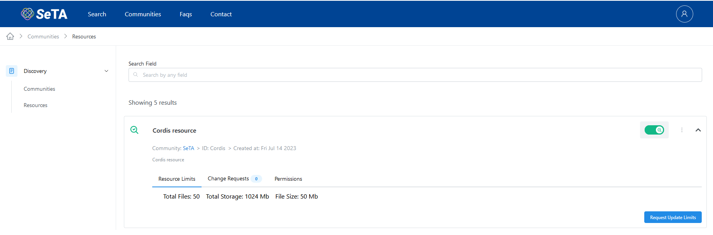
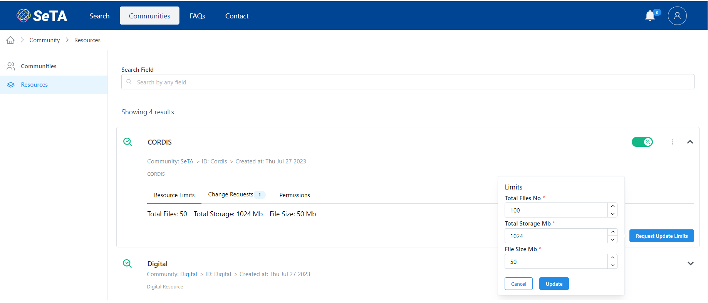

# Community Resources

## Create a Resource in a Community

1. From the side menu click on ^^Discovery^^ -> ^^Communities^^.  
2. You can either use the filters to search the Community or select from the Communities list.             
3. Click on :octicons-chevron-down-12: at the right side of the Community row.      
4. In the opened section, click on button ^^New Resource^^ on the right.  
5. Setup the *Resource ID, Title, Abstract* and click *Save*

<figure markdown>
  
  <figcaption>New Resource in a Community</figcaption>
</figure>

<figure markdown>
  
  <figcaption>New Resource in a Community</figcaption>
</figure>

## List of Resources

1. From the side menu click on ^^Discovery^^ -> ^^Resources^^.      
2. You will see a list of the Resources in the page.                        
3. You can either enter in the search bar the name of the Resource you are looking for.              

<figure markdown>
  
  <figcaption>Resources</figcaption>
</figure>

## Update Details of Resource                

1. From the side menu click on ^^Discovery^^ -> ^^Resources^^.  
2. You can either enter in the search bar the name of the Resource you are looking for.              
3. Click on :material-dots-vertical: at the right side of each Resource and select the option ^^Update Resource^^.  
4. In the pop-up window, you can update the *Title* and *Abstract*.  
5. Click ^^Update^^.

<figure markdown>
  
  <figcaption>Update a Resource</figcaption>
</figure>

<figure markdown>
  
  <figcaption>Update a Resource</figcaption>
</figure>

## Delete a Resource    

1. From the side menu click on ^^Discovery^^ -> ^^Resources^^.  
2. You can either enter in the search bar the name of the Resource you are looking for.              
3. Click on :material-dots-vertical: at the right side of each Resource and select the option ^^Delete Resource^^.  
4. A pop-up window appear asking to confirm.  

<figure markdown>
  
  <figcaption>Delete a Resource</figcaption>
</figure>

## Switch to Searchable / Not Searchable

1. From the side menu click on ^^Discovery^^ -> ^^Resources^^.  
2. You can either enter in the search bar the name of the Resource you are looking for.              
3. Click on :material-dots-vertical: at the right side of each Resource and scroll to abilitate the option ^^Switch to Not Searchable / Switch to Searchable^^.  

<figure markdown>
  
  <figcaption>Searchable Resource</figcaption>
</figure>

## Request Update Limits

1. From the side menu click on ^^Discovery^^ -> ^^Resources^^.  
2. You can either enter in the search bar the name of the Resource you are looking for.              
3. Click on :octicons-chevron-down-12: at the right side of the Resource row.     
4. Click in the botton ^^Request Update Limits^^       
5. Setup the limit values for *Total Files No., Total Storage Mb, File Size Mb*
6. Click on *Update*

<figure markdown>
  
  <figcaption>Searchable Resource</figcaption>
</figure>