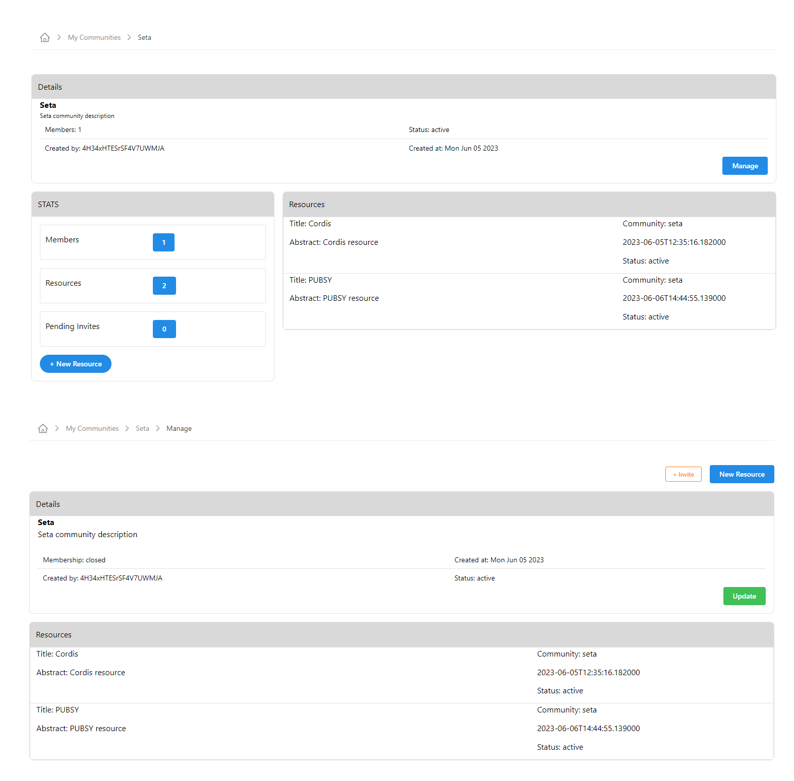
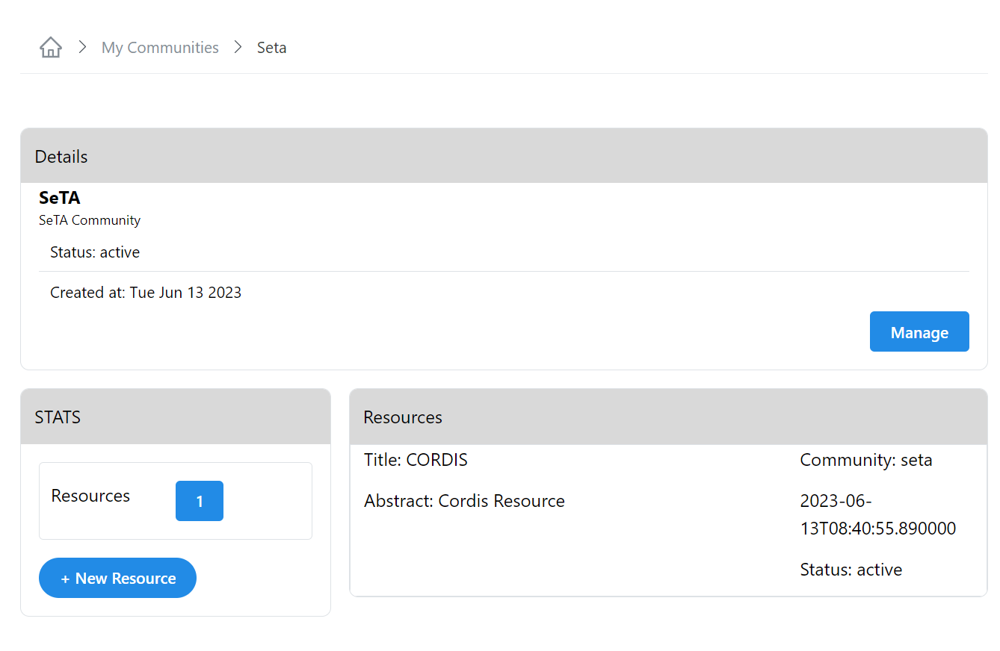
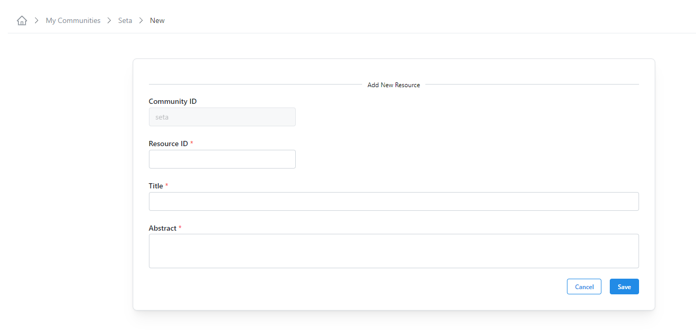
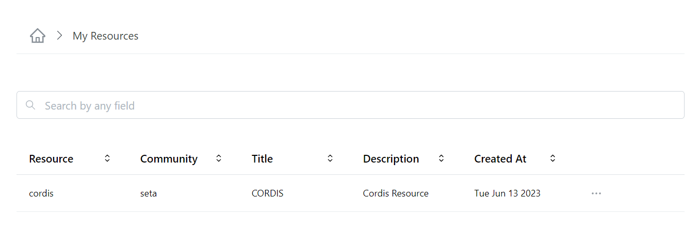
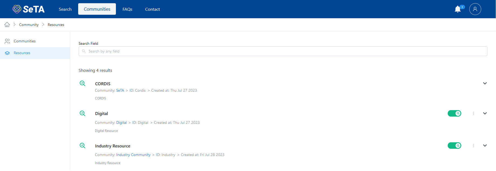
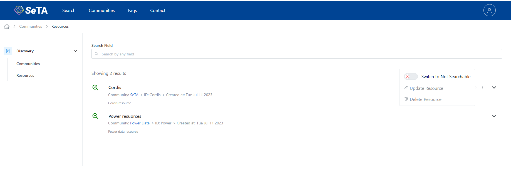
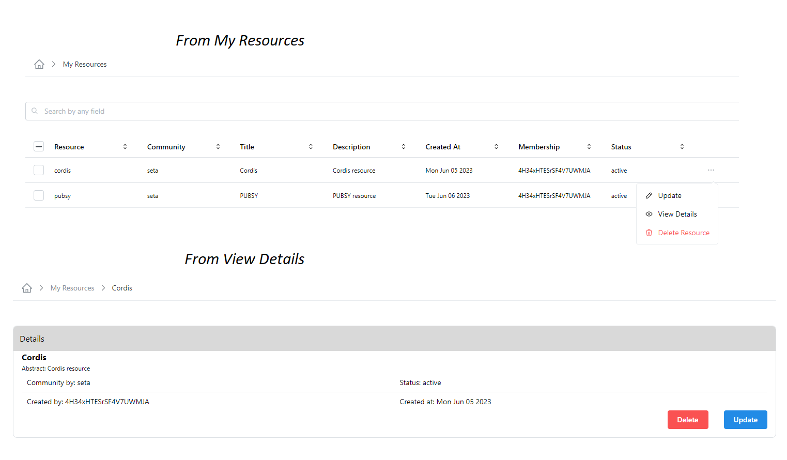
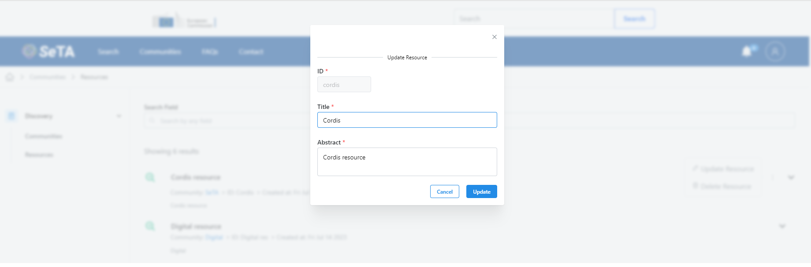
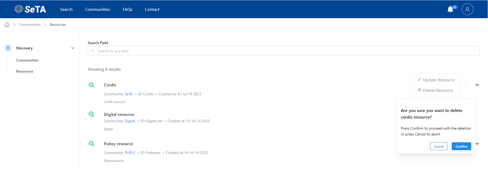

# Community Resources

## Create a Resource in a Community

### From Manage   
1. From the side menu click on ^^Manage^^ -> ^^My Communities^^.  
2. You can either enter in the search bar the name of the Community you are looking for or select from the Community list.   
3. Click on :material-dots-horizontal: at the right side of button ^^Invite^^ and select the option  ^^:octicons-gear-24: Manage^^.    
4. In the next window, click on button ^^New Resource^^ on the top right.  
5. Setup the *Resource ID, Title, Abstract* and click *Save*

<figure markdown>
  
  <figcaption>New Resource in a Community</figcaption>
</figure>

### From View Details   
1. From the side menu click on ^^Manage^^ -> ^^My Communities^^.  
2. You can either enter in the search bar the name of the Community you are looking for or select from the Community list.      
3. Click on :material-dots-horizontal: at the right side of button ^^Invite^^ and select the option ^^:octicons-eye-24: View Details^^.       
4. In the next window, you can either go to section ^^Details^^ or section ^^STATS^^.    
5. On section ^^Details^^, click on button ^^Manage^^ or and click on button ^^New Resource^^ on the top right.  
5. On section ^^STATS^^, click on button ^^New Resource^^ at the button.  
6. On both options, setup the *Resource ID, Title, Abstract* and click *Save*.            

<figure markdown>
  
  <figcaption>New Resource in a Community</figcaption>
</figure>

<figure markdown>
  
  <figcaption>New Resource in a Community</figcaption>
</figure>

## See My Resources

1. From the side menu click on ^^Manage^^ -> ^^My Resources^^.              
2. You will see a list of the Resources in the page.                   
3. You can either enter in the search bar the name of the Resource you are looking for.        

<figure markdown>
  
  <figcaption>My Resources</figcaption>
</figure>

## List of Resources

1. From the side menu click on ^^Discover^^ -> ^^Resources^^.      
2. You will see a list of the Resources in the page.                        
3. You can either enter in the search bar the name of the Resource you are looking for.              

<figure markdown>
  
  <figcaption>Resources</figcaption>
</figure>

## Update Details of Resource                

### From Update

1. From the side menu click on ^^Manage^^ -> ^^My Resources^^.  
2. You can either enter in the search bar the name of the Resource you are looking for or select from the Resources list.  
3. Click on :material-dots-horizontal: at the right side of each Resource and select the option ^^Update^^.  
4. In the next window, you can update the *Title* and *Abstract*.  
5. Click ^^Update^^.

<figure markdown>
  
  <figcaption>Update a Resource from My Resources</figcaption>
</figure>

### From View Details

1. From the side menu click on ^^Manage^^ -> ^^My Resources^^.  
2. You can either enter in the search bar the name of the Resource you are looking for or select from the Resources list.  
3. Click on :material-dots-horizontal: at the right side of each Resource and select the option ^^:octicons-eye-24: View Details^^.  
4. In the next window, click on button ^^Update^^ at the button.  
5. You can update the *Title* and *Abstract*.  
6. Click ^^Update^^.

<figure markdown>
  
  <figcaption>Update a Resource from View Details</figcaption>
</figure>

<figure markdown>
  
  <figcaption>Update a Resource</figcaption>
</figure>

## Delete a Resource    

### From My Resources

1. From the side menu click on ^^Manage^^ -> ^^My Resources^^.  
2. You can either enter in the search bar the name of the Resource you are looking for or select from the Resources list.  
3. After you select the Resource, click on button ^^Delete^^ on the left top of the Resource list.
4. It is also possible to delete the Resource by clicking on :material-dots-horizontal: at the right side of each Resource and select the option ^^Delete Resource^^.  

### From View Details
1. From the side menu click on ^^Manage^^ -> ^^My Resources^^.  
2. You can either enter in the search bar the name of the Resource you are looking for or select from the Resources list.  
3. After you select the Resource, click on :material-dots-horizontal: at the right side of each Resource and select the option ^^:octicons-eye-24: View Details^^.      
4. In the next window, click on button ^^Delete^^ on the right bottom.  
5. A confirm window will appear to delete the resource.    

<figure markdown>
  
  <figcaption>Delete a Resource</figcaption>
</figure>

<!--## Resource Change Requests

> **TO DO**-->