# Search Web interface
Within the search page the options to search are:

* By term
* By phrase
* By document or text
    

### Search by term

1. Start typing in the search bar.  
2. A dropdown box appears automatically, with two sections: 
    1. one section with a list of *autocomplete* words (left side), 
    2. one section with a map of the *related terms* to search (right side). In this section, it is possible to choose for *Related Terms Clusters* or *Related Terms*.
3. After selecting the term to search, click in button *search*

<figure markdown>
  
  <figcaption>Search by term</figcaption>
</figure>

### Search by phrase

1. Start typing in the search bar enclosing with double quotes **" "** the phrase.  
2. A dropdown box appears automatically, with two sections: 
    1. one section with a list of *autocomplete* words (left side), 
    2. one section with a map of the *related terms* to search (right side). In this section, it is possible to choose for *Related Terms Clusters* or *Related Terms*.
3. After selecting the term to search, click in button :octicons-search-16: Search

<figure markdown>
  
  <figcaption>Search by phrase</figcaption>
</figure>

### Enrich query automatically

In the search by terms or phrase it is possible to apply a wizard so the search is enriched automatically by clicking on the :fontawesome-solid-wand-magic-sparkles:.   Every term is expanded in the background to include all the related terms.

<figure markdown>
  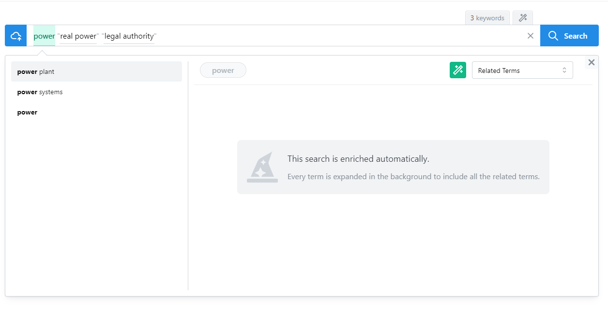
  <figcaption>Enrich query automatically</figcaption>
</figure>

### Search by document or text

#### Search by document
1. Click in the :material-cloud-arrow-up-outline: and a pop-up window will appear.  
2. In this window, there are two sections; the first one on top is to upload the document, we can either select the path where the document is located or we can drag and drop. Either uploading or by drag and drop it is always possible to cancel the upload of the file before the search, with the button :octicons-x-circle-16:.

#### Search by text          
1. Click in the :material-cloud-arrow-up-outline: and a pop-up window will appear.                    
2. In the lower section of the pop-up paste the text you want to search. 

If we don't want to search with this option, it is always possible to cancel the search with the :octicons-x-circle-16: button at the bottom of the pop up, and the pop-up window will close.

<figure markdown>
  
  <figcaption>Search by document or text</figcaption>
</figure>

<figure markdown>
  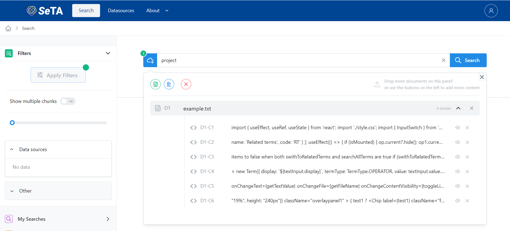
  <figcaption>Search by document or text</figcaption>
</figure>

<figure markdown>
  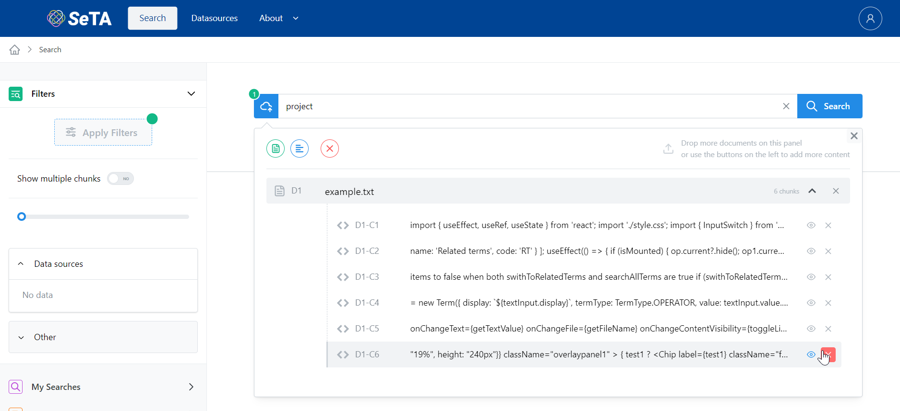
  <figcaption>Remove document or text from Search</figcaption>
</figure>

<figure markdown>
  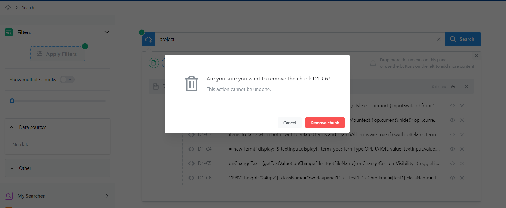
  <figcaption>Remove document or text from Search</figcaption>
</figure>

### Filters         
There are some filters that can be applied to refine the search of the results:

`Show multiple chunks`   
: Chunking is a process of extracting phrases from unstructured text, in our case, it is possible to filter the results by switching to show multiple chunks or not.                
  
`Filter by date range`
: The time range bar, can be adjust to the custom year range.        

`Data sources`        
: In this section it is possible to select from the different sources available a more specific source topic.

<!-- `Taxonomies`                
: From the different taxonomies proposed in this section, it can be possible to select only the results with a specific group of interest. -->

`Other`
: In this section it is possible to filter the results with an extra parameter, this parameter can be any of the tags that appears in tag ^^Other^^ from the uploaded documents (e.g. *crc, project_piknus, regions, identifiers*).

Once all the filters are selected, click in the button **Apply Filters** at the top of the section to apply them.

<figure markdown>
  
  <figcaption>Filters</figcaption>
</figure>

### Results

Once the search is finished, we can see in the results section all the related documents. By default, they are order in percentage of similarity with the searching input. A brief description of the document is display together with a path that describes the document type including the source and the date of publication.  Finally, there is a link to the public URL of the document.               
By clicking in the :octicons-chevron-down-12: at the right side of every result, it is possible to see the Taxonomy tree and the Text chunk.              

<figure markdown>
  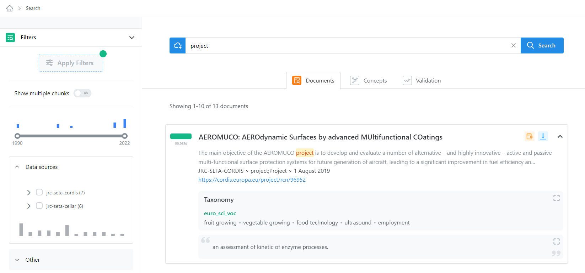
  <figcaption>Search results</figcaption>
</figure>

 On sections Taxonomy and Chunks when clicking on :fontawesome-solid-expand: the data can be seen in an expanded version.              

#### Taxonomy

<figure markdown>
  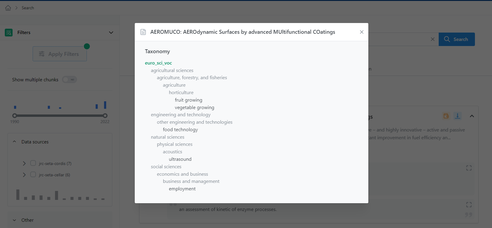
  <figcaption>Taxonomy tree</figcaption>
</figure>

#### Chunks

On the Chunks section it is also possible to expand more the view to a full screen view.
<figure markdown>
  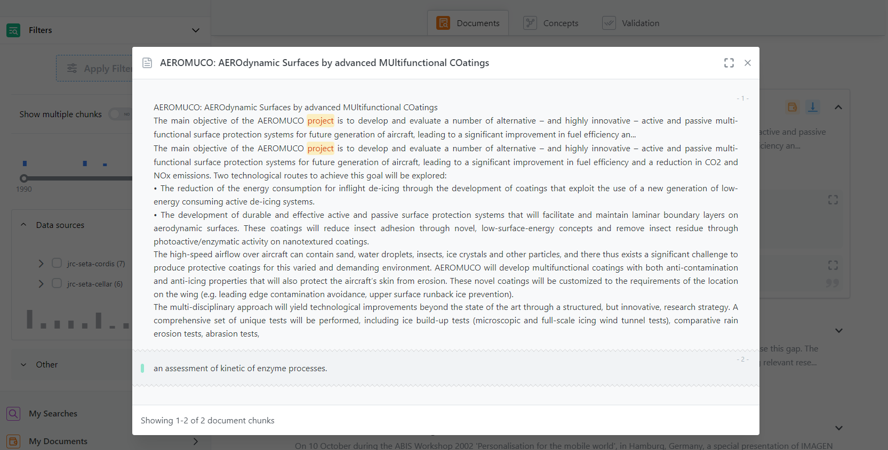
  <figcaption>Chunks inside the document</figcaption>
</figure>

<figure markdown>
  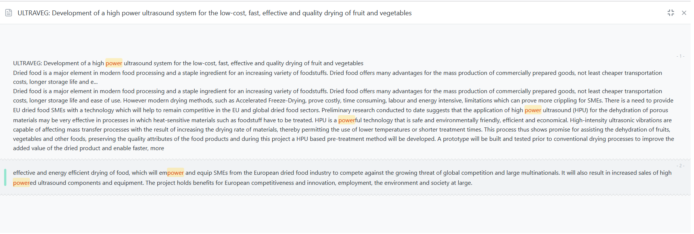
  <figcaption>Full screen view of Chunks</figcaption>
</figure>

### Save to My Documents
It is possible to save the results by clicking on :material-wallet-outline:. This will open a dialog window to select where to save the document.

<figure markdown>
  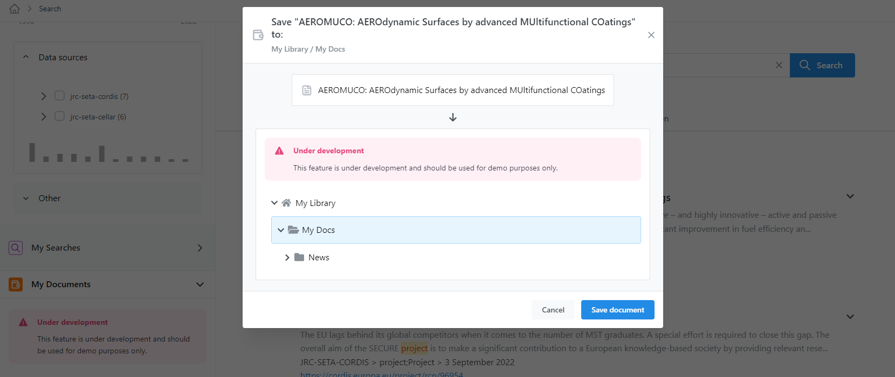
  <figcaption>Save My Documents</figcaption>
</figure>

After saving the document, it is possible to find it on panel My Documents :material-wallet-outline: on the sidebar.

### Stage document
It also possible stage a document in its current version just click on :material-arrow-collapse-down:. You can remove from stage by clicking on :octicons-checkbox-24: that appears. Another option to remove from stage is to click on :material-arrow-collapse-down: that appears on top right of the screen. This will open a pop-up window where it is possible to perform bulk actions.

<figure markdown>
  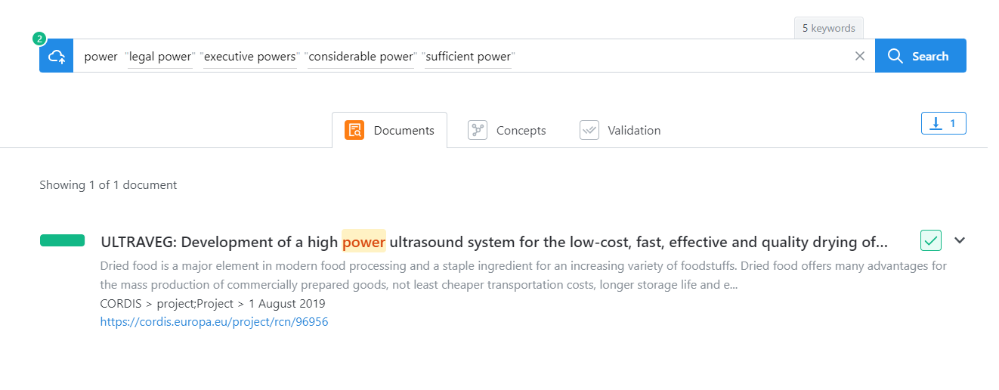
  <figcaption>Remove Stage</figcaption>
</figure>

### My Search           
In this panel, we can see the user's search library. This feature is under development and will be available soon.

<figure markdown>
  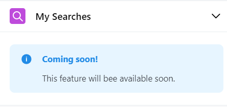
  <figcaption>My Searches</figcaption>
</figure>              

### My Documents         
In this panel we can see the documents the user has saved during the searching.                 

<figure markdown>
  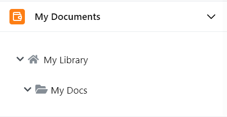
  <figcaption>My Documents</figcaption>
</figure>

