SeTA has two user interfaces:

- Web App: Allows the user to interact through the Web page with the content in a Web browser, which acts as a client.

- API: An Application Programming Interface exposing data and functionality in a consistent format.


## Web App
The Seta Web App is a user-friendly interface that allows the user to access the content in a Web browser. 
 
 <!--   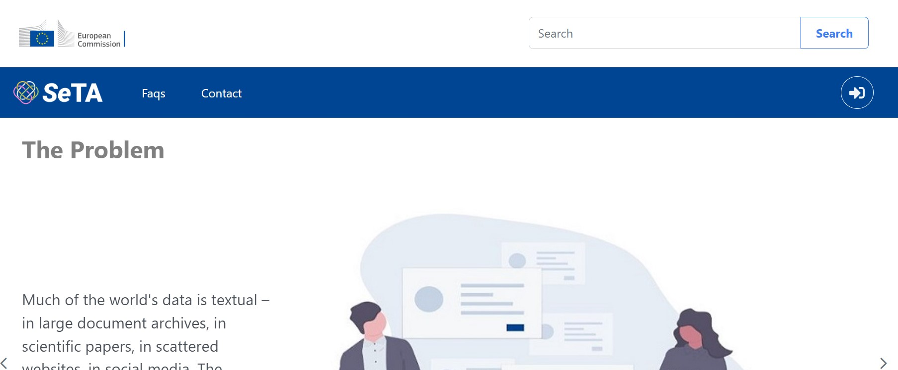{ width="600" }  -->

<figure markdown>
{ width="600" }
<figcaption>Seta main page</figcaption>
</figure>


In the SeTA Web App, we can find:

- Search tool: An online search engine tool designed to search for metadata on the SeTA database based on the user's search query. It sorts the results, and makes an ordered list of these results according to the search algorithms.

- Communities: A digital platform for people with a common interest to discuss or share and connect and communicate with one another.

To access these features, first, you need either to login with an EU login[^1] account or with a GitHub[^2] authentication.


<figure markdown>
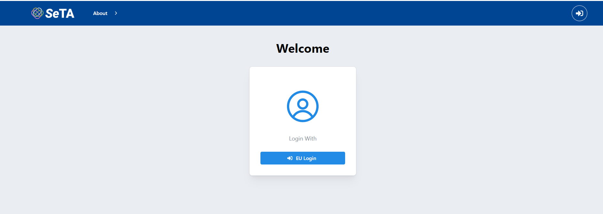{ width="600" }
<figcaption>Login</figcaption>
</figure>


Once you are logged in, you can see in the top menu the link to the Search and to the Communities:


<figure markdown>
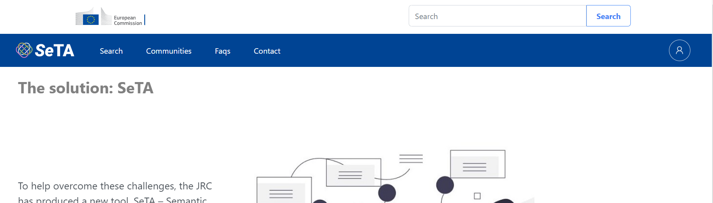{ width="900" }
<figcaption>Search</figcaption>
</figure>


## API

The SeTA API provides the functions and procedures to access data from a developer point of view.

In SeTA there are two API's:   
- Seta API    
- Communities API 

### Seta API


#### Prerequisites


#### EU Login Authentication

Open a browser and go to seta-ui [login](/login) page. Connect with EU Login account or use a GitHub authentication. After that you can open a new tab in the same browser or go to [Search API swagger documentation](/seta-api/doc).


!!! info
    If you open a new tab or window from another browser, you need to open the browser developer tool and copy the value of the ^^csrf_access_token^^ cookie 

You can start using Search API.


<figure markdown>
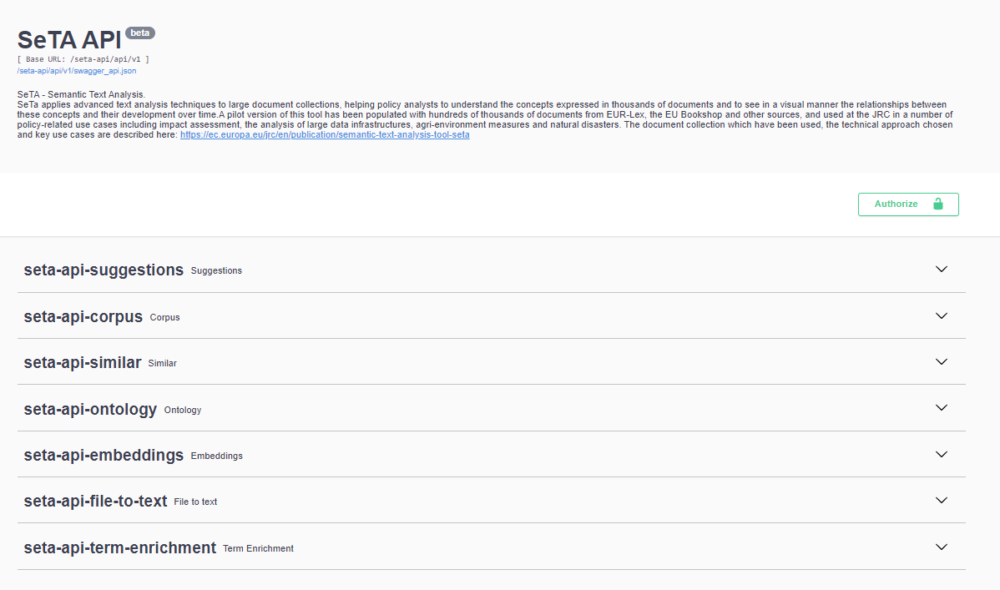{ width="900" }
<figcaption>Seta API</figcaption>
</figure>


### Communities API 


#### Prerequisites

The Docker containers must be running.

!!! note "Optional, but useful:" 
    Install MongoDB Compass and connect to dockerized MongoDB on localhost:27017

    If the seta database exists, then remove it with either MongoDB Compass or bash MongoDB commands.

#### EU Login Authentication

Open browser and go to seta-ui [login](/login) page.

Connect with EU Login account (*you can also use GitHub authentication, but EU Login will be used as an example here*).

After successful authentication, check that you have the following entries in the new **seta database - users collection**:      


<figure markdown>
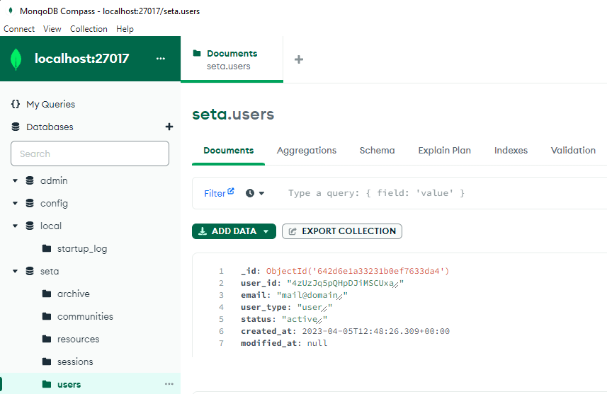{ width="700" }
<figcaption>Partial object for the new seta account</figcaption>
</figure>


<!--```
    {
        "user_id": "5Mq7bNYnhtaiS6BDLvcZ",
        "email": "email@domain",
        "user_type": "user",
        "status": "active",
    }
```-->


<figure markdown>
{ width="700" }
<figcaption>Provider object</figcaption>
</figure>

<!--```
    {
        "user_id": "5Mq7bNYnhtaiS6BDLvcZ",
        "provider_uid": "ecas_id",
        "provider": "ECAS",
        "first_name": "First name",
        "last_name": "Last name",
        "domain": "eu.europa.ec"
    }
``` -->


<figure markdown>
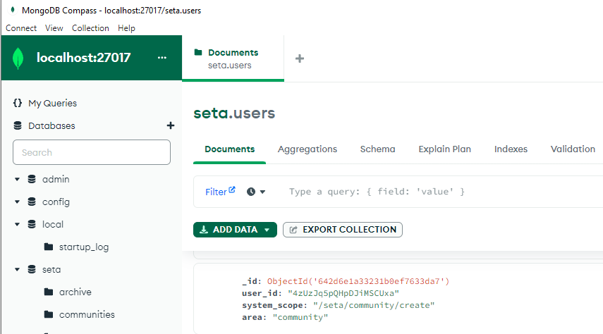{ width="700" }
<figcaption>Community create scope</figcaption>
</figure>


<!--```
    {
        "user_id": "5Mq7bNYnhtaiS6BDLvcZ",
        "system_scope": "/seta/community/create",
        "area": "community"
    }
```-->


<figure markdown>
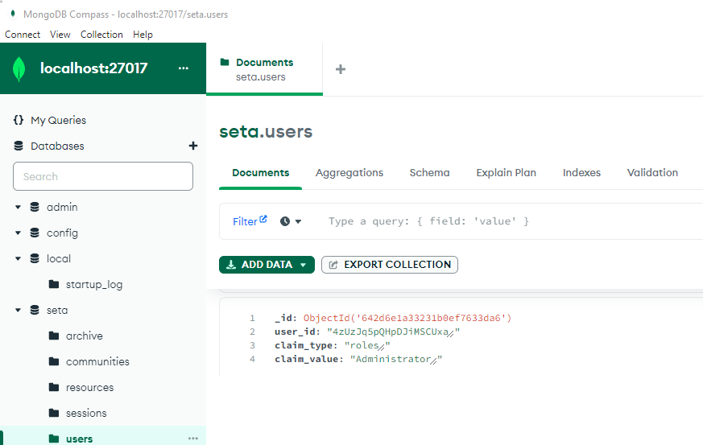{ width="700" }
<figcaption>Role claim (claim_value can different)</figcaption>
</figure>

<!--```
    {
        "user_id": "5Mq7bNYnhtaiS6BDLvcZ",
        "claim_type": "roles",
        "claim_value": "Administrator"
    }
```-->

!!! info
    **user_id** is a randomly generated short guid for each new account


Open a new tab in the same browser for the [Community API swagger documentation](/api/communities/v1/doc)

<figure markdown>
{ width="800" }
<figcaption>Communities API</figcaption>
</figure>


Open the *browser developer tool* and copy the value of the ^^**csrf_access_token**^^ cookie

!!! note
    you can check the decoded access and refresh tokens at [https://jwt.io/](https://jwt.io/) website

Click on the **Authorize** button to open the Available authorizations dialog; set the CSRF value and click on *Authorize* button; leave the **Bearer** field empty.


!!! warning "Only if you want to use seta-api in another browser:"
    * open the browser developer tool and copy the value of the **access_token_cookie**
    * {==click on the **Authorize** button to open the Available authorizations dialog; in the apikey text input set **Bearer** value then click on the *Authorize* button.==}

Seta-API will get at each request another authorization decoded token from seta-ui through the *token info* endpoint using the authenticated JWT.

!!! info 
    You can verify the authorization token at [authorization doc](/authorization/v1/doc) passing the JWT access token as payload.

<figure markdown>
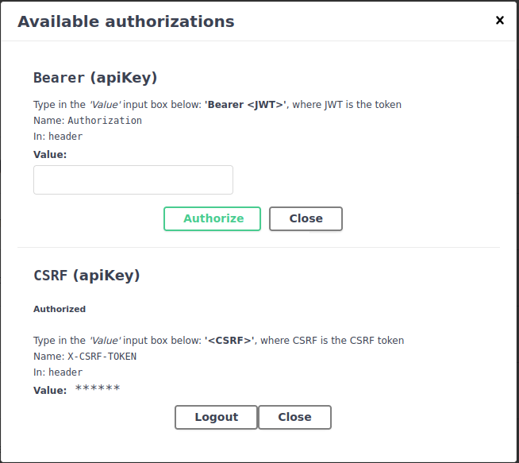{ width="500" }
<figcaption>Authorize</figcaption>
</figure>


#### Create community

Expand **Communities** region and then Try out **POST** /communities:

<figure markdown>
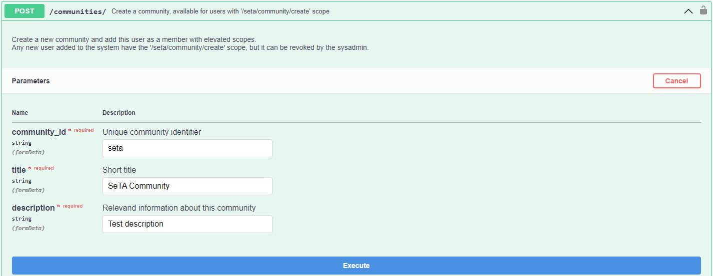{ width="800" }
<figcaption>Create Community</figcaption>
</figure>


The server response should be a 201 code with a JSON body:
```
    { "message": "New community added", "status": "success" }
```
\     
\     
Check the following entries in the **seta database - communities** collection:


<figure markdown>
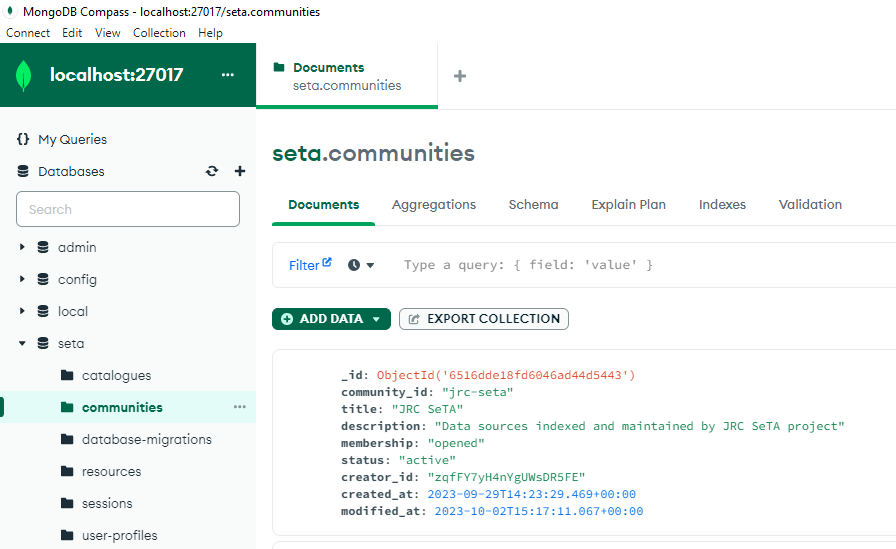{ width="700" }
<figcaption>Community object</figcaption>
</figure>

<!--```
    {
        "community_id": "seta",
        "title": "Seta",
        "description": "Seta community",
        "membership": "closed",
        "data_type": "evidence",
        "status": "active",
        "creator_id": "5Mq7bNYnhtaiS6BDLvcZ"
    }
```-->


<figure markdown>
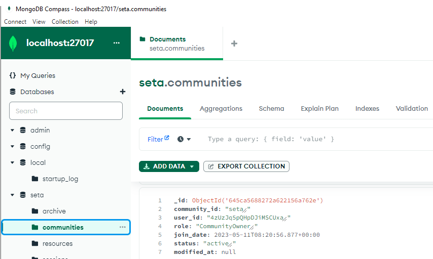{ width="700" }
<figcaption>Membership object</figcaption>
</figure>


<!--
```
    {
        "community_id": "seta",
        "user_id": "5Mq7bNYnhtaiS6BDLvcZ",
        "role": "CommunityOwner",
        "join_date": "2023-03-06T17:34:48.538+00:00",
        "status": "active"
    }
```
-->


Check the objects for the community scopes in the **seta database - users** collection:


<figure markdown>
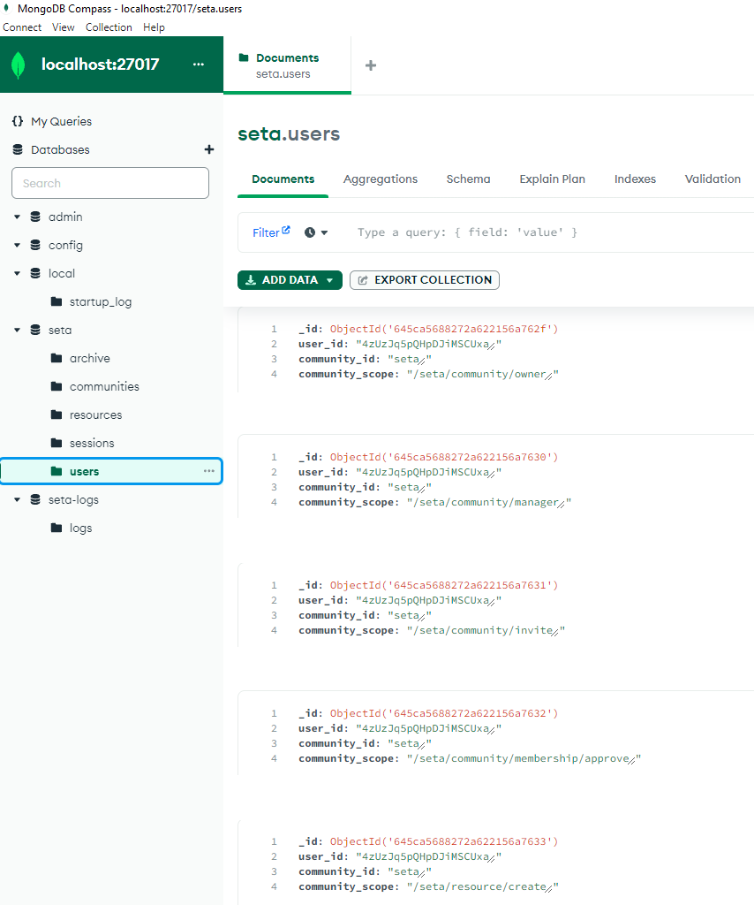{ width="700" }
<figcaption>User scope</figcaption>
</figure>


<!--
```
    {
        "user_id": "5Mq7bNYnhtaiS6BDLvcZ",
        "community_id": "seta",
        "community_scope": "/seta/community/owner"
    },
    {
        "user_id": "5Mq7bNYnhtaiS6BDLvcZ",
        "community_id": "seta",
        "community_scope": "/seta/community/manager"
    },
    {
        "user_id": "5Mq7bNYnhtaiS6BDLvcZ",
        "community_id": "seta",
        "community_scope": "/seta/community/invite"
    },
    {
        "user_id": "5Mq7bNYnhtaiS6BDLvcZ",
        "community_id": "seta",
        "community_scope": "/seta/community/membership/approve"
    },
    {
        "user_id": "5Mq7bNYnhtaiS6BDLvcZ",
        "community_id": "seta",
        "community_scope": "/seta/resource/create"
    }
```
-->


#### Create resource

Expand **Resources** region and then Try out **POST** /resources/community/{community_id}:


<figure markdown>
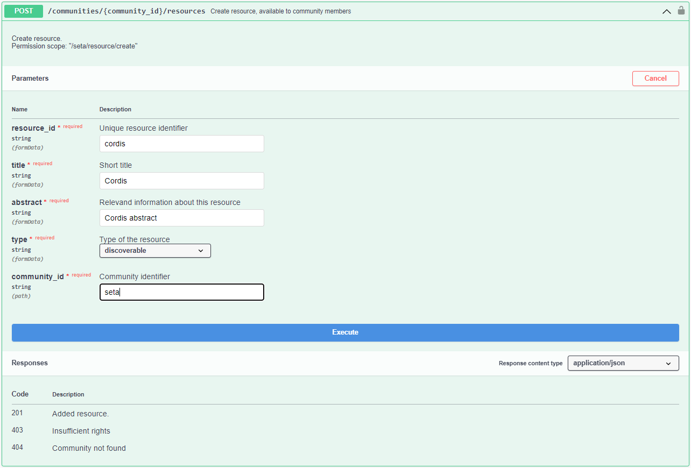{ width="700" }
<figcaption>Create Resource</figcaption>
</figure>


Check that the Resource entry appears in the **seta database - resources** collection:


<figure markdown>
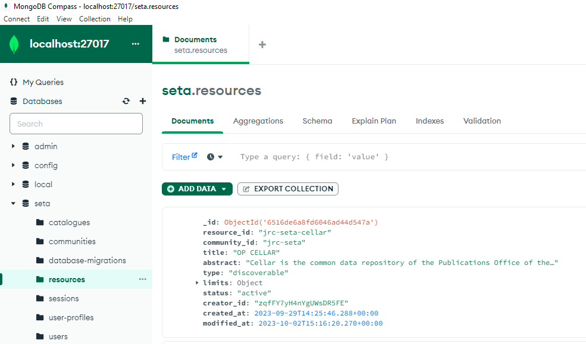{ width="700" }
<figcaption>Resource</figcaption>
</figure>

<!--```
    {
        "resource_id": "cordis",
        "community_id": "seta",
        "title": "Cordis",
        "abstract": "Cordis resource",
        "access": "community",
        "limits": {"total_files_no": 50,"total_storage_mb": 1024,"file_size_mb": 50},
        "status": "active",
        "creator_id": "5Mq7bNYnhtaiS6BDLvcZ"
    }
```-->

Check that the objects for the resource scopes in the **seta database - users** collection exists


<figure markdown>
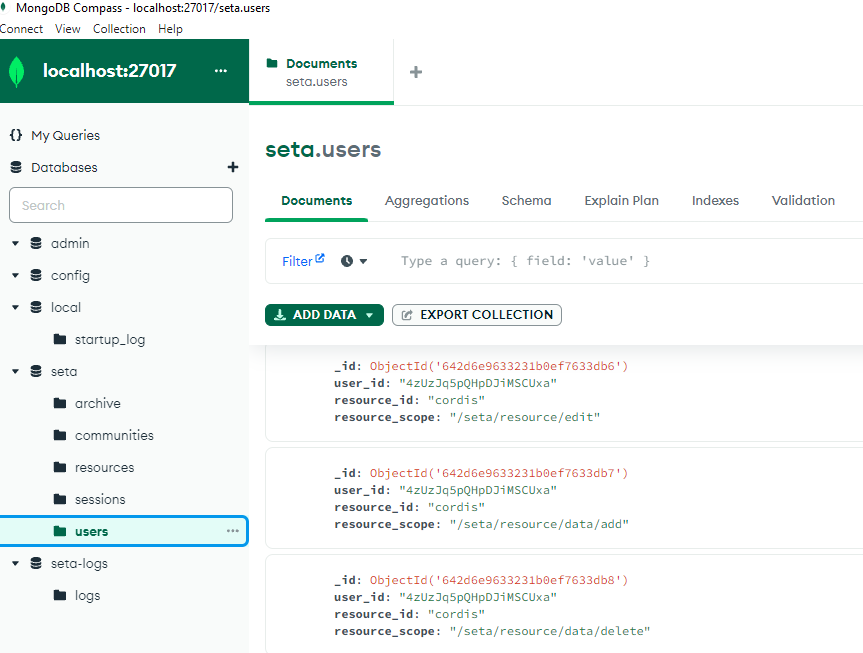{ width="700" }
<figcaption>Users Resource</figcaption>
</figure>

<!--```
    {
        "user_id": "5Mq7bNYnhtaiS6BDLvcZ",
        "resource_id": "cordis",
        "resource_scope": "/seta/resource/edit"
    },
    {
        "user_id": "5Mq7bNYnhtaiS6BDLvcZ",
        "resource_id": "cordis",
        "resource_scope": "/seta/resource/data/add"
    },
    {
        "user_id": "5Mq7bNYnhtaiS6BDLvcZ",
        "resource_id": "cordis",
        "resource_scope": "/seta/resource/data/delete"
    }
```
-->


At this point, Community API usage is set up and you can start using the methods under **seta-api-corpus** region.


[^1]:https://webgate.ec.europa.eu/ern/userguide/Content/A.HOW%20TO%20JOIN/Register%20on%20EU-Login.htm
[^2]:https://github.com/