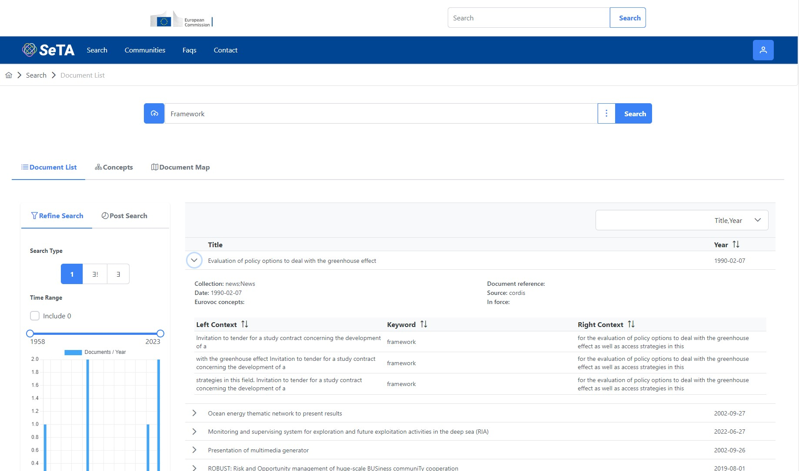
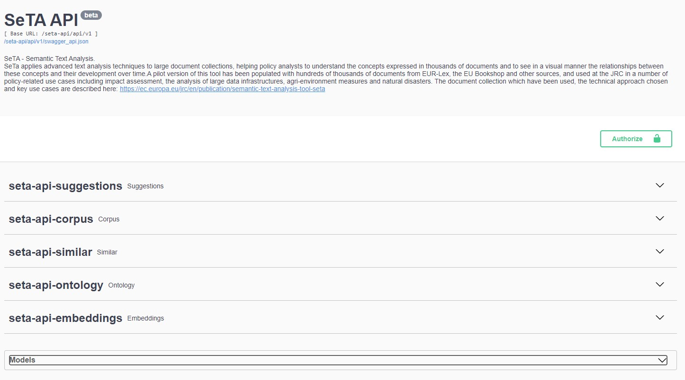

This tutorial shows you how to use SeTA with most of its features, step by step.

SeTA has two user interfaces:

- Web Interface

- API interface

# Web interface
The Seta Web interface is a user friendly user interact where you can start searching directly from the interface.
 
 { width="800" }

The features of this web interface are:

- Search tool

- Communities

In order to access these features, you need either to login an EU login account or a GitHub authentication.

 { width="600" }

Once you are logged in, you can see in the top menu the link to the Search and to the Communities:

 { width="800" }

