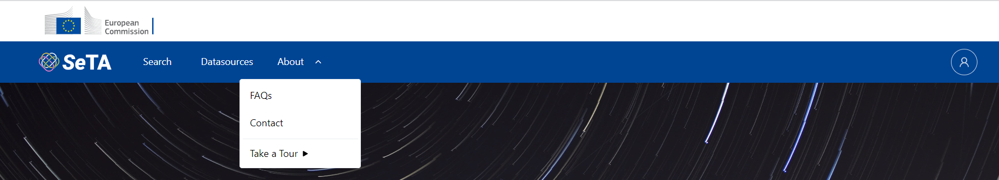

SeTA has two user interfaces:

- Web Interface

- API interface

# Web interface
The Seta Web interface is a user friendly user interact where you can start searching directly from the interface.
 
 { width="600" }


The features of this web interface are:

- Search tool

- Communities


In order to access these features, you need either to login an EU login account or a GitHub authentication.

 { width="600" }


Once you are logged in, you can see in the top menu the link to the Search and to the Communities:


 { width="800" }


# API interface

## Prerequisites

The Docker containers must be running.

!!! note "Optional, but useful:" 
    Install MongoDB Compass and connect to dockerized mongodb on localhost:27017

    If the seta database exists, then remove it with either MongoDB Compass or bash mongodb commands.

### EU Login Authentication

Open browser and go to seta-ui login page: [http://localhost/seta-ui/login](http://localhost/seta-ui/login).

Connect with EU Login account (*you can also use GitHub authentication, but EU Login will be user as an example here*)

After successful authentication, check that you have the following entries in the new *seta database - users collection*:

!!! info "Notice:"
    user_id is a randomly generated short guid for each new account

- Partial object for the new seta account:
```
    {
        "user_id": "5Mq7bNYnhtaiS6BDLvcZ",
        "email": "email@domain",
        "user_type": "user",
        "status": "active",
    }
```


- Provider object:
```
    {
        "user_id": "5Mq7bNYnhtaiS6BDLvcZ",
        "provider_uid": "ecas_id",
        "provider": "ECAS",
        "first_name": "First name",
        "last_name": "Last name",
        "domain": "eu.europa.ec"
    }
```

- community create scope:
```
    {
        "user_id": "5Mq7bNYnhtaiS6BDLvcZ",
        "system_scope": "/seta/community/create",
        "area": "community"
    }
```

- role claim (claim_value can different):
```
    {
        "user_id": "5Mq7bNYnhtaiS6BDLvcZ",
        "claim_type": "roles",
        "claim_value": "Administrator"
    }
```

### Community API

Open a new tab in the same browser for the community api swagger documentation: [http://localhost/api/communities/v1/doc](http://localhost/api/communities/v1/doc)

Open the browser developer tool and copy the value of the ^^csrf_access_token^^ cookie

!!! note "Note:"
    you can check the decoded access and refresh tokens at [https://jwt.io/](https://jwt.io/) website

Click on the **Authorize** button to open the Available authorizations dialog; set the CSRF value and click on *Authorize* button; leave the **Bearer** field empty.


#### Create community

Expand **Communities** region and then Try out **POST** /communities:


The server response should be a 201 code with a JSON body:
```
    { "message": "New community added", "status": "success" }
```

Check the following entries in the *seta database - communities* collection:

- community object:
```
    {
        "community_id": "seta",
        "title": "Seta",
        "description": "Seta community",
        "membership": "closed",
        "data_type": "evidence",
        "status": "active",
        "creator_id": "5Mq7bNYnhtaiS6BDLvcZ"
    }
```

- membership object:
```
    {
        "community_id": "seta",
        "user_id": "5Mq7bNYnhtaiS6BDLvcZ",
        "role": "CommunityOwner",
        "join_date": "2023-03-06T17:34:48.538+00:00",
        "status": "active"
    }
```
Check the objects for the community scopes in the *seta database - users* collection:
```
    {
        "user_id": "5Mq7bNYnhtaiS6BDLvcZ",
        "community_id": "seta",
        "community_scope": "/seta/community/owner"
    },
    {
        "user_id": "5Mq7bNYnhtaiS6BDLvcZ",
        "community_id": "seta",
        "community_scope": "/seta/community/manager"
    },
    {
        "user_id": "5Mq7bNYnhtaiS6BDLvcZ",
        "community_id": "seta",
        "community_scope": "/seta/community/invite"
    },
    {
        "user_id": "5Mq7bNYnhtaiS6BDLvcZ",
        "community_id": "seta",
        "community_scope": "/seta/community/membership/approve"
    },
    {
        "user_id": "5Mq7bNYnhtaiS6BDLvcZ",
        "community_id": "seta",
        "community_scope": "/seta/resource/create"
    }
```

#### Create resource

Expand **Resources** region and then Try out **POST** /resources/community/{community_id}:


Check the resource entry in the *seta database - resources* collection:
```
    {
        "resource_id": "cordis",
        "community_id": "seta",
        "title": "Cordis",
        "abstract": "Cordis resource",
        "access": "community",
        "limits": {"total_files_no": 50,"total_storage_mb": 1024,"file_size_mb": 50},
        "status": "active",
        "creator_id": "5Mq7bNYnhtaiS6BDLvcZ"
    }
```

Check the objects for the resource scopes in the *seta database - users* collection:
```
    {
        "user_id": "5Mq7bNYnhtaiS6BDLvcZ",
        "resource_id": "cordis",
        "resource_scope": "/seta/resource/edit"
    },
    {
        "user_id": "5Mq7bNYnhtaiS6BDLvcZ",
        "resource_id": "cordis",
        "resource_scope": "/seta/resource/data/add"
    },
    {
        "user_id": "5Mq7bNYnhtaiS6BDLvcZ",
        "resource_id": "cordis",
        "resource_scope": "/seta/resource/data/delete"
    }
```

#### SeTA-API Corpus

Open a new tab in the same browser for the seta-api swagger documentation: [http://localhost/seta-api/doc](http://localhost/seta-api/doc)

!!! tip "Only if you want to use seta-api in another browser:"
    * open the browser developer tool and copy the value of the **_access_token_cookie** cookie
    * click on the **Authorize** button to open the Available authorizations dialog; in the apikey text input set **Bearer** value then click on the *Authorize* button.

Seta-API will get at each request another authorization decoded token from seta-ui at [http://localhost/authorization/v1/token_info](http://localhost/authorization/v1/token_info) endpoint using the authenticated JWT.

!!! note "Note:" 
    You can verify the authorization token at [http://localhost/authorization/v1/doc](http://localhost/authorization/v1/doc) passing the JWT access token as payload.

Start using the methods under **seta-api-corpus** region.