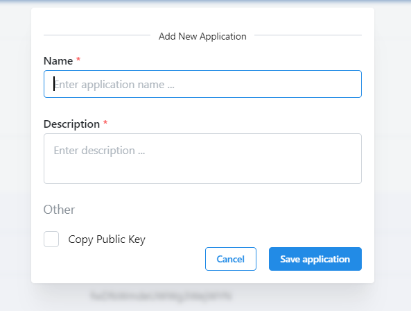

# Applications List
In SeTA, applications refer to integrations or external services that connect and interact with SeTA through APIs or for user authentication and authorization.

These integrations or applications extend SeTA's functionalities. SeTA provides a way to manage these applications within its settings, allowing users to configure, enable, or disable these connections based on their requirements.

Initially, you don't have any applications associated to your account. The list of applications in the dedicated page will be empty.

<figure markdown>
  
  <figcaption>Applications page</figcaption>
</figure>

## Create Application

1. From the list click on the top right bottom ^^Add new application^^.  
2. Enter the Application name and Description.  
3. Select or deselect the option to copy the Public key associated with the user account based on your requirements.
4. Click **Save application** to retain the stored application or **Cancel** to discard any changes made. 

<figure markdown>
  
  <figcaption>Create Application</figcaption>
</figure>

Once you've saved the application, the list will display as follows:

<figure markdown>
  
  <figcaption>Updated Application list</figcaption>
</figure>

## Application actions
Each application can be modified (Name, description, and status fields) or deleted if it's no longer required.

<figure markdown>
  
  <figcaption>Update or Delete Application</figcaption>
</figure>

## Update Application
1. From the list click the option :octicons-pencil-24: on actions column of the application.  
2. Enter the Application name, Description and Status.  
3. Click **Update** to save changes or **Cancel** to discard any changes made. 

<figure markdown>
  
  <figcaption>Update Application</figcaption>
</figure>

## Delete Application
1. From the list click the option :octicons-trash-24: on actions column of the application.  
2. A confirmation popup will appear.  
3. Press **Confirm** to proceed with the deletion or press **Cancel** to abort.

<figure markdown>
  
  <figcaption>Delete Application</figcaption>
</figure>