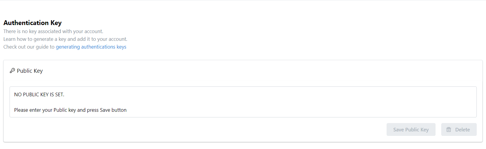

# Authentication Key
An Authentication Key used in user authentication is a unique and secure code or string of characters assigned to a user for identity verification and access authorization purposes. It serves as a digital signature, allowing users to securely access systems, services, or platforms.

Within this interface, users can store generated keys in a designated area for subsequent user authentication. Initially, your account isn't associated with any key. We provide a link with instructions on how to generate this key for the first time.

Once the key is entered into the textarea, the **Save** button becomes active. Clicking it will store the key within your profile section. Additionally, users have the option to **Delete** the key if they no longer wish to use it.

## Store Authentication Key

1. Generate new key (follow instructions in the link provided).  
2. Copy the public key inside file_name.pub.  
3. Paste the public key into the area provided in the page /profile/auth-key.
4. Click **Save Public Key** to store authentication key or **Delete** to discard existing one. 

<figure markdown>
  
  <figcaption>Authentication Key page</figcaption>
</figure>