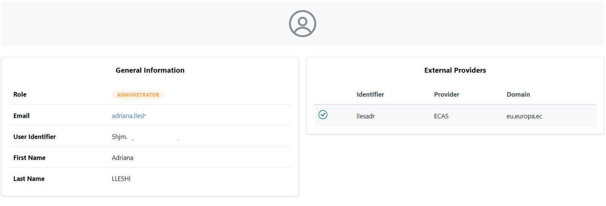

# User Account
The user account page serves as a personalized space where users can manage their account details, preferences, and settings. Accessible by clicking "Profile" in the dropdown menu atop the page, it's divided into two main sections:

* **General Information**:  This area showcases vital user details like role (Administrator or User), email address, first and last name, and the unique identifier.

* **External Providers**:  Here, users can view information such as Identifier, provider, and domain related to external services or connections.

<figure markdown>
  
  <figcaption>Profile page</figcaption>
</figure>