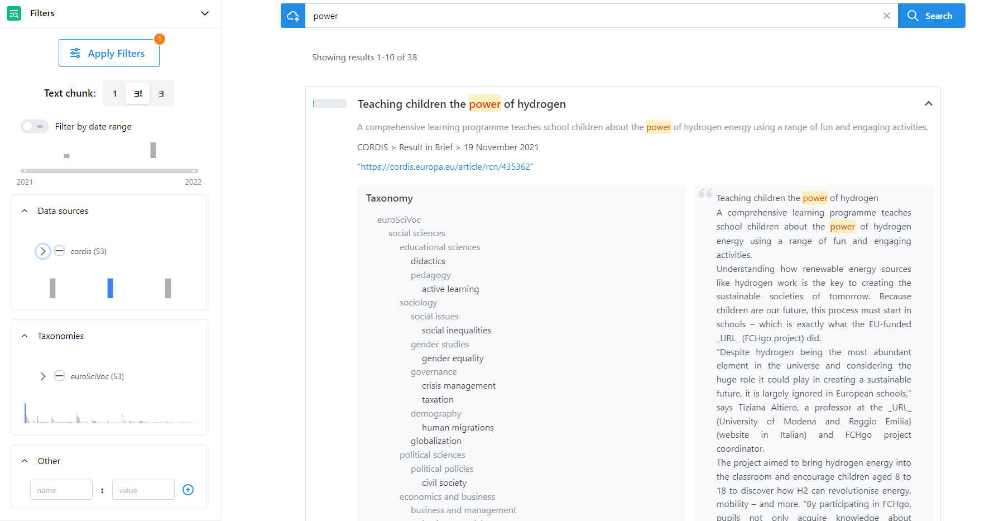

Within the search page the options to search are:

* By term
* By phrase
* By document or text
    

### Search by term
If we search by a term, when we start typing in the search bar, a dropdown box appears automatically, in this dropdown box we see two sections:

- a section with a list of *autocomplete* words (left side), 
- a section with a map of the *related terms* to search (right side). Also, in this section, there is the possibility to choose for *related terms* or *related terms clusters*. And finally, there is a *wizard*  tool to use if we want to **enrich query automatically**. 

<figure markdown>
  { width="800" }
  <figcaption>Search by term</figcaption>
</figure>

### Search by phrase
If we want to search by phrase it is necessary to enclose with double quotes *^^" "^^* the phrase, after that, as with the term search, the dropdown box will appear automatically with the two sections: *autocomplete* and *related terms*.

<figure markdown>
  { width="800" }
  <figcaption>Search by phrase</figcaption>
</figure>

### Search by document or text

If you want to search by uploading a document or by a text, just click in the cloud button { width=30} and a pop-up window will appear. In this window, there are two sections; the first one on top is to upload the document, we can either select the path where the document is located or we can drag and drop. Either uploading or by drag and drop it is always possible to cancel the upload of the file before the search, with the button { width=30}.

In the lower section of the pop-up it is possible to paste the text you want to search. 

If we don't want to search with this option, it is always possible to cancel the search with the *cancel* button at the bottom of the pop up, and the pop-up window will close.

<figure markdown>
  { width="800" }
  <figcaption>Search by document or text</figcaption>
</figure>

### Options
After launching a search, a new section with the results will appear below the search box (see image *Detailed results*). Together with the results there are some options to improve the search:

- Post Search   
In the left side of the new section it is possible to find tab Post Search. Here there is a histogram which can be used to apply filters. Click on a specific part of the histogram and the list of documents will be updated displaying only the related documents according to the specific part of the histogram clicked.

- Refine Search      
In tab Refine Search it is possible to see the list of filters available to apply to the search query:     
    - Search type  
    - Time Range        

- Sort results        
On top of the results section on column ^^Score^^ and column ^^Year^^ there is the ^^Sort By arrow^^ option. 

If the user clicks on the *increase/decrease arrows* the arrow will *increase/decrease* and the items of the list will change their order.

To select the columns, you want to see on the results table, go to the top of the results section on the left corner of the list of documents, click in the dropdown bar in there you will see the list of column headers selected by default. Uncheck the columns you do not want to see.  You can use this option to *show/hide* columns on preference.

- Detail result                
Each item of the result list has an expand icon **>** on the left corner. By clicking on it, it is possible to see more details about the single item:          
    - Collection        
    - Date           
    - Eurovoc concepts
    - Document reference
    - Source
    - In force

Furthermore, you can see a table with the left and right context of the single result.

### Concepts tab           
It is possible to see the visual representation of the topic. The Concept map will help you organize the results and explore the relationships in a topic. Through the concept map it is possible to organize and represent the searched term and explore the connections between elements.  

### Document Map tab         
Mapping is the process of relating the structure values or content of a document in one format to the values and fields in an alternate document format. In the Document Map tab, you will see the maps between different related documents to your search.  

<figure markdown>
  { width="800" }
  <figcaption>Detailed results</figcaption>
</figure>
