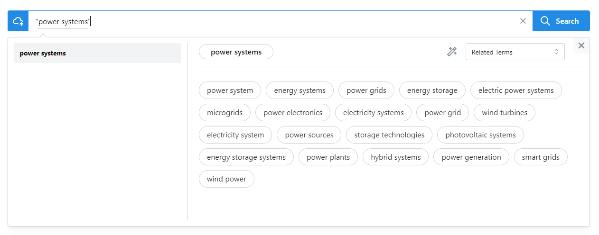
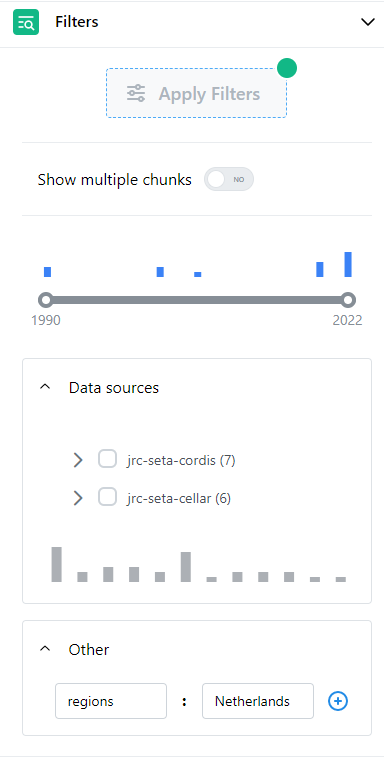

# Search Web interface
Within the search page the options to search are:

* By term
* By phrase
* By document or text
    

### Search by term

1. Start typing in the search bar.  
2. A dropdown box appears automatically, with two sections: 
    1. one section with a list of *autocomplete* words (left side), 
    2. one section with a map of the *related terms* to search (right side). In this section, it is possible to choose for *Related Terms Clusters* or *Related Terms*.
3. After selecting the term to search, click in button *search*

<figure markdown>
  
  <figcaption>Search by term</figcaption>
</figure>

### Search by phrase

1. Start typing in the search bar enclosing with double quotes **" "** the phrase.  
2. A dropdown box appears automatically, with two sections: 
    1. one section with a list of *autocomplete* words (left side), 
    2. one section with a map of the *related terms* to search (right side). In this section, it is possible to choose for *Related Terms Clusters* or *Related Terms*.
3. After selecting the term to search, click in button *search*

<figure markdown>
  
  <figcaption>Search by phrase</figcaption>
</figure>

### Search by document or text

**Search by document**           
1. Click in the cloud button { width=30} and a pop-up window will appear.  
2. In this window, there are two sections; the first one on top is to upload the document, we can either select the path where the document is located or we can drag and drop. Either uploading or by drag and drop it is always possible to cancel the upload of the file before the search, with the button { width=30}.

**Search by text**               
1. Click in the cloud button { width=30} and a pop-up window will appear.                    
2. In the lower section of the pop-up paste the text you want to search. 

If we don't want to search with this option, it is always possible to cancel the search with the *cancel* button at the bottom of the pop up, and the pop-up window will close.

<figure markdown>
  { width="800" }
  <figcaption>Search by document or text</figcaption>
</figure>

### Filters         
There are some filters that can be applied to refine the search of the results:

`Text chunk`   
: Chunking is a process of extracting phrases from unstructured text, in our case, it is possible to filter the results by: 
    1. First chunk of the text
    2. Single chunk only
    3. Any chunks

`Filter by date range`
: If this option is switched on, then the time range bar below, can be adjust to the custom year range.        

`Data sources`        
: In this section it is possible to select from the different sources available a more specific source topic.

`Taxonomies`                
: From the different taxonomies proposed in this section, it can be possible to select only the results with a specific group of interest.

`Other`
: In this section it is possible to filter the results with an extra parameter, this parameter can be any of the tags that appears in tag ^^Other^^ from the uploaded documents (e.g. *crc, project_piknus, regions, identifiers*).

Once all the filters are selected, click in the button **Apply Filters** at the top of the section to apply them.

<figure markdown>
  { width="300" }
  <figcaption>Filters</figcaption>
</figure>

### My Search           
In this panel, we can see the user's search library.               

### My Documents         
In this panel we can see the user's documents library.                 

<!--<figure markdown>
  
  <figcaption>Detailed results</figcaption>
</figure> -->
