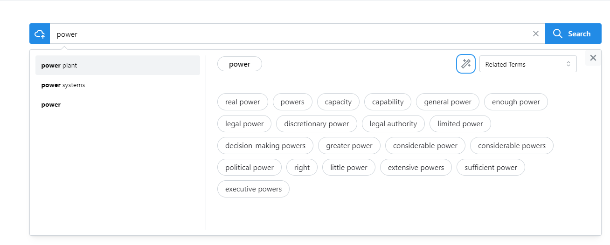
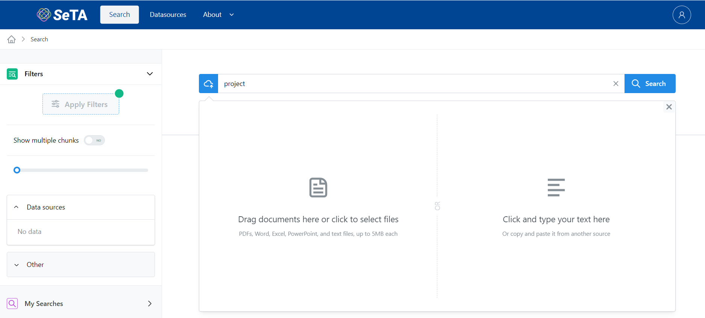

- Within the search page it is possible search:
    * By term
    * By phrase
    * By document or text
    

## Search by term:
As in the image below, if we put a term in the search bar, the app will list the related terms. Furthermore if we click on the *wizard* icon, the query can be enriched with terms related.

{ width="700" }

## Search by phrase:
Search by phrase requires to put the double " " in between the phrase, afterwards, as with the term search, it can be possible to click on the *wizard* icon, the query can be enriched with terms related.
{ width="700" }

## Search by document or text:

{ width="500" }